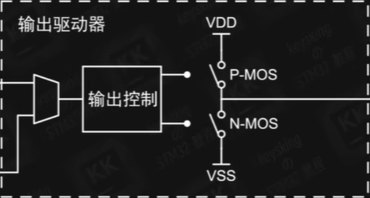

# 技术沙龙-GPIO

- STM32F10x-中文参考手册：https://kdocs.cn/l/cumyUMQCcp3I

- 当我们使用一个新的器件时，通常都需要开启时钟，初始化对应 GPIO 对其进行配置。


## 一、开启时钟

- 在固件库 FWLIB 中找到 stm32f10x_rcc.h 文件，打开拉至最后，所有时钟相关的函数都在这里，找到外设时钟使能函数：

  ```c
  void RCC_AHBPeriphClockCmd(uint32_t RCC_AHBPeriph, FunctionalState NewState);
  void RCC_APB2PeriphClockCmd(uint32_t RCC_APB2Periph, FunctionalState NewState);
  void RCC_APB1PeriphClockCmd(uint32_t RCC_APB1Periph, FunctionalState NewState);
  ```

- 我们可以看到，一共有三个外设时钟使能函数。通过查看 STM32F10x-中文参考手册 P25，我们能发现 GPIO 都是在 APB2 时钟总线上的。

  

- 故若我们想要打开 GPIO 的时钟，应选择` void RCC_APB2PeriphClockCmd(uint32_t RCC_APB2Periph, FunctionalState NewState); `这个函数。注意：看清楚再做选择，是`Clock`，而不是`Reset`，很多同学会选成：`void RCC_APB2PeriphResetCmd(uint32_t RCC_APB2Periph, FunctionalState NewState);`，这个函数用于启用或禁用连接到 APB2 总线的外设的复位状态，两个是不一样的。

- ```c
  void RCC_APB2PeriphClockCmd(uint32_t RCC_APB2Periph, FunctionalState NewState)
  {
    /* Check the parameters */
    assert_param(IS_RCC_APB2_PERIPH(RCC_APB2Periph));
    assert_param(IS_FUNCTIONAL_STATE(NewState));
    if (NewState != DISABLE)
    {
      RCC->APB2ENR |= RCC_APB2Periph;
    }
    else
    {
      RCC->APB2ENR &= ~RCC_APB2Periph;
    }
  }
  ```

  

- 我们可以发现该函数有两个参数，右键跳转到定义，找到` assert_param `后面的生效参数（IS_开头），再次跳转到定义，可以看到参数列表，选择我们需要的参数。第一个参数，我们一般选择对应的 GPIO 口；第二个参数，通常选择使能`ENABLE`，复制粘贴，开启时钟的函数便配置完成。


## 二、初始化GPIO

- 在固件库中找到 stm32f10x_gpio.h 文件,同样将其拉至最后，我们可以看到所有 GPIO 相关的函数，找到 GPIO 初始化函数` void GPIO_Init(GPIO_TypeDef* GPIOx, GPIO_InitTypeDef* GPIO_InitStruct); `

- 右键跳转到定义，我们发现第二个变量有些特殊，` GPIO_InitTypeDef* GPIO_InitStruct `这是一个指针变量，如果我们想要配置它，需要先定义结构体变量，将` GPIO_InitTypeDef* GPIO_InitStruct `复制下来，去掉 * ，`GPIO_InitTypeDef GPIO_InitStruct;`这样便完成了结构体变量的定义。

- 接下来我们需要对结构体内数据成员进行配置，我们可以通过.引出结构体`GPIO_InitStruct`的数据成员，然后通过` GPIO_Init `右键跳转到定义，找到` assert_param `后面的生效参数（IS_开头），再次跳转到定义，可以看到参数列表，选择我们需要的参数，复制粘贴，第一个参数同理。

- `GPIO_Pin`这里我们会选择对应的引脚；如果该引脚为输出模式，一般我们配置`GPIO_Speed`时会选择`GPIO_Speed_50MHz`，输入模式不需要配置这个；至于`GPIO_Speed`模式的选择，下面会单独介绍。需要注意的是，在 GPIO 初始化函数中书写第二个参数时，需要加上 & ，因为` GPIO_InitTypeDef* GPIO_InitStruct `是一个指针变量。

- 这里以 LED 为例：

  ```c
  void LED_GPIO_Init(void)
  {
  	GPIO_InitTypeDef GPIO_InitStruct;//定义结构体变量 类型别名 变量名
  	//使能对应GPIO时钟
  	RCC_APB2PeriphClockCmd(RCC_APB2Periph_GPIOB, ENABLE);//APB2外设时钟使能函数
  	//调用GPIO初始化函数初始化对应GPIO口
  	GPIO_InitStruct.GPIO_Pin = GPIO_Pin_5;
  	GPIO_InitStruct.GPIO_Speed = GPIO_Speed_50MHz;//输出速度（输入不需要配置这个）
  	GPIO_InitStruct.GPIO_Mode = GPIO_Mode_Out_PP;//推挽输出 驱动LED灯、蜂鸣器
  	GPIO_Init(GPIOB, &GPIO_InitStruct);
  }
  ```
  


## 三、如何选择模式

- B站学习链接：https://www.bilibili.com/video/BV1zG4y1K78S?vd_source=11abb0bdc56ff631df804fcc39855118

- 通过学习我们能够知道，GPIO有8大模式，模拟输入`GPIO_Mode_AIN`、浮空输入`GPIO_Mode_IN_FLOATING`、下拉输入`GPIO_Mode_IPD`、上拉输入`GPIO_Mode_IPU`、开漏输出`GPIO_Mode_Out_OD`、推挽输出`GPIO_Mode_Out_PP`、复用开漏输出`GPIO_Mode_Out_PP`、复用推挽输出`GPIO_Mode_Out_PP`这8大模式。

- 打开STM32F10x-中文参考手册P105，这里面是关于 GPIO 的功能描述。而其中关键的是这样一张结构图，这张图描绘了每个 GPIO 口内部的基本结构。

  

- 结构图的最右侧是 I/O 引脚，也就是我们在芯片上看到的小铁丝， STM32 芯片就是靠它们与其他器件进行连接，连接的线路可以在开发板上隐约看到。

- 由于芯片内部电路所能承受的电压有限，因而从I/O引脚向里是两个保护二极管，当有静电等瞬间电压波动进入 I/O 引脚时，若此电压大于 VDD 3.3V ，则上方的保护二极管导通，将电压引入电源，由电源网络吸收；而当波动电压小于 VSS 也就是 0V 时，下方的保护二极管导通，波动电压被引入 GND 中吸收。当然，此结构仅能抵御一瞬间的电压波动，若较长时间将较高的电压接入 I/O 口依旧会损坏芯片。此外， STM32 芯片中有一部分 I/O 口可以做到 5V 容忍，也就是可以承受 5V 电压作为高电平输入，这种 I/O 口的上方保护二极管电压为 5V 。

- 在结构图的最内侧有几个称为寄存器的结构，在 STM32 中有许多具有特定功能的内存单元，它们按照功能被叫做xxx寄存器，这些可以被称为寄存器的内存单元是程序与硬件电路连接的桥梁

  

- 其按照每32位二进制0/1数据为一组，存储着芯片中特定功能电路的开关信息

  

- 我们可以通过程序对寄存器中的数据进行修改，来改变芯片中某功能电路的开关

   

- 或者通过程序对寄存器数据进行读取，来获取芯片中某段功能电路的当前状态

  

- 我们甚至可以说控制单片机实际上就是在控制寄存器。了解了寄存器，我们将目光转向两个虚线框中的内容。一个称为输入驱动器，另一个称为输出驱动器。

  

  ### （一）输出驱动器

- 首先来看输出驱动器，在图中我们可以看到被输出控制模块控制的两个 MOS ，分别是 P-MOS 与 N-MOS ，其作用可以简化为两个被控制的开关

  

- VDD 是指 3.3V 的高电平， VSS 是指 0V 的低电平。 STM32 的输出模式分为两类，推挽输出与开漏输出。我们先假设 I/O 口连接了一个普通小灯，小灯的另一端是 GND 

  


#### 1、推挽输出

- 倘若小灯的工作电压为 3.3V ，则我们可以使用推挽输出模式，此模式下 P-MOS 与 N-MOS 协同工作。当使用函数控制此 I/O 口输出高电平，函数内部对相关寄存器的数据进行了修改，导致 P/MOS 激活， N/MOS 关闭，此时 VDD 与 I/O 引脚连通输出高电平，电流形成，小灯亮起；
- 而当我们控制 I/O 口输出低电平时，则正好相反， P/MOS 关闭， N/MOS 激活， VSS 连接到 I/O 引脚，对外输出 0V 的低电平，没有电流产生，小灯也就熄灭。这就是推挽输出的工作方式，其具有一定的电压与电流驱动能力，可以直接驱动一些合适的元件工作。
- 但总有一些元件需要更高或者更低的电压来驱动。例如，倘若小灯的工作电压为 5V ，则由推挽输出提供的 3.3V 高电平就无法正常将其驱动，此时就是开漏输出的用武之地。


#### 2、开漏输出

- 开漏输出模式下只有 N/MOS 工作， P/MOS 一直处于断开状态。使用函数控制 I/O 口输出高电平，则 N/MOS 断开，整个 I/O 内部处于高阻态，或者说“断路”，并不对外输出特定的电平信号，电路断路，小灯也就不会亮起；若控制 I/O 口输出低电平，则 N/MOS 激活， I/O 引脚与 VSS 连接，小灯两端都是 0V ，也不会亮起。

- 但倘若我们将小灯的 GND 改为来自外部的 5V ，则此时电压差形成，电流产生，小灯亮起。而再让 I/O 输出高电平， 也就是 N/MOS 断开，依旧形成断路，也就无法产生电流，小灯熄灭。这样，我们在开漏模式下也可以正常控制小灯亮灭了。

- 推挽输出时小灯是由来自芯片的电压所驱动，但开漏输出却并没有驱动能力，必须依靠外部的电压源来进行驱动，这是其缺点，但也因此而拥有了最大的优点：更加灵活。

- 需要提一句的是，这里我们需要用支持 5V 容忍的 I/O 口，否则会使上方保护二极管长期导通，将 5V 引入电源中，造成损坏。

  

- 稍作总结，两者区别如下：

  

- 此外，我们可以看到对于输出控制模块来说，它有两个控制指令的来源，一个是使用函数控制的输出寄存器，另一个则是我们后面将会学习的片上外设，例如串口模块， I²C 模块等，由于同时控制会导致输出控制模块不知道听谁的，因而根据控制来源的不同， STM32 将两种输出模式又细分为了普通的推挽输出与开漏输出，以及复用推挽输出与复用开漏输出，至此我们就完成了对输出驱动器的了解。具体细节可以不必牢记，但务必要清晰推挽输出与开漏输出各自的优势与缺陷。

  

  ### （二）输入驱动器

- 再来到输入驱动器，外部输入的电流从 I/O 引脚进入后，首先经过的是一对上拉下拉电阻，当我们设置上拉输入时，上拉电阻启用，设置下拉输入时，下拉电阻启用，而浮空输入时，两个电阻都不会启用。与开漏输出类似，可以依赖外部的电路实现更多可能性。

- 电流继续前进会遇见一个TTL肖特基触发器，或者说施密特触发器，其作用是稳定电平。由于外部输入的电压可能不太稳定，并不总能达到标准的 3.3V 或者 0V ，因而我们可以简单地规定一个参考电压例如 1.65V ，高于此电压的就算作高电平，低于此电压的就算作低电平，使用一个比较器就可以实现此效果。

  

- 但若输入电压中噪声较多，在参考电压附近徘徊，则会导致高低电平快速变化，无法准确测得当前电平

  

- 因而对比较器稍作改造形成施密特触发器，就会产生两个参考电压。当输入电压高于高参考电压则输出高电平，低于低参考电压则输出低电平，在两者之间，则维持原本的电平信号不变。

  

- 最后，经过施密特触发器处理后的电平信号被写入输入数据寄存器，等待我们使用函数对寄存器进行读取，这就是最基本的 GPIO 口读取高低电平的原理。不过我们可以看到，在这条主线路中有两个分支，第一条分支通向了模拟输入，浮空、上拉、下拉这三种输入模式都是仅读取了高低电平，也就是所谓的数字信号，因而我们统称为数字输入。

- 但模拟输入却是读取输入电压的具体数值，因而其在施密特触发器前便产生了分支，将电压引入了模式输入相关的片上外设，具体如何使用模拟输入读取到 I/O 引脚的电压值，我们将会在未来的 ADC 相关学习中了解到。

- 而另一条支线则是在施密特触发器后，接入了例如串口模块等需要数字输入的片上外设。不过，与输出部分只能有一个控制源不同的是，输入部分的不同分支可以同时读取施密特触发器的输出，也就没有出现什么复用上拉输入等模式，而是在片上外设上也使用普通的输入模式即可。

- 至此，GPIO的8大模式就介绍完了。

## 四、AFIO时钟

- 功能复用：I/O口不是作为普通的输入输出口使用，而是给其他外设使用。
- 不是说使用了I/O的复用功能就一定要启动`RCC_APB2Periph_AFIO`的时钟，只有使用了AFIO的事件控制寄存器、AFIO的重映射功能以及外部中断（EXTI）控制寄存器才需要开启AFIO的时钟。
