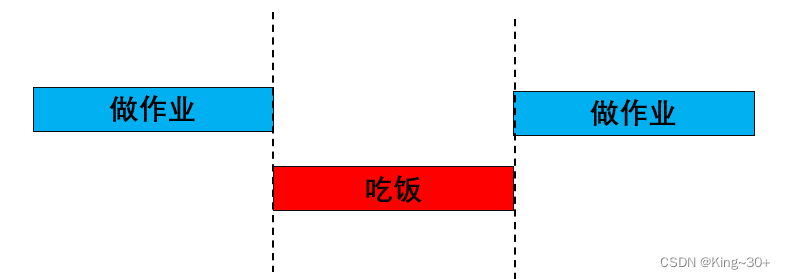
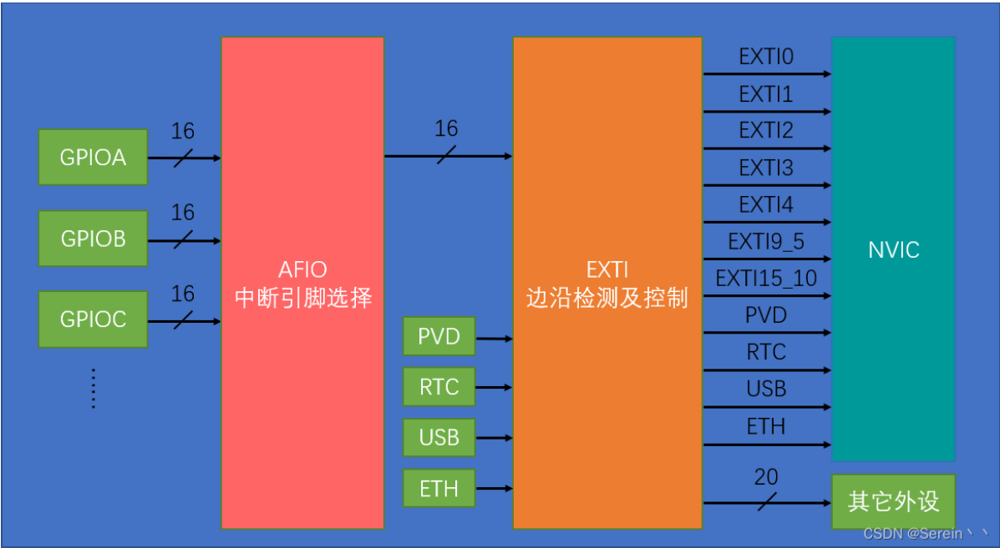
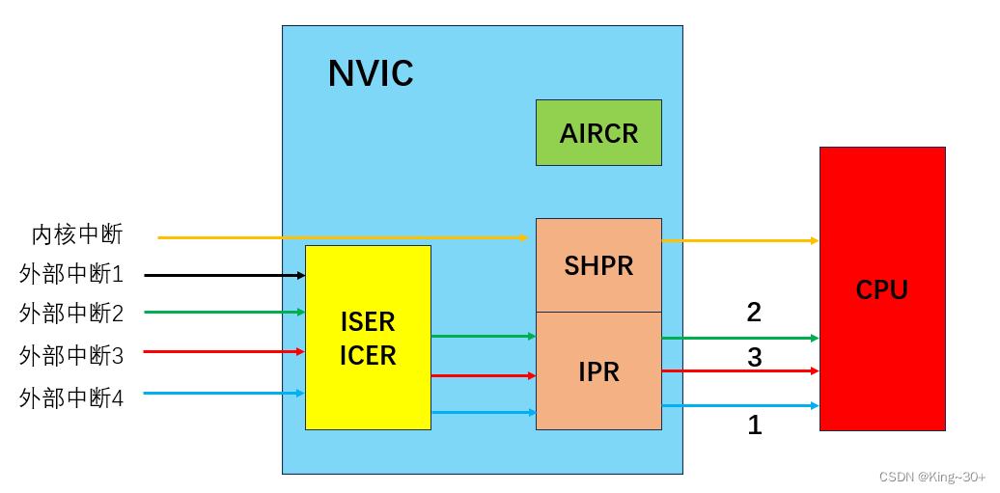
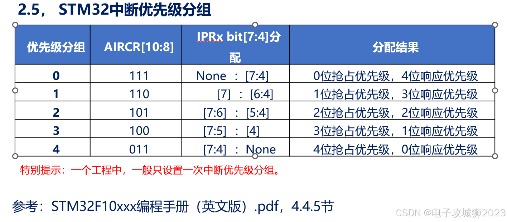
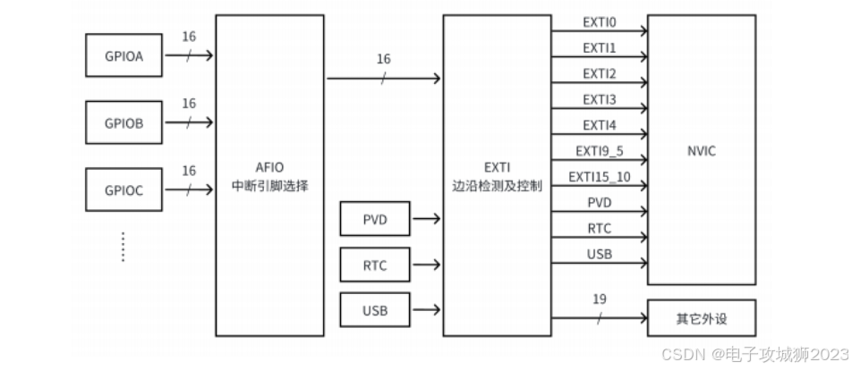
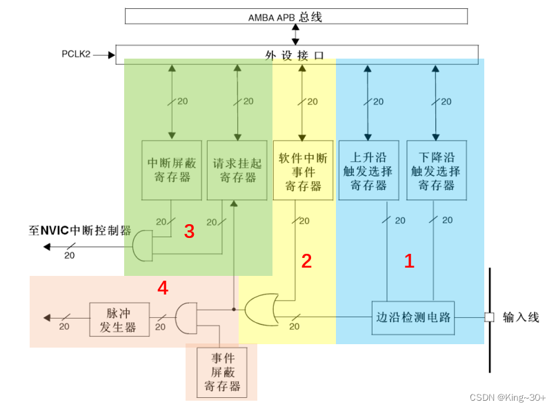
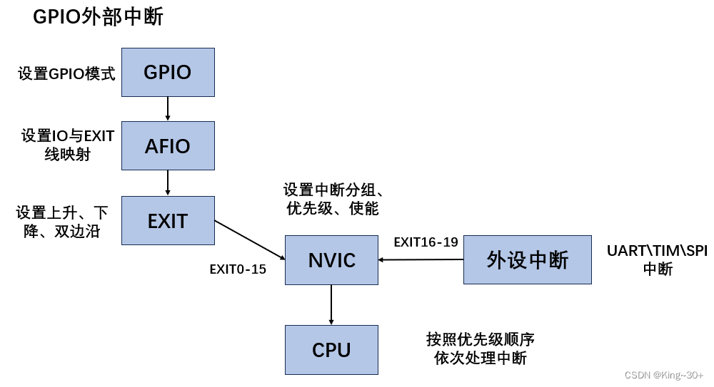

# 中断系统


## 一、什么是中断

中断：打断CPU执行正常的程序，转而去处理更为紧急的程序，然后返回原暂停的程序继续运行。



举例：当你正在写作业时，做到一半又去吃饭，吃完饭后又回来接着原来的作业继续完成。

对于单片机来说，**中断是指CPU正在处理某个事件A，发生了另一件事件B，请求CPU迅速去处理（中断发生）；CPU暂时停止当前的工作（中断响应），转去处理事件B（中断服务）；待CPU处理事件B完成后，再回到原来的事件A（断点）继续执行，这一过程称之为中断。**

>**中断的作用和意义：**
>
>1.实时控制：在确定的时间内对相应事件做出相应；例如：温度控制；
>
>2.故障处理：检测到故障，需要第一时间进行处理；
>
>中断的作用：高效处理紧急程序，并且不会占用CPU资源

## 二、NVIC(中断管家)

### 2.1 NVIC基本概念

​    NVIC 即嵌套向量中断控制器，全称 Nested vectored interrupt controller。属于是内核的器件，其作用是对STM32中的中断进行管理，因为M3内核中的中断数量很多，当同时出现多个中断时，优先处理哪个中断？以及那些中断不处理等，都要靠NVIC 进行控制。M3 内核都是支持 256 个中断，其中包含了 16 个系统中断和 240 个外部中断，并且具有 256 级的可编程中断设置。

### 2.2NVIC基本结构




### 2.3 NVIC工作原理

工作原理图：



>工作过程：
>
>        当外部被出发时，首先进入ICER、ISER寄存器，用于控制是否开对应的中断，打开的中断进入IPR寄存器，进行中断优先级的判断，IPR寄存器受AIRCR寄存器控制，最后按照中断优先级依次进入CPU被执行。
>    
>        内核中断由SHPR寄存器控制，SHPR与IPR寄存器属于同一级别；


### 2.4 中断优先级

> STM32中断优先级基本概念：
>
>1、抢占优先级(pre):高抢占优先级可以打断正在执行的低抢占优先级中断；
>
>2、响应优先级(sub):当抢占优先级相同时，响应优先级高的先执行，但是不能相互打断；
>
>3、抢占优先级和响应优先级都相同的情况下，自然优先级越高的先执行；
>
>4、自然优先级:中断向量表中的优先级；
>
>5、数值越小，表示优先级越高；

### 2.5 STM32中断优先级分组



### 2.6NVIC的使用

```c
/*NVIC中断分组*/
	NVIC_PriorityGroupConfig(NVIC_PriorityGroup_2);				//配置NVIC为分组2


/*NVIC配置*/
	NVIC_InitTypeDef NVIC_InitStructure;						//定义结构体变量
	NVIC_InitStructure.NVIC_IRQChannel = EXTI0_IRQn;			//选择配置NVIC的EXTI0线
	NVIC_InitStructure.NVIC_IRQChannelCmd = ENABLE;				//指定NVIC线路使能
	NVIC_InitStructure.NVIC_IRQChannelPreemptionPriority = 1;	//指定NVIC线路的抢占优先级为1
	NVIC_InitStructure.NVIC_IRQChannelSubPriority = 1;			//指定NVIC线路的响应优先级为1
	NVIC_Init(&NVIC_InitStructure);	
```


## 三、EXTI（外部中断控制）

### 3.1 EXTI基本概念

>1.EXTI 是 External Interrupt 的缩写，表示外部中断事件控制器。EXTI 可以监测指定 GPIO 口的电平信号变化，并在检测到指定条件时，向内核的中断控制器 NVIC 发出中断申请。NVIC 在裁决后，如果满足条件，会中断CPU的主程序，使 CPU 转而执行EXTI 对应的中断服务程序。
>2.EXTI 支持的触发方式：上升沿、下降沿、双边沿或软件触发。
>3.EXTI 支持所有的 GPIO 口，但需要注意的是，相同的 Pin 不能同时触发中断。例如，PA0 和 PB0 不能同时被配置为中断源。
>4.EXTI 提供了 16 个 GPIO_Pin 的中断线，以及额外的中断线如 PVD 输出、RTC 闹钟、USB唤醒和以太网唤醒。
>5.通过适当的配置，EXTI可以实现丰富多样的功能，如响应按键的按下、传感器的状态变化等外部事件。


### 3.2 EXTI基本结构



### 3.3 EXTI工作原理

工作原理图：



>其中按照控制功能划分，共分为4个部分；有两条主线，一条是由输入线到 NVIC 中断控制器（123），一条是由输入线到脉冲发生器（124）。
>
>输入线：是线路的信息输入端，它可以通过配置寄存器设置为任何一个 GPIO 口，或者是一些外设的事件。输入线一般都是存在电平变化的信号。
>
>1、边沿检测电路：上升沿触发选择寄存器和下降沿触发选择寄存器。边沿检测电路以输入线作为信号输入端，如果检测到有边沿跳变就输出有效信号‘1’，就输出有效信号‘1’到标号2部分电路，否则输入无效信号‘0’。边沿跳变的标准在于对两个触发选择寄存器的设置。
>
>2、或门电路：它的两个信号输入端分别是软件中断事件寄存器和边沿检测电路的输入信号。或门电路只要输入端有信号‘1’，就会输出‘1’，所以就会输出 ‘1’到标号3电路和标号4电路。
>
>3、与门电路(标号3):两个信号输入端分别是中断屏蔽寄存器和标号2电路信号。如果中断屏蔽寄存器设置为 0 时，不管从标号2电路输出的信号特性如何，最终标号3电路输出的信号都是 0；假如中断屏蔽寄存器设置为 1 时，最终标号3电路输出的信号才由标号2电路输出信号决定，这样子就可以简单控制 中断屏蔽寄存器 来实现中断的目的。标号4电路输出 ‘1’就会把请求挂起寄存器(EXTI_PR)对应位置 1。
>
>4、与门电路(标号4)：输入端来自标号2电路以及来自于事件屏蔽寄存器。可以简单的控制事件屏蔽寄存器来实现是否产生事件的目的。标号4电路输出有效信号 1 就会使脉冲发生器电路产生一个脉冲，而无效信号就不会使其产生脉冲信号。脉冲信号产生可以给其他外设电路使用，例如定时器，模拟数字转换器等，这样的脉冲信号一般用来触发 TIM 或者 ADC 开始转换。
>
>        产生中断线路目的使把输入信号输入到 NVIC，进一步运行中断服务函数，实现功能。

### 3.4 EXTI的使用


```c
/*AFIO选择中断引脚*/
	GPIO_EXTILineConfig(GPIO_PortSourceGPIOB, GPIO_PinSource0);//将外部中断的0号线映射到GPIOB，即选择PB0为外部中断引脚
	GPIO_EXTILineConfig(GPIO_PortSourceGPIOB, GPIO_PinSource1);//将外部中断的1号线映射到GPIOB，即选择PB1为外部中断引脚
/*EXTI初始化*/
    EXTI_InitTypeDef EXTI_InitStructure;						//定义结构体变量
    EXTI_InitStructure.EXTI_Line = EXTI_Line0 | EXTI_Line1;		//选择配置外部中断的0号线和1号线
    EXTI_InitStructure.EXTI_LineCmd = ENABLE;					//指定外部中断线使能
    EXTI_InitStructure.EXTI_Mode = EXTI_Mode_Interrupt;			//指定外部中断线为中断模式
    EXTI_InitStructure.EXTI_Trigger = EXTI_Trigger_Falling;		//指定外部中断线为下降沿触发
    EXTI_Init(&EXTI_InitStructure);
```


## 四、中断的使用

### 4.1中断的使用步骤



上述中断步骤共有两条线路，一条为GPIO外部中断的工作流程，即**EXIT线（0-15）**的工作流程，另外一条为其他外设中断的工作流程，即**EXIT线（16-19）**的工作流程。 

### 4.2中断服务函数

每开启一个中断，就必须编写其对应的中断服务函数，否则将会导致死机（CPU 将找不到 中断服务函数）。

中断线 0-4，每个中断线对应一个中断函数，中断线 5-9 共用中断函数EXTI9_5_IRQHandler， 中断线 10-15 共用中断函数 EXTI15_10_IRQHandler

示例代码：

```c
void EXTI15_10_IRQHandler(void)  
{  
  if (EXTI_GetITStatus(EXTI_Line11) != RESET)  
  {  
    EXTI_ClearITPendingBit(EXTI_Line11);//清除标志  
    ...  
  }  
}
```


## 五、代码实操

**按键控制LED的亮灭**

### （1）配置GPIO

LED初始化代码如下：

```c
void Led_Init(void)
{	

**//开启GPIOC的时钟**

	RCC_APB2PeriphClockCmd(RCC_APB2Periph_GPIOC, ENABLE);

**//将PC13引脚初始化为推挽输出**

	GPIO_InitTypeDef Led_InitStructure;

	Led_InitStructure.GPIO_Pin = GPIO_Pin_13;
	Led_InitStructure.GPIO_Mode = GPIO_Mode_Out_PP;		//配置为推挽输出
	Led_InitStructure.GPIO_Speed = GPIO_Speed_2MHz;
	GPIO_Init(GPIOC, &Led_InitStructure);

}

void Led_Open(void)
{

**//PC13引脚口置为低电平**

	GPIO_ResetBits(GPIOC, GPIO_Pin_13);
}

void Led_Close(void)
{

**//PC13引脚口置为高电平**

	GPIO_SetBits(GPIOC, GPIO_Pin_13);
}
```


按键初始化代码如下：

```c
void Key_Init(void)
{

**//开启GPIOC的时钟**

	RCC_APB2PeriphClockCmd(RCC_APB2Periph_GPIOA );	

**//将PA1引脚初始化为上拉输入**

	GPIO_InitTypeDef Key_InitStructure;

	Key_InitStructure.GPIO_Pin = GPIO_Pin_1;
	Key_InitStructure.GPIO_Mode = GPIO_Mode_IPU;		//配置为上拉输入
	GPIO_Init(GPIOA, &Key_InitStructure);

}
```


外部中断EXTI的配置代码如下

```c
uint8_t flag = 0;

void Exti_Init(void)
{

	EXTI_InitTypeDef Exti_InitStructure;

	Exti_InitStructure.EXTI_Line = EXTI_Line0;		//选择使能外部线路
	Exti_InitStructure.EXTI_LineCmd = ENABLE;		//定义选中线路的状态
	Exti_InitStructure.EXTI_Mode = EXTI_Mode_Interrupt;		//设置EXTI线路为中断请求
	Exti_InitStructure.EXTI_Trigger = EXTI_Trigger_Rising_Falling;		//设置输入线路上升沿和下降沿为中断请求
	EXTI_Init(&Exti_InitStructure);


	NVIC_InitTypeDef Nvic_InitStructure;

	NVIC_PriorityGroupConfig(NVIC_PriorityGroup_2);         //配置NVIC为分组2

	Nvic_InitStructure.NVIC_IRQChannel = EXTI0_IRQn;		//设置指定通道
	Nvic_InitStructure.NVIC_IRQChannelCmd = ENABLE;		//使能IRQ通道的中断
	Nvic_InitStructure.NVIC_IRQChannelPreemptionPriority = 1;		//设置抢占优先级
	Nvic_InitStructure.NVIC_IRQChannelSubPriority = 1;		//设置子优先级
	NVIC_Init(&Nvic_InitStructure);


}

void EXTI1_IRQHandler(void)		//中断服务函数
{
	if(EXTI_GetITStatus(EXTI_Line1) != RESET)		//判断是否发生中断
	{
		flag = 1 - flag;		//实现标志位翻转
	}
	EXTI_ClearITPendingBit(EXTI_Line1);		//清除中断标志位
}
```


main.c代码如下：

```c
#include "stm32f10x.h"
#include "led.h"
#include "exti.h"
#include "key.h"

int main()
{
	Led_Init();
	Exti_Init();
	Key_Init();
while(1)
	 {
		if(flag)
		{
			Led_Open();
		}
		else
		{
			Led_Close();
		}
	 } 
}
```


