# 1.定时器的分类

​        STM32F1 系列中，除了互联型的产品，共有 **8 个定时器**，分为**基本定时器**，**通用定时器**和**高级定时器**。基本定时器 TIM6 和 TIM7 是一个 16 位的只能向上计数的定时器，只能定时，没有外部IO。通用定时器 TIM2/3/4/5 是一个 16 位的可以向上/下计数的定时器，可以定时，可以输出比较，可以输入捕捉，每个定时器有四个外部 IO。高级定时器 TIM1/8 是一个 16 位的可以向上/下计数的定时器，可以定时，可以输出比较，可以输入捕捉，还可以有三相电机互补输出信号，每个定时器有 8 个外部 IO。

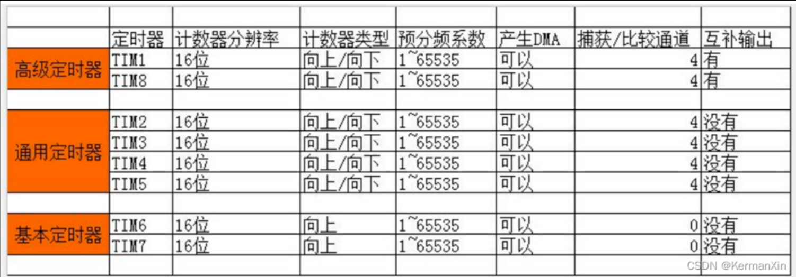

# 2.TIM基本定时器简介

## 	2.1 定时器的概念和作用

​        STM32的TIM定时器是一种硬件计时器，用于在嵌入式系统中生成精确的时间基准。TIM实际上是"Timer/Counter (计时器/计数器) Interface Module"(计时器/计数器接口模块)的缩写。

​    STM32中的TIM定时器通常由一个或多个计数器、预分频器和比较器组成，并具有许多不同的工作模式。这些模式包括向上计数模式、向下计数模式、自动重载模式以及其他特殊模式。

​    计数器是STM32 TIM定时器的核心组件之一。它可以递增或递减，每当计数器计数达到特定值时，就会触发中断或输出信号。计数器可以被设置为向上或向下模式，并且具有可配置的计数位数。

​    预分频器是一个可编程的除法器，用于将外部时钟信号分频以产生所需的计数速度。预分频器的运作方式为：当计时器工作时，输入的时钟信号经过预分频器进行等分频处理，输出给计数器控制计数，从而实现了对计数器工作频率的控制。

​    比较器是另一个重要的组件，用于将计数器的值与预设的比较值进行比较。当两者相等时，可以触发中断或输出信号。通过设置比较器的阈值，可以实现周期性任务等功能。

​    除了以上基本组件，STM32 TIM定时器还提供了许多高级功能，例如输入捕获模式、PWM波形生成模式、编码器模式等。这些功能使得TIM定时器变得更加灵活和功能强大，可适应不同的应用场景。

​    总之，STM32 TIM定时器是一种非常重要的硬件计时器，在嵌入式系统中具有广泛的应用前景。通过配置它的各种参数和模式，我们可以实现各种功能，如延时、频率计数、PWM波形生成等，并提供高精度和可靠性的时间基准。

## 2.2 三类定时器的基本框图

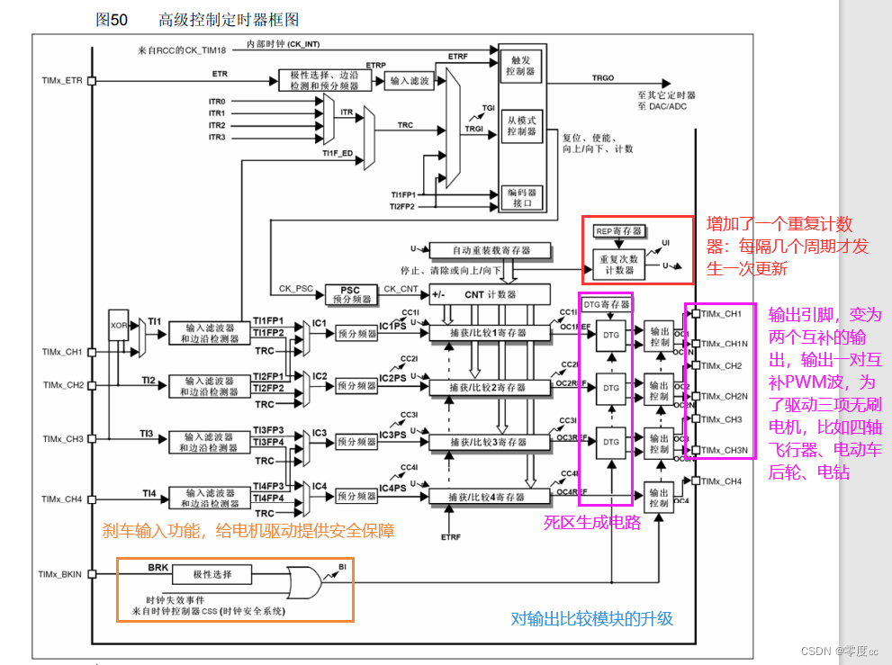


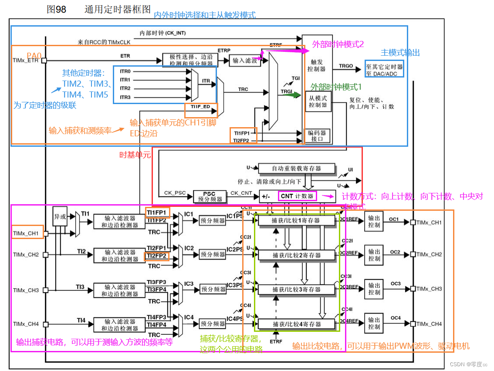


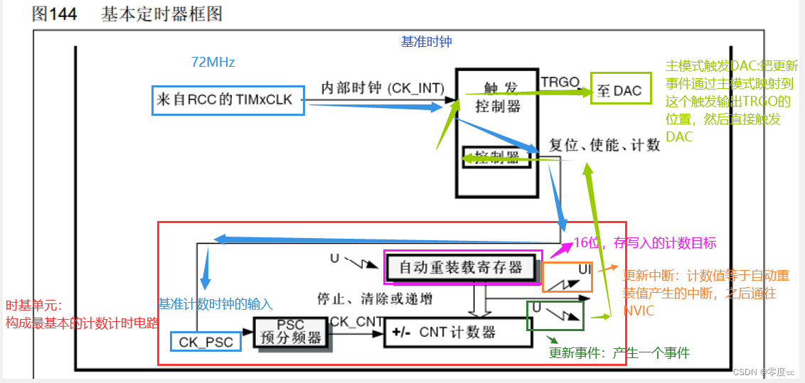

## 2.3 定时中断基本结构

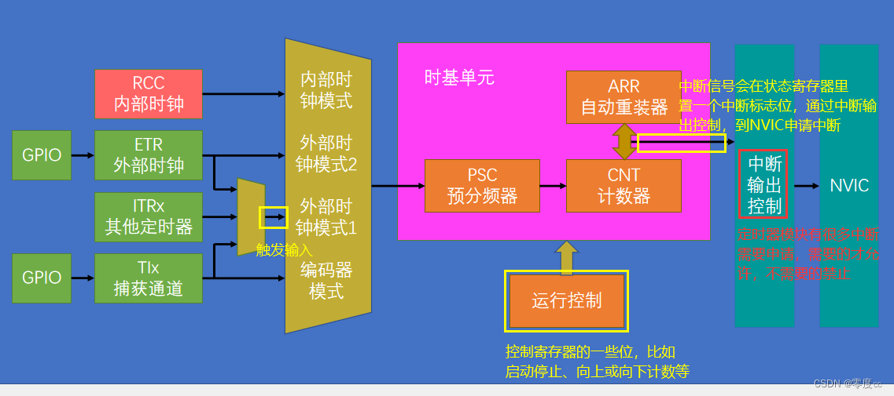

## 2.4 时序

### 2.4.1 预[分频器](https://so.csdn.net/so/search?q=分频器&spm=1001.2101.3001.7020)时序

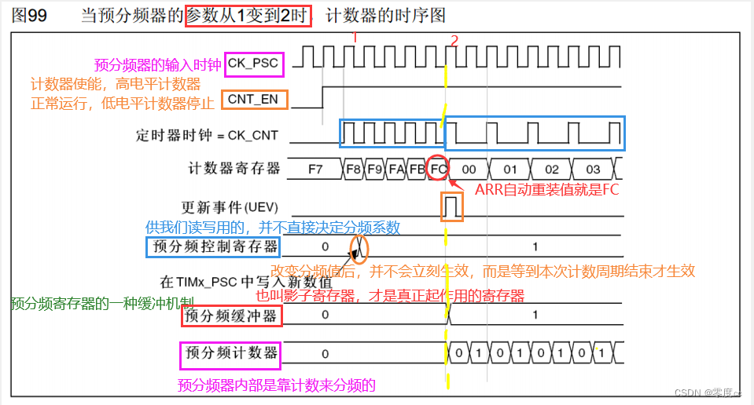

 计数器计数频率：CK_CNT = CK_PSC / (PSC + 1)

​    PSC：预分频器的值

### 2.4.2 计数器时序

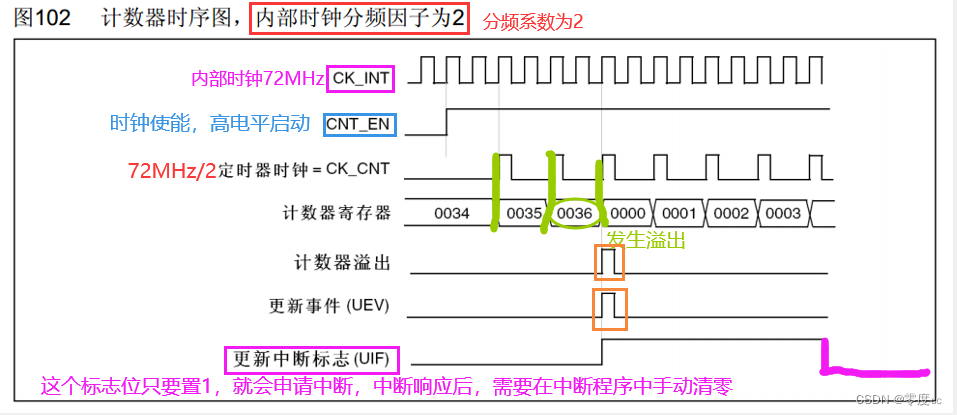


定时器时钟 TIMxCLK，即内部时钟 CK_INT，经 APB1 预分频器后分频提供，如果 APB1 预分频系吧数等于 1，则频率不变，否则频率乘以 2，库函数中 APB1 预分频的系数是 2，即 PCLK1=36M，所以定时器时钟 TIMxCLK=36*2=72M。

计数器溢出频率：CK_CNT_OV = CK_CNT / (ARR + 1)                           

​                                                        = CK_PSC / (PSC + 1) / (ARR + 1)

​    ARR:自动重装载寄存器

### 2.4.3 计数器无预装时序

### （无缓冲寄存器的情况）

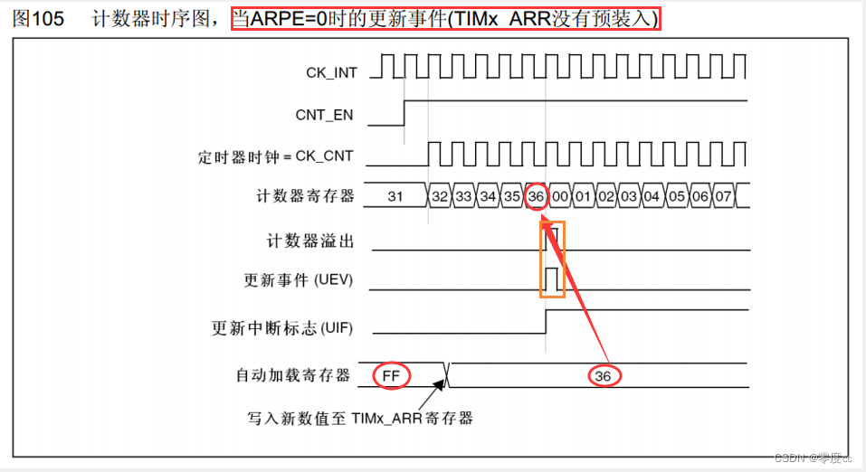

### 2.4.4 计数器有预装时序

### （有缓冲寄存器的情况）

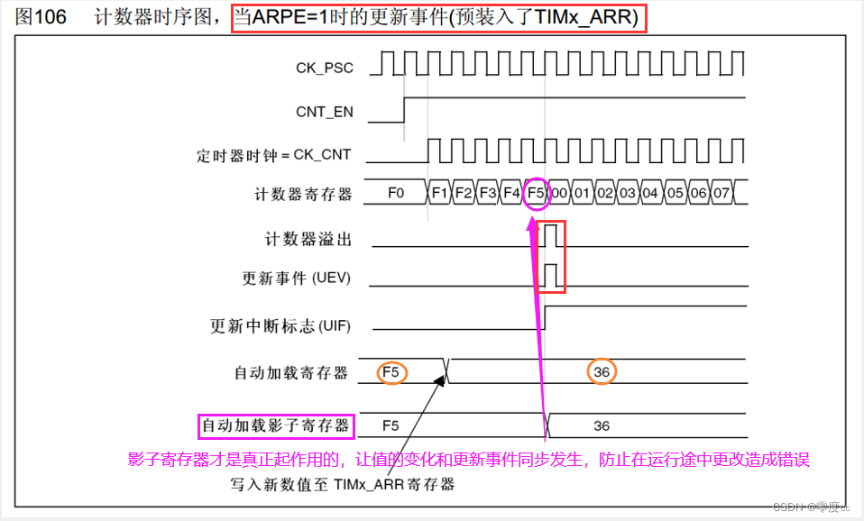

## 2.5 RCC时钟树

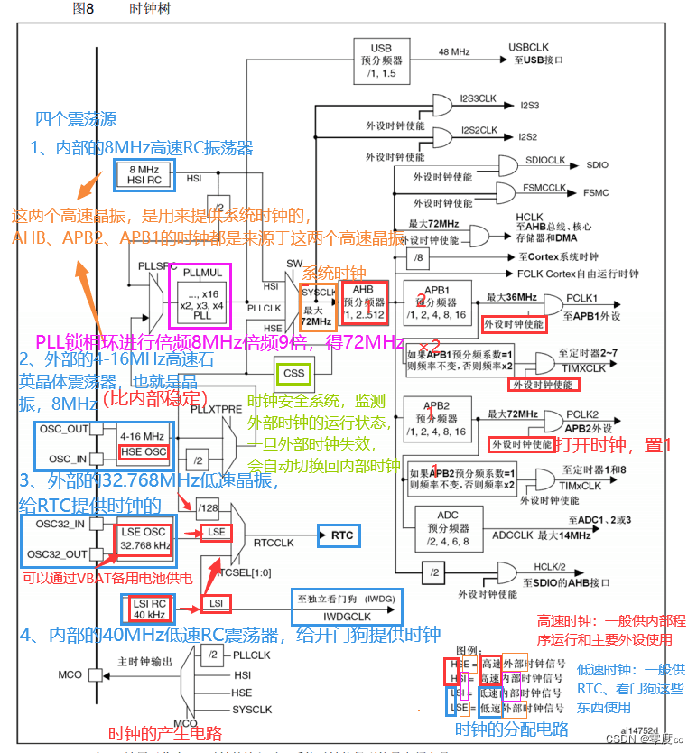

# 3.PWM波

  PWM（脉冲宽度调制）是一种通过调整脉冲宽度来模拟不同电压的技术。在LED灯控制中，通过改变占空比可以实现亮度调节，频率高于50Hz时人眼几乎察觉不到闪烁。对于电机转速控制，占空比决定了电机的平均速度，从而实现调速。舵机控制则通过固定频率和不同占空比的脉冲来改变转角。

脉冲宽度调制(PWM)，是英文“Pulse Width Modulation”的缩写，简称**脉宽调制**，是利用微处理器的数字输出来对模拟电路进行控制的一种非常有效的技术，广泛应用在从测量、通信到功率控制与变换的许多领域中。

**pwm的频率**：

**是指1秒钟内信号从高电平到低电平再回到高电平的次数(一个周期)；**

**也就是说一秒钟PWM有多少个周期**
单位：**Hz**
表示方式：50Hz 100Hz

**pwm的周期：**

**T=1/f**
**周期=1/频率**
50Hz = **20ms** **一个周期**

如果频率为50Hz ，也就是说一个周期是20ms 那么一秒钟就有 50次PWM周期

**占空比**：
**是一个脉冲周期内，高电平的时间与整个周期时间的比例**
单位：**%** (0%-100%)
表示方式：20%

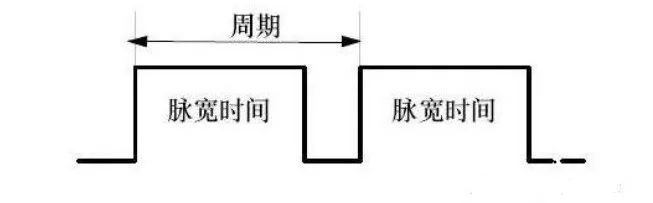
**周期：一个脉冲信号的时间**     1s内测周期次数等于频率
**脉宽时间：高电平时间**

上图中 脉宽时间占总周期时间的比例，就是占空比

**比方说周期的时间是10ms，脉宽时间是8ms 那么低电平时间就是2ms 总的占空比 8/8+2= 80%**

这就是占空比为80%的脉冲信号

而我们知道PWM就是**脉冲宽度调制** 通过调节占空比，就可以调节脉冲宽度(脉宽时间) 而频率 就是单位时间内脉冲信号的次数，频率越大

**以20Hz 占空比为80% 举例 就是1秒钟之内输出了20次脉冲信号 每次的高电平时间为40ms**

我们换更详细点的图

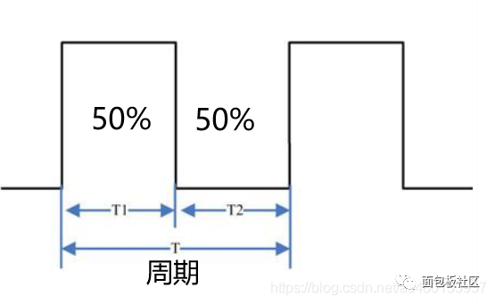
上图中，**周期为T
T1为高电平时间
T2 为低电平时间**

**假设周期T为 1s 那么频率就是 1Hz 那么高电平时间0.5s ，低电平时间0.5s 总的占空比就是 0.5 /1 =50%**

## 3.1 PWM原理

以单片机为例，我们知道，单片机的IO口输出的是**数字信号**，**IO口只能输出高电平和低电平**

假设高电平为5V 低电平则为0V 那么我们要**输出不同的模拟电压**，就要用到PWM，通过改变IO口输出的**方波的占空比**从而获得使用数字信号模拟成的模拟电压信号

我们知道，电压是以一种连接1或断开0的重复脉冲序列被夹到模拟负载上去的（例如LED灯，直流电机等），连接即是直流供电输出，断开即是直流供电断开。通过对连接和断开时间的控制，理论上来讲，可以输出任意不大于最大电压值（即0~5V之间任意大小）的模拟电压

比方说 占空比为50% 那就是高电平时间一半，低电平时间一半，在一定的频率下，就可以得到模拟的2.5V输出电压 那么75%的占空比 得到的电压就是3.75V

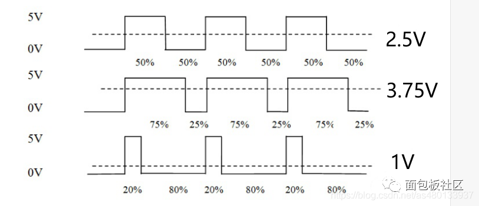

pwm的调节作用来源于对“占周期”的宽度控制，“占周期”变宽，输出的能量就会提高，通过阻容变换电路所得到的平均电压值也会上升，“占周期”变窄，输出的电压信号的电压平均值就会降低，通过阻容变换电路所得到的平均电压值也会下降

也就是，**在一定的频率下，通过不同的占空比 即可得到不同的输出模拟电压**

pwm就是通过这种原理实现D/A转换的。

**总结：
PWM就是在合适的信号频率下，通过一个周期里改变占空比的方式来改变输出的有效电压**

PWM频率越大，相应越快，

## 3.2 PWM输出呼吸灯

那么，PWM信号的实际作用是什么呢？
我们以经常使用的呼吸灯举例：

**一般人眼睛对于80Hz 以上刷新频率则完全没有闪烁感。**

**频率太小的话 看起来就会闪烁**

那么我们平时见到的LED灯，当它的频率大于50Hz的时候，人眼就会产生视觉暂留效果，基本就看不到闪烁了，而是一个常亮的LED灯，

你在1秒内，高电平0.5秒，低电平0.5秒，(**频率1Hz**)如此反复，那么你看到的电灯就会闪烁，

但是如果是10毫秒内，5毫秒打开，5毫秒关闭，(**频率100Hz**) 这时候灯光的亮灭速度赶不上开关速度(LED灯还没完全亮就又熄灭了)，由于视觉暂留作用 人眼不感觉电灯在闪烁，而是感觉灯的亮度少了 因为高电平时间(占空比)为50% 亮度也就为之前的50% ，

**频率很高时，看不到闪烁，占空比越大，LED越亮；
频率很低时，可看到闪烁，占空比越大，LED越亮。**

   PWM波形生成：通过设置计数器的计数周期和比较器的比较值，可以实现周期性的PWM波形输出，并通过比较器的占空比设置，调节PWM波形的占空比，从而控制电机、LED等设备的亮度或速度。

​    周期性任务：通过定时器的中断功能，可以创建周期性任务，例如定时读取温度传感器数据、驱动显示屏幕刷新等操作。

​    总之，STM32 TIM基本定时器是一种非常重要的硬件计时器，在嵌入式系统中具有广泛的应用前景。通过合理配置其参数和模式，可以实现各种延时、计数、PWM波形生成等功能，同时提供高精度、可靠性和稳定性的时间基准。

# 4.配置&函数

 a.时基单元、中断输出控制、运行控制函数

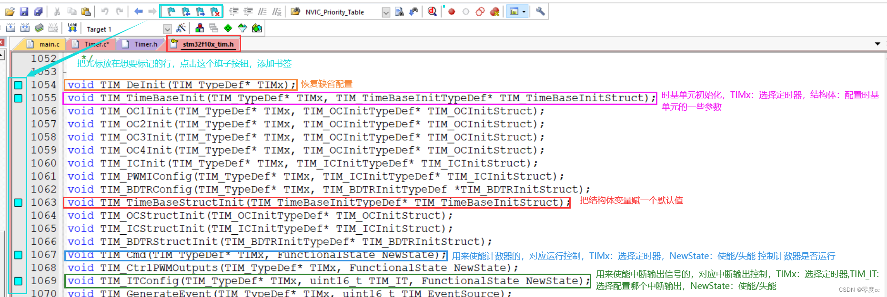

​    b.时钟源选择函数（选择时基单元的时钟）

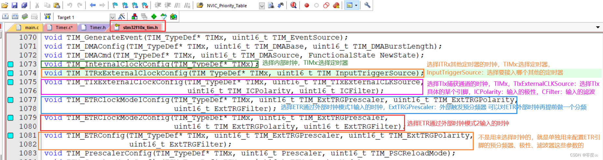

​    c.更改关键参数函数


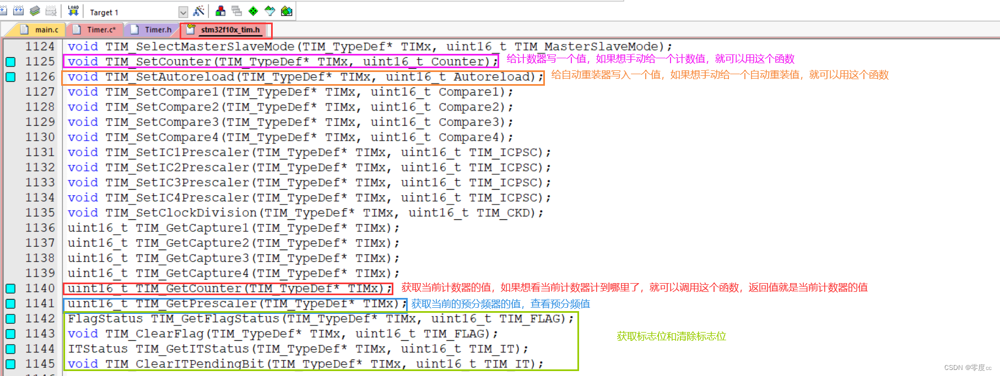

## 4.1 例题

利用TIM3通道1(CH1 PA6)产生频率为9kHz，占空比为25%的PWM波。通道2(CH2 PA7)产生频率为9kHz，占空比为50%的PWM波。

```
void Timer3_Init(u16 psc,u16 arr){
	RCC_APB1PeriphClockCmd(RCC_APB1Periph_TIM3,ENABLE);
	RCC_APB2PeriphClockCmd(RCC_APB2Periph_GPIOB|RCC_APB2Periph_AFIO,ENABLE);//AFIO时钟要开
	

	GPIO_PinRemapConfig(GPIO_PartialRemap_TIM3,ENABLE);//使能TIM3部分重映像

//2-定时器复位
	TIM_DeInit(TIM2);
	
//3-定时器时基初始化，GPIO口初始化
	TIM_TimeBaseInitTypeDef  TIM_TimeBaseInitStructure;
	TIM_TimeBaseInitStructure.TIM_ClockDivision=TIM_CKD_DIV1;//设置时钟分频因子,不分频
	TIM_TimeBaseInitStructure.TIM_CounterMode=TIM_CounterMode_Up;//向上计数
	TIM_TimeBaseInitStructure.TIM_Period=arr;
	TIM_TimeBaseInitStructure.TIM_Prescaler=psc;
	TIM_TimeBaseInit(TIM3,&TIM_TimeBaseInitStructure);
	

	GPIO_InitTypeDef GPIO_InitStructure;
	GPIO_InitStructure.GPIO_Mode=GPIO_Mode_AF_PP;//推挽复用输出，看手册P110
	GPIO_InitStructure.GPIO_Pin=GPIO_Pin_5;//CH2对应哪个引脚，要到手册P120上下去找
	GPIO_InitStructure.GPIO_Speed=GPIO_Speed_50MHz; 
	GPIO_Init(GPIOB,&GPIO_InitStructure);

//4-定时器输出比较OC初始化
TIM_OCInitTypeDef  TIM_OCInitStructure;
TIM_OCInitStructure.TIM_OCMode=TIM_OCMode_PWM2;//PWM模式2，和极性配合设置得到需要到波形，实验6要求从暗到亮，模式2CCR从小变大就对应着低电平时间从少到多，也就是LED灯从暗到亮
TIM_OCInitStructure.TIM_OutputState=TIM_OutputState_Enable;
TIM_OCInitStructure.TIM_Pulse=0;//CCRx的匹配值，0——ARR，CCRx=(ARR+1)*D(D是占空比,是一个百分比)，ARR+1=CCRx/D
TIM_OCInitStructure.TIM_OCPolarity=TIM_OCPolarity_High;
TIM_OC2Init(TIM3,&TIM_OCInitStructure);//CH2

//使能预装载寄存器，避免修改CCR的值影响当前周期的波形（修改后的值在下一个周期生效）
TIM_OC2PreloadConfig(TIM3,TIM_OCPreload_Enable);
//5-使能定时器
TIM_Cmd(TIM3,ENABLE);
}
```

