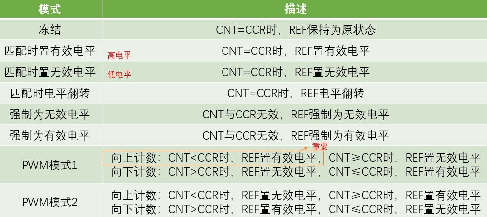

# 1.输出比较

## 1.1基本概念

> * OC（Output Compare）输出比较
> * 输出比较可以通过比较CNT（时基单元里的计数器）与CCR（捕获/比较寄存器）寄存器值的关系，来对输出电平进行置1、置0或翻转的操作，用于输出一定频率和占空比的PWM波形
>
> * 每个高级定时器和通用定时器都拥有4个输出比较通道
> * 基本定时器没有输入捕获和输出比较功能
>
> * 高级定时器的前3个通道额外拥有死区生成和互补输出的功能，用于驱动三相无刷电机
>
> * PWM模式和输出比较模式是不同的，区别在于PWM模式中同一个TIM下所有输出口的频率一致不能单独控制单个频率，而输出比较就弥补了这一缺点，可以对同一个TIM下的各个输出口分别设置频率。

## 1.2输出比较模块

### 1.2.1 输出比较通道的输出部分

### 

1. 输入部分连接的是 CNT 计数器和 CCR1 第一路的捕获/比较寄存器，当 CNT > 或者 = CCR1 时，就会给这个输出模式控制器传一个信号，然后输出模式控制器就会改变它输出 OC1REF（REF：reference 缩写，意思是参考信号） 的高低电平。
2. OC1REF将被分成三路，一路接到从模式控制器，一路接到数据选择器，一路接到死区发生器。在经过死区发生器之后会产生两路带死区的互补信号 OCx_DT 和 OCxN_DT（通道 1~3 才有互补信号，通道 4 没有，其余跟通道1~3 一样），这两路带死区的互补信号然后就进入输出控制电路。
3. 然后进入输出控制电路的信号会被分成两路，一路是原始信号，一路是被反向的信号，具体的由寄存器 CCER 的位 CCxP 和 CCxNP 控制。  如果给寄存器写 0，信号就会往上走，就是信号电平不反转；写 1 的话，信号就会往下走，就是信号通过一个非门取反，那输出信号就是输入信号高低电平反转的信号，这就是极性选择，就是选择是不是要把高低电平反转一下。
4. 接下来是输出使能电路了，选择是否输出，最后就是 OC1 引脚，这个引脚就是 CH1 通道的引脚，具体是哪个GPIO口可在[参考手册](./STM32F10x-中文参考手册.pdf)119页中找到。

### 1.2.2 输出模式控制器



> 模式作用：
>
> * 冻结模式：CNT 和 CCR 无效，REF 保持不变，维持上一个状态即可。
> * 三个匹配时模式：有效电平与无效电平，一般是高级定时器里面的说法，是和关断、刹车这些功能配合表述的(可以直接认为置有效电平就是置高电平，置无效电平就是置低电平。)都是在 CNT = CRR 时，执行操作.
> * 强制输出模式，和冻结模式差不多。如果你想暂停波形输出，并且在暂停期间保持低电平或者高电平，就可以设置这两个强制输出模式。
> * PWM1 模式和 PMW2 模式，可以用于输出频率和占空比都可调的 PWM 波形，是我们主要使用的模式（PWM1 模式下一般我们都只使用向上计数）。
> * PWM2 模式实际上就是 PWM1 模式的取反，改变 PWM1 模式和 PMW2 模式，就只是改变了 REF 电平的极性而已。由于 REF 输出之后还有一个极性的配置，所以使用 PWM1 模式的正极性和 PWM2 模式的反极性最终的输出是一样的。

## 1.3 输出比较代码

### 1.3.1 输出比较初始化

1. RCC开启时钟，把我们要用的 TIM 外设和 GPIO 外设的时候都打开

   ```
   RCC_APB1PeriphClockCmd(RCC_APB1Periph_TIM2, ENABLE);
   //TIM2 是 APB1 总线的外设
   ```

2. 配置时基单元，包括前面的时钟源选择

   ```
   TIM_InternalClockConfig(TIM2);//选择内部时钟
   	
   TIM_TimeBaseInitTypeDef TIMTimeBaseInitStructure;
   TIMTimeBaseInitStructure.TIM_ClockDivision = TIM_CKD_DIV1;
   //指定时钟分频，决定滤波器的采样频率
   TIMTimeBaseInitStructure.TIM_CounterMode = TIM_CounterMode_Up;
   //计数器模式，向上计数
   TIMTimeBaseInitStructure.TIM_Period = 100 - 1;
   //ARR 的值（取值范围0~65535）
   TIMTimeBaseInitStructure.TIM_Prescaler = 720 - 1;
   //PSC 的值（取值范围0~65535）
   TIMTimeBaseInitStructure.TIM_RepetitionCounter = 0;
   //重复计数器的值（高级定时器才有，基本和通用定时器不用写）,不需要用赋值为0
   TIM_TimeBaseInit(TIM2, &TIMTimeBaseInitStructure);
   
   ```

3. 配置输出比较单元（CRR的值，输出比较模式，极性选择，输出使能），用结构体统一配置

   ```
   TIM_OCInitTypeDef TIM_OCInitStructure;
   //有些参数高级定时器才会用到，只列出需要用到的
   TIM_OCStructInit(&TIM_OCInitStructure);
   //给结构体变量赋初始值，函数内部也是手动赋初始值
   TIM_OCInitStructure.TIM_OCMode = TIM_OCMode_PWM1;
   //输出比较模式，强制输出模式不允许初始化时使用
   TIM_OCInitStructure.TIM_OCPolarity = TIM_OCPolarity_High;
   //输出比较极性，高极性，电平不翻转
   TIM_OCInitStructure.TIM_OutputState = TIM_OutputState_Enable;
   //输出状态
   TIM_OCInitStructure.TIM_Pulse = 0;//设置 CCR 寄存器值
   TIM_OC1Init(TIM2, &TIM_OCInitStructure); 
   
   ```

4. 配置GPIO，把 PWM 对应的 GPIO 口初始化为复用推挽输出的配置

   ```
   RCC_APB2PeriphClockCmd(RCC_APB2Periph_GPIOA, ENABLE);
   GPIO_InitTypeDef GPIO_InitStructure;
   GPIO_InitStructure.GPIO_Mode = GPIO_Mode_AF_PP;//复用推挽输出：输出数据寄存器将被断开，输出控制权转移给片上外设，片上外设引脚连接到 TIM2 的 CH1 通道
   GPIO_InitStructure.GPIO_Pin = GPIO_Pin_0;
   GPIO_InitStructure.GPIO_Speed = GPIO_Speed_50MHz;
   GPIO_Init(GPIOA, &GPIO_InitStructure);//GPIO 配置好默认低电平
   ```

5. 运行控制，启动计数器，输出 PWM

   ```
   TIM_Cmd(TIM2, ENABLE);
   ```

### 1.3.2 示例代码

* PWM.c

  ```
  #include "PWM.h"
  
  /*用于PWM初始化*/
  void PWM_Init(void)
  {
  	/*开启时钟*/
  	RCC_APB1PeriphClockCmd(RCC_APB1Periph_TIM2, ENABLE);		//开启TIM2的时钟
  	RCC_APB2PeriphClockCmd(RCC_APB2Periph_GPIOA, ENABLE);		//开启GPIOA的时钟
  	
  	/*GPIO初始化*/
  	GPIO_InitTypeDef GPIO_InitStructure;
  	GPIO_InitStructure.GPIO_Mode = GPIO_Mode_AF_PP;
  	GPIO_InitStructure.GPIO_Pin = GPIO_Pin_1;
  	GPIO_InitStructure.GPIO_Speed = GPIO_Speed_50MHz;
  	GPIO_Init(GPIOA, &GPIO_InitStructure);						
  	//将PA1引脚初始化为复用推挽输出	
  															
  	//受外设控制的引脚，均需要配置为复用模式
  	
  	/*配置时钟源*/
  	TIM_InternalClockConfig(TIM2);		
  	//选择TIM2为内部时钟，若不调用此函数，TIM默认也为内部时钟
  	
  	/*时基单元初始化*/
  	TIM_TimeBaseInitTypeDef TIM_TimeBaseInitStructure;			//定义结构体变量
  	TIM_TimeBaseInitStructure.TIM_ClockDivision = TIM_CKD_DIV1;    
      //时钟分频，选择不分频，此参数用于配置滤波器时钟，不影响时基单元功能
  	TIM_TimeBaseInitStructure.TIM_CounterMode = TIM_CounterMode_Up; 	
  	//计数器模式，选择向上计数
  	TIM_TimeBaseInitStructure.TIM_Period = 20000 - 1;			//计数周期，即ARR的值
  	TIM_TimeBaseInitStructure.TIM_Prescaler = 72 - 1;			//预分频器，即PSC的值
  	TIM_TimeBaseInitStructure.TIM_RepetitionCounter = 0;           
      //重复计数器，高级定时器才会用到
  	TIM_TimeBaseInit(TIM2, &TIM_TimeBaseInitStructure);             
  	//将结构体变量交给TIM_TimeBaseInit，配置TIM2的时基单元
  	
  	/*输出比较初始化*/ 
  	TIM_OCInitTypeDef TIM_OCInitStructure;						//定义结构体变量
  	TIM_OCStructInit(&TIM_OCInitStructure); 
  	/*结构体初始化，若结构体没有完整赋值‘则最好执行此函数，给结构体所有成员都赋一个默认值，
  	避免结构体初值不确定的问题*/
  	TIM_OCInitStructure.TIM_OCMode = TIM_OCMode_PWM1;               
  	//输出比较模式，选择PWM模式1
  	TIM_OCInitStructure.TIM_OCPolarity = TIM_OCPolarity_High;      
      //输出极性，选择为高，若选择极性为低，则输出高低电平取反
  	TIM_OCInitStructure.TIM_OutputState=TIM_OutputState_Enable;   	//输出使能
  	TIM_OCInitStructure.TIM_Pulse = 0;								//初始的CCR值
  	TIM_OC2Init(TIM2, &TIM_OCInitStructure);//将结构体变量交给TIM_OC2Init，配置TIM2的输出比较通道2
  	
  	/*TIM使能*/
  	TIM_Cmd(TIM2, ENABLE);			
  	//使能TIM2，定时器开始运行
  }
  
  /*PWM设置CCR*/
  void PWM_SetCompare2(uint16_t Compare)
  {
  	TIM_SetCompare2(TIM2, Compare);		//设置CCR2的值
  }
  
  
  ```

* PWM.h

  ```
  #include "stm32f10x.h"                  // Device header
  #ifndef __PWM_H
  #define __PWM_H
  
  void PWM_Init(void);
  void PWM_SetCompare2(uint16_t Compare);
  
  #endif
  ```

 # 2.输入捕获

## 2.1基本概念

> * IC（Input Capture）输入捕获
> * 输入捕获模式可以用来测量脉冲宽度或者测量频率
> * STM32 的定时器，除了 TIM6 和 TIM7，其他定时器都有输入捕获功能
> * 输入捕获模式下，当通道输入引脚出现指定电平跳变（产生上升沿、下降沿）时，当前CNT的值将被锁存到CCR中（即把CNT的值读出来，写入CCR中）
> * 每个高级定时器和通用定时器都拥有4个输入捕获通道，和输出比较共用一个引脚与通道，所以同一个定时器只能选择输入捕获和输出比较中的一个，不能同时使用。
> * 可配置为PWMI模式，同时测量频率和占空比
> * 可配合主从触发模式，实现硬件全自动测量（结合上面的功能，能实现硬件全自动测量频率和占空比）

## 2.2硬件电路

### 2.2.1 总述

​	下面这部分就是定时器输入捕获功能的区域，一共有四个通道，其中每一个通道的输入捕获和输出比较是共同用一个通道的，所以二者在同一个通道的时候不能同时使用，另外就是输入捕获可以用一个输入口输入，然后传输给两个定时器通道，这就是输入捕获的PWMI模式，这种模式是可以同时去测量频率和占空比的。

 

### 2.2.2 分步讲解

### 2.2.2.1


图的最左边，是四个通道的引角，根据引脚定义图选择引脚。引脚进来通过一个三输入的异或门（异或门的输入接在通道1、2、3端口，异或门的执行逻辑为当三个输入引脚的任何一个有电平翻转时，输出引脚就产生一次电平翻转)翻转之后输出通过数据选择器到达输入捕获通道1。数据选择器如果选择上面一个,那输入捕获通道1的输入就是三个引脚的异或值;如果选择下面一个那异或门就没有用,四个通道各用各的引脚。

### 2.2.2.2


接下来输入信号来到了输入滤波器和边缘检测器。

* 边缘检测器，和外部中断的一样，可以选择高电平触发或者低电平触发，当出现指定的电平时，边缘检测电路就会触发后续电路执行动作，它其实是设计了两套滤波和边缘检测电路。第一套电路，经过滤波和极性选择，得到Tl1FP1 (Tl1 Filter Polarity 1)输入给通道1的后续电路。第二套电路经过另一个滤波和极性选择，得到Tl1FP2 (Tl1 Filter Polarity 2)输入给下面通道2的后续电路，同理TI2信号进来也经过两套滤波和极性原则。
* 输入滤波器可以对信号进行滤波（TIM_ICInitStructure. TIM_ICFilter用于设置滤波值），避免一些高频的毛刺信号误触发。

> 滤波器工作原理:
>
> 以采样频率对输入信号进行采样，当连续n个值都为高电平，输出才为高电平。连续n个值都为低电平，输出才为低电平。如果你信号出现高频抖动，导致连续采样n个值不全都一样，那输出就不会变化，这样就可以达到滤波的效果。采样频率越低，采样个数n越大，滤波效果就越好。具体参考下图:


### 2.2.2.3


得到T21FP1和T21FP2后，T21FP1输给上面T21FP2输入给下面。两个信号进来可以选择各走各的也可以选择进行一个交叉，让CH2引脚输入给通道1或者CH1引脚输入给通道2。交叉连接首先可以灵活切换后续捕获电路的输入，其次是因为可以把一个引脚的输入，同时映射到两个捕获单元，这是PWMI模式的经典结构。

> PWMI模式：第一个捕获通道使用上升沿触发用来捕获周期，第二个通道使用下降沿触发用来捕获占空比，两个通道同时对一个硬件进行捕获，就可以同时测量频率和占空比。

> 通道三四的用法和通道一二的一样。

### 2.2.2.4


输入信号进行滤波和极性选择后就来到了预分频器，分频之后的触发信号就可以触发捕获电路进行工作了，每来一个触发信号，CNT的值就会向CCR转运一次，转运的同时会发生一个捕获事件，这个事件会在状态寄存器置标志位，同时也可以产生中断。如果需要在捕获的瞬间处理一些事情的话，就可以开启这个捕获中断。

## 2.2输入捕获通道

 

下图是输入捕获通道的结构图。在捕获的过程中计数器CNT的值会一直增加，输入捕获到的信号进入到这个通道的时候，首先输入信号在通道TI1（也就是CH1）会去经过一个滤波器去消减噪声，然后就到了边沿检测器当检测到上升沿或者是下降沿，二者是可以通过CC1P来选择极性（控制上升沿有效还是下降沿有效），当检测到了有效信号的时候就进入到了数据选择器进入到了捕获电路，后面我们可以去用分频器选择分频模式，最后就完成了这一次的捕获，捕获完成了之后CNT的值就会转运到CCR寄存器。

> 每捕获一次CNT的值，都要把CNT清零一下，以便于下一次的捕获

## 2.3主从触发模式

 


主从触发模式就是主模式、从模式和触发源选择这三个功能的简称。

* 其中主模式可以将定时器内部的信号，映射到 TRGO 引脚，用于触发别的外设，简单来说就是发送。
* 从模式就是接受其他外设或者自身外设的一些信号，用于控制自身定时器的运行，也就是被别的信号控制，也就是接收数据后进行预定操作。
* 触发源选择就是选择从模式的触发信号源的，可以认为是从模式的一部分，触发源选择，选择指定的一个信号，得到 TRGI，TRGI 去触发从模式，从模式可以在这个列表里，选择一项操作来自动执行。


如果想让 TI1FP1 信号自动触发 CNT 清零，那触发源选择，就可以选中TI1FP1，从模式执行的操作，就可以选择执行 Reset 的操作，这样 TI1FP1 的信号就可以自动触发从模式，从模式自动清零 CNT，实现硬件全自动测量，这就是主从触发模式的用途。

> 关于信号的具体解释可以看看[参考手册](./STM32F10x-中文参考手册.pdf)283和285页

## 2.4输入捕获基本结构


1. 右上角是时基单元，当时基单元配置后，启动定时器，CNT 就会在预分频之后的这个时钟驱动下，不断自增，这个 CNT 就是测周法用来计数计时的东西，经过预分频之后这个位置的时钟频率，就是驱动 CNT 的标准频率 [fc]()。

   >  可得标准频率 = 72M / 预分频系数

2. 从左下角的看起，输入捕获通道 1 的 GPIO 口，输入一个方波信号经过滤波器和边沿检测，选择 TI1FP1 为上升沿触发，之后输入选择直连的通道，分频器选择不分频，当 TI1FP1 出现上升沿之后，CNT 的当前计数值转运到 CCR1 里。

3. 同时触发源选择，选中 TI1FP1 为触发信号，从模式选择复位操作，这样 TI1FP1 的上升沿，也会通过上面这一路，去触发 CNT 清零。这里需要先转运 CNT 的值到 CCR 里去，再触发从模式给 CNT 清零；或者非阻塞的同时转移，CNT 的值转移到 CCR，同时 0 转移到 CNT 里面去。

### 注意：

* CNT 的值是有上限的，ARR 一般设置为最大 65535，那 CNT 最大也只能计 65535 个数，如果信号频率太低，CNT 计数值可能会溢出。
* 从模式的触发源选择，在这里看到只有 TI1FP1 和 TI2FP2，没有 TI3 和 TI4 信号，所以这里如果想使用从模式自动清零 CNT，就只能用通道 1 和通道 2；对于通道 3 和 通道 4，就只能开启捕获中断，在中断里手动清零了，不过这样，程序就会处于频繁中断的状态，比较消耗软件资源。


### 

* 当检测到信号出现一个上升沿时，CCR1 = CNT（把 CNT 的值转运到 CCR1 里），这是输入捕获自动执行的，然后从模式自动执行计数器清零（ CNT = 0），然后在一个周期之内，CNT 在标准时钟的驱动下，不断自增，并且由于之前清零过了，所以 CNT 从 0 开始不断自增，直到下一次上升沿来临，然后执行相同的操作，CCR1 = CNT， CNT = 0。

* 第二次捕获的时候，CNT 就是两个上升沿之间的计数值，所以当这个电路工作的时候，CCR1 的值，始终保持为最新一个周期的计数值（计数值就是公式中的 N，fc是我们设置的标准频率） fc/N 就是信号的频率，所以当我们想要读取信号的频率时，只需要读取 CCR1 得到 N(使用uint16_t TIM_GetCapture1(TIM_TypeDef* TIMx)这个函数)，再计算 fc/N，就行了，当我们不需要读取的时候，整个电路全自动测量，不需要占用任何软件资源。

## 2.5 输入捕获代码

### 2.5.1 输入捕获初始化

1. RCC开启时钟，把 GPIO 和 TIM 时钟打开

   ```
   TIM_SelectInputTrigger(TIM3, TIM_TS_TI1FP1);
   ```

2. GPIO 初始化，把 GPIO 配置成输入模式（一般选择上拉输入/浮空输入模式)

   ```
   RCC_APB2PeriphClockCmd(RCC_APB2Periph_GPIOA, ENABLE);
   GPIO_InitTypeDef GPIO_InitStructure;
   GPIO_InitStructure.GPIO_Mode = GPIO_Mode_IPU;//看手册100页选择
   GPIO_InitStructure.GPIO_Pin = GPIO_Pin_6;//看手册119页
   GPIO_InitStructure.GPIO_Speed = GPIO_Speed_50MHz;
   GPIO_Init(GPIOA, &GPIO_InitStructure);//GPIO 配置好默认低电平
   ```

3. 配置时基单元，让 CNT 计数器在内部时钟的驱动下自增运行

   ```
   TIM_InternalClockConfig(TIM3);//选择内部时钟
   	
   TIM_TimeBaseInitTypeDef TIMTimeBaseInitStructure;
   TIMTimeBaseInitStructure.TIM_ClockDivision = TIM_CKD_DIV1;
   //指定时钟分频，决定滤波器的采样频率
   TIMTimeBaseInitStructure.TIM_CounterMode = TIM_CounterMode_Up;
   //计数器模式，向上计数
   TIMTimeBaseInitStructure.TIM_Period = 65536 - 1;
   //最好设置大一些，防止计数溢出,这里给出最大值65535
   TIMTimeBaseInitStructure.TIM_Prescaler = 72 - 1;
   //决定测周法的标准频率，需要根据信号频率的分布范围来调整
   TIMTimeBaseInitStructure.TIM_RepetitionCounter = 0;
   //重复计数器的值（高级定时器才有，基本和通用定时器不用写）,不需要用赋值为0
   TIM_TimeBaseInit(TIM3, &TIMTimeBaseInitStructure);
   ```

4. 配置输入捕获单元（包括滤波器、极性、直连通道还是交叉通道、分频器这些参数），用一个结构体统一配置

   ```
   TIM_ICInitTypeDef TIM_ICInitStructure;
   TIM_ICInitStructure.TIM_Channel = TIM_Channel_1;
   //选择通道
   TIM_ICInitStructure.TIM_ICFilter = 0xF;
   //用来配置输入捕获的滤波器
   TIM_ICInitStructure.TIM_ICPolarity = TIM_ICPolarity_Rising;
   //边沿检测与极性选择
   TIM_ICInitStructure.TIM_ICPrescaler = TIM_ICPSC_DIV1;
   //触发信号分频器：不分频就是每次触发都有效，二分频就是每隔一次有效一次，以此类推，不过分频值不能任意指定，由参数决定
   TIM_ICInitStructure.TIM_ICSelection = TIM_ICSelection_DirectTI;
   //选择触发信号从哪个引脚输入
   TIM_ICInit(TIM3, &TIM_ICInitStructure);
   ```

5. 选择从模式的触发源，触发源选择 TI1FP1，这里调用一个库函数，给一个参数就行

   ```
   TIM_SelectInputTrigger(TIM3, TIM_TS_TI1FP1);
   ```

6. 选择触发之后执行的操作，执行 Reset 操作，这里也是调用一个库函数就行

   ```
   TIM_SelectSlaveMode(TIM3, TIM_SlaveMode_Reset);
   ```

7. 开启定时器，CNT 自增运行

   ```
   TIM_Cmd(TIM3, ENABLE);
   ```

### 2.5.2 示例代码：

* IC.c

  ```
  #include "IC.h"
  /*输入捕获初始化函数*/
  void IC_Init(void)
  {
  	/*开启时钟*/
  	RCC_APB1PeriphClockCmd(RCC_APB1Periph_TIM3, ENABLE);		//开启TIM3的时钟
  	RCC_APB2PeriphClockCmd(RCC_APB2Periph_GPIOA, ENABLE);		//开启GPIOA的时钟
  	
  	/*GPIO初始化*/
  	GPIO_InitTypeDef GPIO_InitStructure;
  	GPIO_InitStructure.GPIO_Mode = GPIO_Mode_IPU;
  	GPIO_InitStructure.GPIO_Pin = GPIO_Pin_6;
  	GPIO_InitStructure.GPIO_Speed = GPIO_Speed_50MHz;
  	GPIO_Init(GPIOA, &GPIO_InitStructure);					
  	
  	/*配置时钟源*/
  	TIM_InternalClockConfig(TIM3);		
  	//选择TIM3为内部时钟
  	
  	/*时基单元初始化*/
  	TIM_TimeBaseInitTypeDef TIM_TimeBaseInitStructure;			//定义结构体变量
  	TIM_TimeBaseInitStructure.TIM_ClockDivision = TIM_CKD_DIV1;     
      //时钟分频，选择不分频，此参数用于配置滤波器时钟，不影响时基单元功能
  	TIM_TimeBaseInitStructure.TIM_CounterMode = TIM_CounterMode_Up; 
  	//计数器模式，选择向上计数
  	TIM_TimeBaseInitStructure.TIM_Period = 65536 - 1;           	//计数周期，即ARR的值
  	TIM_TimeBaseInitStructure.TIM_Prescaler = 72 - 1;           	//预分频器，即PSC的值
  	TIM_TimeBaseInitStructure.TIM_RepetitionCounter = 0;
      //重复计数器，高级定时器才会用到
  	TIM_TimeBaseInit(TIM3, &TIM_TimeBaseInitStructure);         	
  	//将结构体变量交给TIM_TimeBaseInit，配置TIM3的时基单元
  	
  	/*输入捕获初始化*/
  	TIM_ICInitTypeDef TIM_ICInitStructure;						//定义结构体变量
  	TIM_ICInitStructure.TIM_Channel = TIM_Channel_1;			//选择配置定时器通道1
  	TIM_ICInitStructure.TIM_ICFilter = 0xF;						
  	//输入滤波器参数，可以过滤信号抖动，此处设为最大
  	TIM_ICInitStructure.TIM_ICPolarity = TIM_ICPolarity_Rising;		
  	//极性，选择为上升沿触发捕获
  	TIM_ICInitStructure.TIM_ICPrescaler = TIM_ICPSC_DIV1;		
  	//捕获预分频，选择不分频，每次信号都触发捕获
  	TIM_ICInitStructure.TIM_ICSelection = TIM_ICSelection_DirectTI;	
  	//输入信号交叉，选择直通，不交叉
  	TIM_ICInit(TIM3, &TIM_ICInitStructure);						
  	//将结构体变量交给TIM_ICInit，配置TIM3的输入捕获通道
  	
  	/*选择触发源及从模式*/
  	TIM_SelectInputTrigger(TIM3, TIM_TS_TI1FP1);				//触发源选择TI1FP1
  	TIM_SelectSlaveMode(TIM3, TIM_SlaveMode_Reset);				
  	//从模式选择复位，即TI1产生上升沿时，会触发CNT归零
  	
  	/*TIM使能*/
  	TIM_Cmd(TIM3, ENABLE);			
  	//使能TIM3，定时器开始运行
  }
  /*获取输入捕获的频率*/
  uint32_t IC_GetFreq(void)
  {
  	return 1000000 / (TIM_GetCapture1(TIM3) + 1);		
  	//测周法得到频率fx = fc / N，这里不执行+1的操作也可
  }
  ```

* IC.h

  ```
  #include "stm32f10x.h"                  // Device header
  #ifndef __IC_H
  #define __IC_H
  
  void IC_Init(void);
  uint32_t IC_GetFreq(void);
  
  #endif
  
  ```

  


