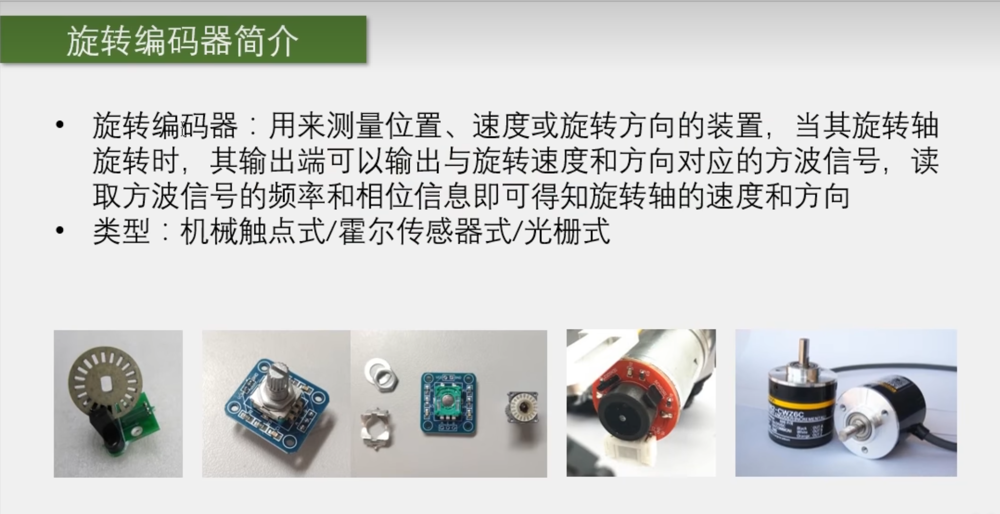
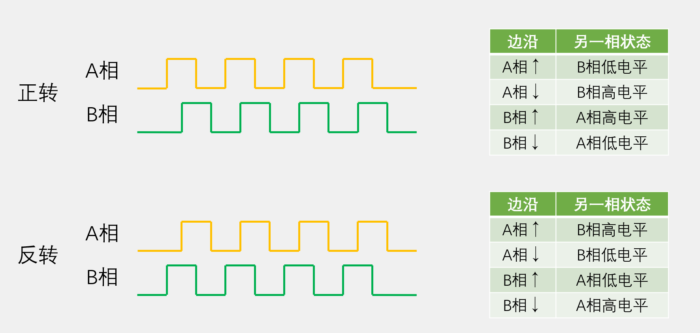
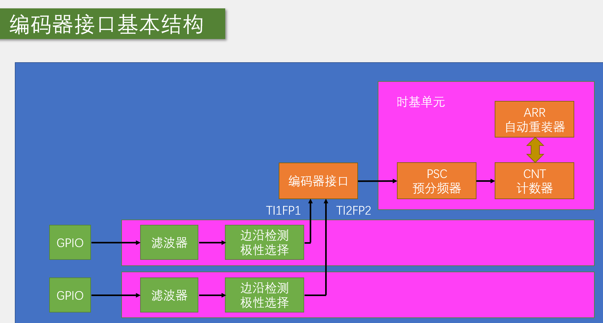
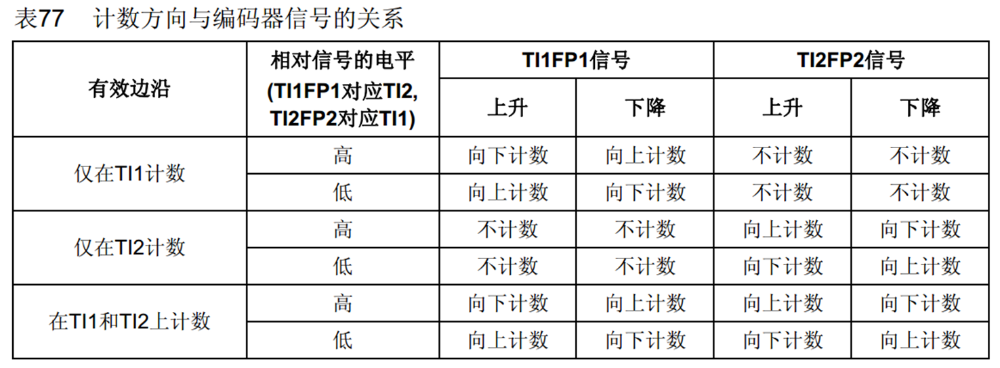

# 目的
 通过定时器的编码器接口，来自动计次（之前使用外部中断进行计次），相比较下，节约软件资源，如果使用外部中断进行计次，当电机高速旋转时，编码器每秒产生成千上万个脉冲，程序会频繁进中断，又只是简单加减，所以对于这种需要频繁执行，操作简单的任务，一般我们会设计一个硬件电路模块来自动完成，而本节的编码器接口就是用来自动给编码器计次的电路

 # 简介
 

1、简述：每个一段时间取一下计值，就可得到编码器旋转速度

2、编码器接口简介：

  - Encoder Interface 编码器接口
  - 编码器接口可接收增量（正交）编码器的信号，根据编码器旋转产生的正交信号脉冲，自动控制CNT自增和自减，从而指示编码器的位置、旋转**方向**和旋转速度
  - 每个高位定时器和通用定时器都拥有1个编码器接口（编码器接口资源比较紧缺，如果一个定时器【TIM】配置为编码接口模式，那它就不能实现其他功能，所以如果编码器过多需要考虑一下资源是否够用，实在不行可以通过外部中断来接编码器）
  - 来个输入引脚接借用了输入捕获的通道1和通道2（需使用每个定时器的CH1和CH2引脚，CH3和CH4不能接编码器）

# 正交编码器

1、正交编码器一般可以测量位置，或者带有方向的速度值，它一般有两个输出引脚，一个是A相，一个是B相

（回到图1中的图（2/3/4）图（2）就是我们常见使用的编码器，里面靠两个金属触点交替导通，可以输出A相和B相两个正交信号，其中四个引脚，上面两个是供电的正负极，下面两个A相和B相的输出，图（3）是电机后面自带的编码器，电机旋转带动之间的磁铁旋转，两个霍尔传感器90度放置，最终输出A相和B相两个正交信号，一般有6根线，最左最右是直接接到电机的，然后靠里的两根是编码器电源线，最中间两根就是A相和B相的输出）




2、上图是正交编码器相位图，当编码器旋转时就会A相和B相就会输出如上方波信号，转的越快，方波频率越高，所以我们就可以取任意一相的信号来测频率来计算旋转速度，但是想要测出旋转方向就需要配合AB两相来读取，正传时，A相提前B相90度，反传时，A相滞后B相90度，当然这个正传的定义不是绝对的，由具体需求规定；当然，你可以使用一个相来测速度，再另外定义一个方向引脚，高电平正向，低电平相反，但是单独的方向引脚与正交信号相比，首先，正交信号AB两相都可以计次，计次频率提高一倍，**精度更高**，其次，正交信号两个信号交替跳变可以设计一个**抗噪声**电路


3、由图可知，正反转时，同一边沿，另一相的状态是相反，所以我们编码器接口的设计逻辑就是，首先吧A相和B相的所有边沿作为计数器的计数时钟，出现边沿信号时，就计数自增或自减，具体由另一相状态来决定，依照上面图2的表格来确定，符合正转就是自增，反之就是自减，这即为是stm32定时器编码器接口的执行逻辑




4、编码器接口基本结构如图所示，A,B接口各接一个[GPIO](https://so.csdn.net/so/search?q=GPIO&spm=1001.2101.3001.7020)，然后分别检测是否是使用上升沿还是下降沿，并选择极性。接着接到编码器接口，初始化编码器




5、如表，前两种计次是在单个边沿变化计数，例如仅在TI1计数就指的是只有在TI1信号的边沿才计算，而第三种是在两个边沿任意变换下就计数，频率即是前两种的双倍，而且可以有效过滤噪声（在一个引脚电平不变，另一个引脚毛刺抖动，计数器就会加减、加减来回摆动，结果计数器的值就会保持原来的值）

# 代码部分

新的库函数：定时器编码器接口配置函数

```c
void TIM_EncoderInterfaceConfig(TIM_TypeDef* TIMx, uint16_t TIM_EncoderMode, uint16_t TIM_IC1Polarity, uint16_t TIM_IC2Polarity)
```

- 第一个参数：选择定时器
- 第二个参数：选择编码器模式
- 第三个参数：选择通道一的电平极性
- 第四个参数：选择通道二的电平极性


**Encoder.c**

```c
#include "stm32f10x.h"                  // Device header

void Encoder_Init(void)
{
	RCC_APB1PeriphClockCmd(RCC_APB1Periph_TIM3, ENABLE);      //第一步：开启时钟
	RCC_APB2PeriphClockCmd(RCC_APB2Periph_GPIOA, ENABLE);
	
	GPIO_InitTypeDef GPIO_InitStructure;
	GPIO_InitStructure.GPIO_Mode = GPIO_Mode_IPU;
	GPIO_InitStructure.GPIO_Pin = GPIO_Pin_6 | GPIO_Pin_7;
	GPIO_InitStructure.GPIO_Speed = GPIO_Speed_50MHz;
	GPIO_Init(GPIOA, &GPIO_InitStructure);
	
//	TIM_InternalClockConfig(TIM3);                            //第二步：选择时基单元的时钟，编码器接口会托管时钟，编码器接口就是一个带方向的外部时钟，所以不需要
	
    TIM_TimeBaseInitTypeDef TIM_TimeBaseInitStructure;        //第三步：配置时基单元
	TIM_TimeBaseInitStructure.TIM_ClockDivision = TIM_CKD_DIV1;
	TIM_TimeBaseInitStructure.TIM_CounterMode = TIM_CounterMode_Up;//计数器模式，这个参数目前也是没有作用，编码器会托管计数方向
	TIM_TimeBaseInitStructure.TIM_Period = 65536 - 1;        //周期ARR     分辨率=1/(ARR+1)*100%
	TIM_TimeBaseInitStructure.TIM_Prescaler = 1 - 1;         //PSC  预分频给0，即不分频，编码器时钟直接驱动计数器
	TIM_TimeBaseInitStructure.TIM_RepetitionCounter = 0;
	TIM_TimeBaseInit(TIM3, &TIM_TimeBaseInitStructure);
	
	TIM_ICInitTypeDef TIM_ICInitStructure;                   //第四步：初始化输入捕获单元
	TIM_ICStructInit(&TIM_ICInitStructure);                  //因为下面删掉结构体俩个配置，使之不完整，为防止出现不确定值而造成问题，所以要用该函数给结构体赋上初始值
	TIM_ICInitStructure.TIM_Channel = TIM_Channel_1;
	TIM_ICInitStructure.TIM_ICFilter = 0xF;                           //滤波器为0xF
//	TIM_ICInitStructure.TIM_ICPolarity = TIM_ICPolarity_Rising;       //(1)
//	TIM_ICInitStructure.TIM_ICPrescaler = TIM_ICPSC_DIV1;             //后面俩个与编码器无关
//	TIM_ICInitStructure.TIM_ICSelection = TIM_ICSelection_DirectTI;   //可以删掉
	TIM_ICInit(TIM3, &TIM_ICInitStructure);
	TIM_ICInitStructure.TIM_Channel = TIM_Channel_2;
	TIM_ICInitStructure.TIM_ICFilter = 0xF;
//	TIM_ICInitStructure.TIM_ICPolarity = TIM_ICPolarity_Rising;       //(2)
	TIM_ICInit(TIM3, &TIM_ICInitStructure);
	
	TIM_EncoderInterfaceConfig(TIM3, TIM_EncoderMode_TI12, TIM_ICPolarity_Rising, TIM_ICPolarity_Rising);  //配置编码器接口  
	// 后面俩个参数是选择IC1和IC2的极性，Rising就是不反相，Falling就是反相,而且其效果与（1）（2）相等，且Encoder函数在ICInit函数下面，即会覆盖ICInit函数，所以可以删掉（1）（2）
	
	TIM_Cmd(TIM3, ENABLE);            //开启定时器  
}

int16_t Encoder_Get(void)
{
	int16_t Temp;
	Temp = TIM_GetCounter(TIM3);
	TIM_SetCounter(TIM3, 0);         //给CNT清零
	return Temp;
}
```


**Encoder.h**

```c
#ifndef __ENCODER_H
#define __ENCODER_H

void Encoder_Init(void);
int16_t Encoder_Get(void);

#endif

```


