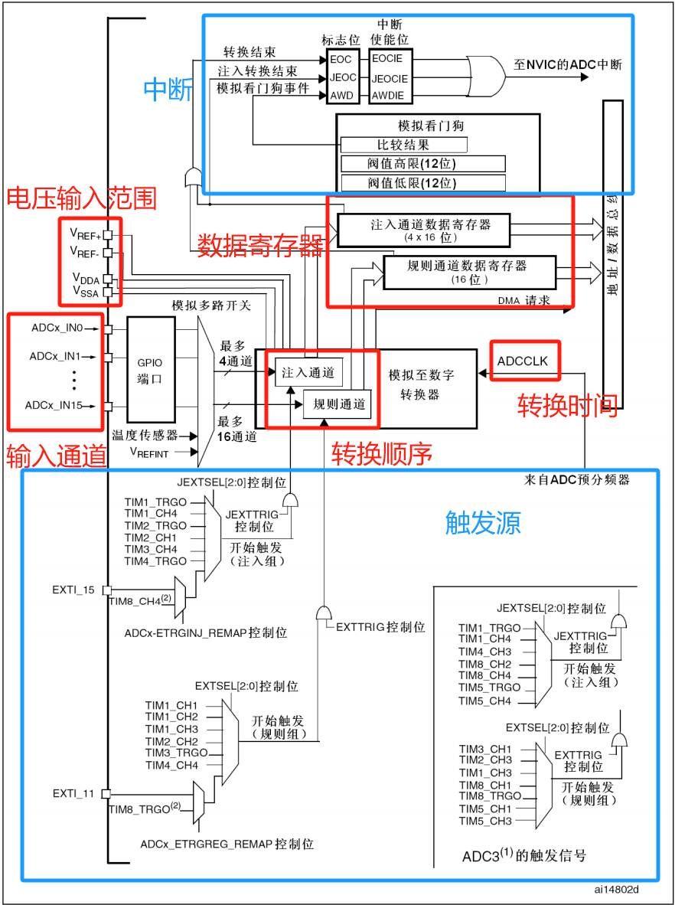
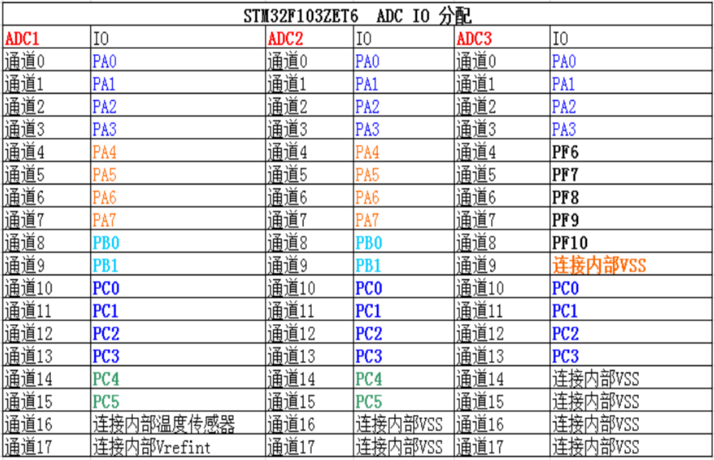
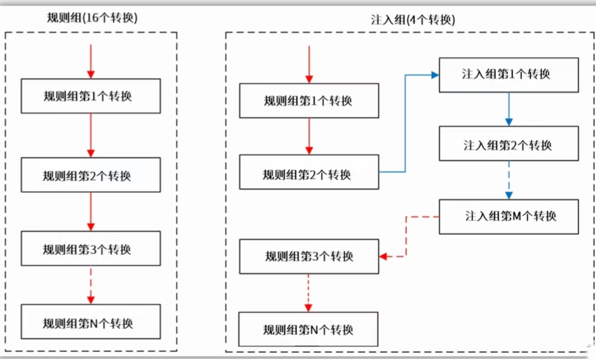
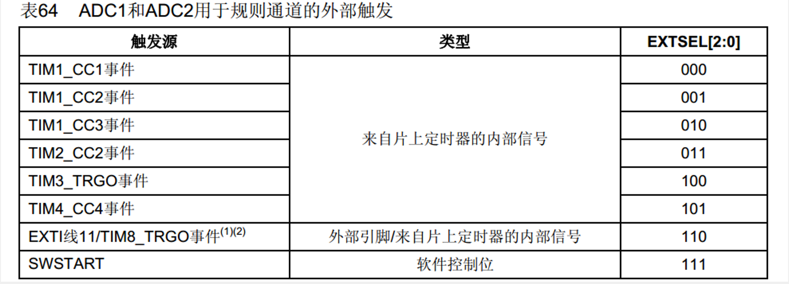
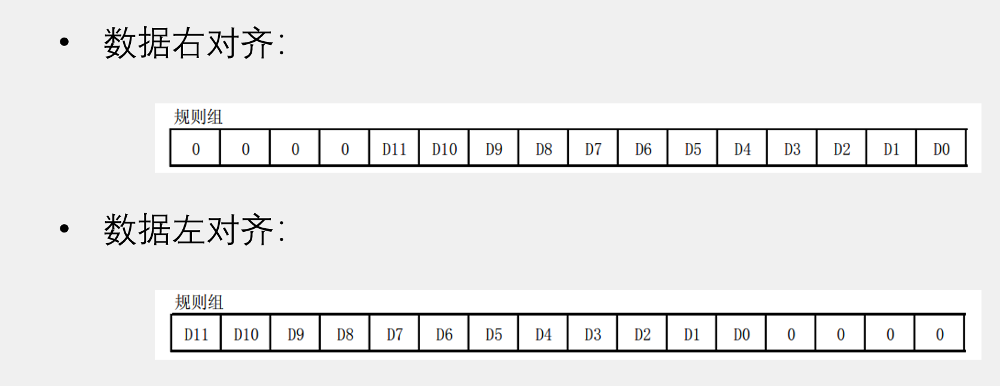

# **ADC**


# 一、实验原理

### 1.ADC简介

>A——模拟信号
>
>D——数字信号
>
>C——转换器

- ADC是指将模拟信号转换成数字信号的过程。通俗理解ADC采样就是采集电路中的电压，通过数值的方式表现出来。

-  STM32F103系列最少都拥有2个ADC

- STM32的ADC是1位(分辨率)逐次逼近型的模拟数字转换器。它有18个通道，可测量16个外部和2个内部信号源。


### 2.ADC框架图



##### 1.电压输入范围

- 这部分提供了 ADC 输入信号的参考电压，用于将模拟信号转换为数字信号。输入电压范围：0~3.3V， 对应的转换结果为0~4095

##### 2.输入通道

- ADC 可以从多个输入通道中选择进行转换。这些输入通道可以连接到外部传感器、电路或其他模拟源。每个 ADC 具有 18 个通道，其中外部通道16个。

	

##### 3.转换顺序

- 转换顺序定义了 ADC 转换的顺序，即每次转换涉及的输入通道的顺序。

- 外部的 16 个通道在转换的时候又分为规则通道和注入通道，其中规则通道最多有 16路，注入通道最多有4路。

	> **规则通道：顾名思意，规则通道就是很规矩的意思，我们平时一般使用的就是这个通道**

	> **注入通道：注入，可以理解为插入，插队的意思，是一种不安分的通道。它是一种在规则通道转换的时候强行插入要转换的一种。**
	
	

- 这跟中断程序很像，规则通道相当于你正常运行的主程序，而注入通道就相当于中断。
- 注入通道的转换可以打断规则通道的转换，在注入通道被转换完成之后，规则通道才得以继续转换。

##### 4.触发源

- 触发源确定ADC何时启动转换。它可以是软件触发（通过代码触发）或外部触发（来自外部信号）。

##### 5.转换时间

- 转换时间是完成一次模拟到数字转换所需的时间。它取决于ADC的时钟频率、分辨率和采样时间等因素。

	>模拟量转换为数字量需要经过采用、量化、编码
	>
	>T~CONV=~采样时间+12.5个周期（量化编码）

- ==ADC模拟电路时钟频率 ADCCLK最大值为14MHz==

##### 6.数据寄存器

- 转换后的数字输出存储在数据寄存器中，以便供微处理器或其他设备使用。

##### 7.中断

- ADC可以在转换完成时生成中断请求，以通知微处理器有新的数据可用。

##### 8.补充

> （1）触发控制
>
> 

> （2）数据对齐
>
> 

> （3）校准
>
> - ADC有一个内置自校准模式。校准可大幅减小因内部电容器组的变化而造成的准精度误差。校准期间，在每个电容器上都会计算出一个误差修正码(数字值)，这个码用于消除在随后的转换中每个电容器上产生的误差。
> - 建议在每次上电后执行一次校准。
> - 启动校准前， ADC必须处于关电状态超过至少两个ADC时钟周期。

# 二、实验步骤

## 1.单路通道

### （1）ADC初始化配置

```c
//1-开启ADC用到的GPIO的时钟，ADC时钟
	RCC_APB2PeriphClockCmd(RCC_APB2Periph_GPIOA|RCC_APB2Periph_ADC1,ENABLE);
	
//2-配置ADC时钟分频系数
	RCC_ADCCLKConfig(RCC_PCLK2_Div6);//APB2是72M，要6分频=12M，保证小于14M
	
//3-初始化GPIO
//将PA1引脚初始化为模拟输入
	GPIO_InitTypeDef GPIO_InitStructure;
	GPIO_InitStructure.GPIO_Mode=GPIO_Mode_AIN;
	GPIO_InitStructure.GPIO_Pin=GPIO_Pin_1;

	GPIO_Init(GPIOA,&GPIO_InitStructure);
	
//4-复位ADC
	ADC_DeInit(ADC1);
	
//5-设置ADC结构体，使用该结构体初始化ADC。配置通道的转换顺序和采样时间
	ADC_InitTypeDef ADC_InitStructure;
	ADC_InitStructure.ADC_ContinuousConvMode=DISABLE;//连续转换模式
	ADC_InitStructure.ADC_DataAlign=ADC_DataAlign_Right;//数据对齐方式 左对齐需要/2^4 右对齐不用还原 方便计算
	ADC_InitStructure.ADC_ExternalTrigConv=ADC_ExternalTrigConv_None;//外部触发转换 关闭 使用软件触发
	ADC_InitStructure.ADC_Mode=ADC_Mode_Independent;//模式  独立模式
	ADC_InitStructure.ADC_NbrOfChannel=1;//<0x10==16 通道数目
	ADC_InitStructure.ADC_ScanConvMode=DISABLE;//扫描转换模式
	ADC_Init(ADC1,&ADC_InitStructure);
//配置规则组通道的转换顺序和采样时间，很易忘记//第三个参数：顺序   第四个：采样时间（随便选 决定采样快慢）
	ADC_RegularChannelConfig(ADC1,ADC_Channel_1,1,ADC_SampleTime_55Cycles5);//每个通道都要用本函数设置一次
	
//6-使能ADC
	ADC_Cmd(ADC1,ENABLE);
	
//7-校准ADC 提高准确度
	ADC_ResetCalibration(ADC1);//复位校准
	while(ADC_GetResetCalibrationStatus(ADC1)==SET);//1:校准寄存器已初始化  0:初始化校准寄存器。
	ADC_StartCalibration(ADC1);//开始校准
	while(ADC_GetCalibrationStatus(ADC1)==SET);//1:校准寄存器已初始化  0:初始化校准寄存器。
	
//8-软件触发ADC，开始转换
	ADC_SoftwareStartConvCmd(ADC1,ENABLE);
```

### （2）获取ADC转换结果函数

```c
u16 Get_AdcValue(void){
	while(ADC_GetFlagStatus(ADC1,ADC_FLAG_EOC)==RESET);//等待转换完成  0:转换未完成   1:转换完成
	return ADC_GetConversionValue(ADC1);//获取转换值  读取DR寄存器会自动清除EOC标志位,固无需手动清除标志位
}

```

### （3）ADC任务执行函数

```
//读取ADC转换结果,输出
//采用多次测量取平均值减小误差
	u16 ADC_Value=0;
	static u8 ADC_ConvTimer=0;//转换次数
	static u16 ADC_Sum=0;//放转换完值的和
	
	ADC_Value=Get_AdcValue();
	ADC_ConvTimer++;
	ADC_Sum+=ADC_Value;
	
// 启动下一次转换
	ADC_SoftwareStartConvCmd(ADC1,ENABLE);
	
	if(ADC_ConvTimer==10){
		ADC_Value=ADC_Sum/10;
		printf("ADC1的通道1转换值：%d \r\n",ADC_Value);
		ADC_ConvTimer=0;
		ADC_Sum=0;
	}
```

## 2.多路通道（DMA读取）

### （1）ADC初始化配置

```c
//1-开启ADC用到的GPIO的时钟，ADC时钟
RCC_APB2PeriphClockCmd(RCC_APB2Periph_GPIOA|RCC_APB2Periph_ADC1|RCC_APB2Periph_GPIOB|RCC_APB2Periph_GPIOC,ENABLE);	
	
//2-配置ADC时钟分频系数，保证小于14M
	RCC_ADCCLKConfig(RCC_PCLK2_Div6);//APB2是72M，要6分频=12M，保证小于14M
	
//3-初始化GPIO
	GPIO_InitTypeDef GPIO_InitStructure;
	
	GPIO_InitStructure.GPIO_Mode=GPIO_Mode_AIN;
	GPIO_InitStructure.GPIO_Pin=GPIO_Pin_1;
	GPIO_Init(GPIOA,&GPIO_InitStructure);
	
	GPIO_InitStructure.GPIO_Mode=GPIO_Mode_AIN;
	GPIO_InitStructure.GPIO_Pin=GPIO_Pin_1;
	GPIO_Init(GPIOB,&GPIO_InitStructure);
	
	GPIO_InitStructure.GPIO_Mode=GPIO_Mode_AIN;
	GPIO_InitStructure.GPIO_Pin=GPIO_Pin_0|GPIO_Pin_1;
	GPIO_Init(GPIOC,&GPIO_InitStructure);
	
//4-复位ADC
	ADC_DeInit(ADC1);	
	
//5-设置ADC结构体，使用该结构体初始化ADC
	ADC_InitTypeDef  ADC_InitStructure;
	ADC_InitStructure.ADC_ContinuousConvMode=ENABLE;//连续转换开启
	ADC_InitStructure.ADC_DataAlign=ADC_DataAlign_Right;//右对齐，数据读出后直接使用，若是左对齐，读出后要除以16再用
	ADC_InitStructure.ADC_ExternalTrigConv=ADC_ExternalTrigConv_None;//不用外部触发
	ADC_InitStructure.ADC_Mode=ADC_Mode_Independent;//独立模式
	ADC_InitStructure.ADC_NbrOfChannel=4;//4个通道
	ADC_InitStructure.ADC_ScanConvMode=ENABLE;//扫描模式，多通道使能
	ADC_Init(ADC1,&ADC_InitStructure);
	
//配置规则组通道的转换顺序和采样时间，考试时容易忘记
	ADC_RegularChannelConfig(ADC1,ADC_Channel_1,1,ADC_SampleTime_55Cycles5);//每个通道都要用本函数设置1次
	ADC_RegularChannelConfig(ADC1,ADC_Channel_9,2,ADC_SampleTime_55Cycles5);//每个通道都要用本函数设置1次
	ADC_RegularChannelConfig(ADC1,ADC_Channel_10,3,ADC_SampleTime_55Cycles5);//每个通道都要用本函数设置1次
	ADC_RegularChannelConfig(ADC1,ADC_Channel_11,4,ADC_SampleTime_55Cycles5);//每个通道都要用本函数设置1次
	
//6-使能ADC、DMA
	ADC_Cmd(ADC1,ENABLE);
	ADC_DMACmd(ADC1,ENABLE);
	
//7-校准ADC
	ADC_ResetCalibration(ADC1);
	while(ADC_GetResetCalibrationStatus(ADC1)==SET){;}//等待复位校准标志变为0(复位校准完成)
	ADC_StartCalibration(ADC1);
	while(ADC_GetCalibrationStatus(ADC1)==SET){;}//等待校准标志变为0(校准完成)	

//8-软件触发ADC，开始转换
	ADC_SoftwareStartConvCmd(ADC1,ENABLE);
```

### （2）DMA初始化

```c
u16 ADC_Value[10][4]={0};//ADC转换值存储数据，10次取平均

void ADCDMAInit(void){
//10-复位DMA，初始化DMA通道参数
	RCC_AHBPeriphClockCmd(RCC_AHBPeriph_DMA1,ENABLE);
	
	DMA_DeInit(DMA1_Channel1);
	
	DMA_InitTypeDef DMA_InitStructure;
	
	DMA_InitStructure.DMA_PeripheralBaseAddr=(u32)(&(ADC1->DR));//DNA传输的外设基地址
	DMA_InitStructure.DMA_MemoryBaseAddr=(u32)ADC_Value;//内存基地址
	DMA_InitStructure.DMA_DIR=DMA_DIR_PeripheralSRC;//设置数据传输方向 外设到内存
	DMA_InitStructure.DMA_BufferSize=40;//一次传输数据量的大小(1-65535)搬运数据量，本次10次取平均，故10
	DMA_InitStructure.DMA_PeripheralInc=DMA_PeripheralInc_Disable;//设置传输外设地址是否递增
	DMA_InitStructure.DMA_MemoryInc=DMA_MemoryInc_Enable;//设置传输数据时内存地址是否递增
	DMA_InitStructure.DMA_PeripheralDataSize=DMA_PeripheralDataSize_HalfWord;//设置传输数据外设的数据长度
	DMA_InitStructure.DMA_MemoryDataSize=DMA_MemoryDataSize_HalfWord;//设置传输数据时内存的数据长度
	DMA_InitStructure.DMA_Mode=DMA_Mode_Circular;//模式 循环搬运
	DMA_InitStructure.DMA_Priority=DMA_Priority_High;//通道优先级
	DMA_InitStructure.DMA_M2M=DMA_M2M_Disable; //是否内存到内存搬运
	
	DMA_Init(DMA1_Channel1,&DMA_InitStructure);
	
//11-使能DMA通道
	DMA_Cmd(DMA1_Channel1,ENABLE);
}

```

### (3)获取ADC转换结果函数

```c
//9-查询转换完成标志位，等待转换完成，读取ADC转换数据
u16 GetADCValue(void){
	while(ADC_GetFlagStatus(ADC1,ADC_FLAG_EOC)==RESET){;}//等待转换完成
	return ADC_GetConversionValue(ADC1);//读取ADC1转换结果
}

```

### (4)ADC任务执行函数

```c
//读取ADC转换结果，输出
//采用多次测量取平均值减小误差
	u16 ADC_Result[4]={0};
	u8 i=0,j=0;
	static u16 ADC_Sum[4]={0}; //多次转换值的和
	for(j=0;j<4;j++)
	{
		for(i=0;i<10;i++)
		{
			ADC_Sum[j]+=ADC_Value[i][j];
		}
		ADC_Result[j] =	ADC_Sum[j]/10;
		ADC_Sum[j]=0;		
	}

	
	printf("ADC1的通道1的转换值：%d \r\n",ADC_Result[0]);
	printf("ADC1的通道9的转换值：%d \r\n",ADC_Result[1]);
	printf("ADC1的通道10的转换值：%d \r\n",ADC_Result[2]);
	printf("ADC1的通道11的转换值：%d \r\n",ADC_Result[3]);
	
//软件触发ADC，再次转换
	ADC_SoftwareStartConvCmd(ADC1,ENABLE);
```

# 三、实操代码

## 1.单通道

system.c

```c
/**
  ******************************************************************************
  * @file    system.c
  * @author  gyx
  * @version V1.0.0
  * @brief   系统初始化及公共函数
  ******************************************************************************
  */

#include "system.h"
#define USART1RecProcessPeriod 15
#define USART2RecProcessPeriod 15
#define ADCTaskPeriod 10 //ADC

/**
  * @brief  代码延时
  * @param  ms 要延时的毫秒数
  * @retval None
	*	@note  for语句的分号是代表空语句，等价于{;}
	*				代码延时不精确	
    */
	  void Delay_ms(u16 ms){
	  u16 i=0;
	  while(ms--){
	  for(i=0;i<11000;i++);//1ms，测出来的值，不准确
	  }
	  }

/**
  * @brief  系统初始化
  * @param  None
  * @retval None
	*	@note  所有系统及外设的初始化都在本函数进行
	*					
    */
	  void SysInit(void){
	  CPU_INT_ENABLE();//开总中断
	  NVIC_PriorityGroupConfig(NVIC_PriorityGroup_2);//设置中断优先级分组
	  UsartInit();//串口初始化
	  ExtiInit();//EXTI的初始化
	  //……所有用到的外设到初始化都要放到这里来
	  //……
	  MyAdc_Init();
	  SystickInit();//滴答时钟初始化
	  }

void TaskInit(void){//任务执行时间（周期）赋初值
	USART1RecProcessTimer=USART1RecProcessPeriod;
	USART2RecProcessTimer=USART2RecProcessPeriod;
	ADCTaskTimer=ADCTaskPeriod;	
}

void ADCTask(void){
	if(ADCTaskTimer) return;
	ADCTaskTimer=ADCTaskPeriod;
	
	//读取ADC转换结果,输出
	//采用多次测量取平均值减小误差
	u16 ADC_Value=0;
	static u8 ADC_ConvTimer=0;//转换次数
	static u16 ADC_Sum=0;//放转换完值的和
	
	ADC_Value=Get_AdcValue();
	ADC_ConvTimer++;
	ADC_Sum+=ADC_Value;
	
	// 启动下一次转换
	ADC_SoftwareStartConvCmd(ADC1,ENABLE);
	
	if(ADC_ConvTimer==10){
		ADC_Value=ADC_Sum/10;
		printf("ADC1的通道1转换值：%d \r\n",ADC_Value);
		ADC_ConvTimer=0;
		ADC_Sum=0;
	}

}

void TaskRun(void){//所有任务调用
	ADCTask();
}

```

ADC.c

```c
/**
  ******************************************************************************
  * @file    ADC.c
  * @author  gyx
  * @version V1.0.0
  * @brief   ADC相关函数,初始化、读取转换结果函数等
  ******************************************************************************
  */

//1-开启ADC用到的GPIO的时钟，ADC时钟
//2-配置ADC时钟分频系数，保证小于14M
//3-初始化GPIO
//4-复位ADC
//5-初始化ADC结构体，配置规则组通道的转换顺序和采样时间
//6-使能ADC，使能ADC_DMA
//7-校准ADC
//8-软件触发ADC，开始转换
//9-查询转换完成标志位，等待转换完成，读取ADC转换数据

#include "config.h"
#include "ADC.h"

void MyAdc_Init(void){
	
//1-开启ADC用到的GPIO的时钟，ADC时钟
	RCC_APB2PeriphClockCmd(RCC_APB2Periph_GPIOA|RCC_APB2Periph_ADC1,ENABLE);
	
//2-配置ADC时钟分频系数
	RCC_ADCCLKConfig(RCC_PCLK2_Div6);//APB2是72M，要6分频=12M，保证小于14M
	
//3-初始化GPIO
//将PA1引脚初始化为模拟输入
	GPIO_InitTypeDef GPIO_InitStructure;
	GPIO_InitStructure.GPIO_Mode=GPIO_Mode_AIN;
	GPIO_InitStructure.GPIO_Pin=GPIO_Pin_1;

	GPIO_Init(GPIOA,&GPIO_InitStructure);
	
//4-复位ADC
	ADC_DeInit(ADC1);
	
//5-设置ADC结构体，使用该结构体初始化ADC。配置通道的转换顺序和采样时间
	ADC_InitTypeDef ADC_InitStructure;
	ADC_InitStructure.ADC_ContinuousConvMode=DISABLE;//连续转换模式
	ADC_InitStructure.ADC_DataAlign=ADC_DataAlign_Right;//数据对齐方式 左对齐需要/2^4 右对齐不用还原 方便计算
	ADC_InitStructure.ADC_ExternalTrigConv=ADC_ExternalTrigConv_None;//外部触发转换 关闭 使用软件触发
	ADC_InitStructure.ADC_Mode=ADC_Mode_Independent;//模式  独立模式
	ADC_InitStructure.ADC_NbrOfChannel=1;//<0x10==16 通道数目
	ADC_InitStructure.ADC_ScanConvMode=DISABLE;//扫描转换模式
	ADC_Init(ADC1,&ADC_InitStructure);
//配置规则组通道的转换顺序和采样时间，很易忘记//第三个参数：顺序   第四个：采样时间（随便选 决定采样快慢）
	ADC_RegularChannelConfig(ADC1,ADC_Channel_1,1,ADC_SampleTime_55Cycles5);//每个通道都要用本函数设置一次
	
//6-使能ADC
	ADC_Cmd(ADC1,ENABLE);
	
//7-校准ADC 提高准确度
	ADC_ResetCalibration(ADC1);//复位校准
	while(ADC_GetResetCalibrationStatus(ADC1)==SET);//1:校准寄存器已初始化  0:初始化校准寄存器。
	ADC_StartCalibration(ADC1);//开始校准
	while(ADC_GetCalibrationStatus(ADC1)==SET);//1:校准寄存器已初始化  0:初始化校准寄存器。
	
//8-软件触发ADC，开始转换
	ADC_SoftwareStartConvCmd(ADC1,ENABLE);

}

//9-查询转换完成标志位，等待转换完成，读取ADC转换数据
//获取结果
u16 Get_AdcValue(void){
	while(ADC_GetFlagStatus(ADC1,ADC_FLAG_EOC)==RESET);//等待转换完成  0:转换未完成   1:转换完成
	return ADC_GetConversionValue(ADC1);//获取转换值  读取DR寄存器会自动清除EOC标志位,固无需手动清除标志位
	
}

```

ADC.h

```
#ifndef __ADC_H__
#define __ADC_H__
#include "config.h"

void MyAdc_Init(void);
u16 Get_AdcValue(void);


#endif


```


## 2.多通道（DMA）

system.c

```c
/**
  ******************************************************************************
  * @file    system.c
  * @author  gyx
  * @version V1.0.0
  * @brief   系统初始化及公共函数
  ******************************************************************************
  */

#include "system.h"
#define USART1RecProcessPeriod 15
#define USART2RecProcessPeriod 15
#define ADCTaskPeriod 10 //用来ADC转换结果读取和输出

/**
  * @brief  代码延时
  * @param  ms 要延时的毫秒数
  * @retval None
	*	@note  for语句的分号是代表空语句，等价于{;}
	*				代码延时不精确	
  */
void Delay_ms(u16 ms){
	u16 i=0;
	while(ms--){
	for(i=0;i<11000;i++);//1ms，测出来的值，不准确
	}
}

/**
  * @brief  系统初始化
  * @param  None
  * @retval None
	*	@note  所有系统及外设的初始化都在本函数进行
	*					
  */
void SysInit(void){
	CPU_INT_ENABLE();//开总中断
	NVIC_PriorityGroupConfig(NVIC_PriorityGroup_2);//设置中断优先级分组
	UsartInit();//串口初始化
	ExtiInit();//EXTI的初始化
	//……所有用到的外设到初始化都要放到这里来
	//……
	ADCInit();
	ADCDMAInit();
	SystickInit();//滴答时钟初始化
}

void TaskInit(void){//任务执行时间（周期）赋初值
	USART1RecProcessTimer=USART1RecProcessPeriod;
	USART2RecProcessTimer=USART2RecProcessPeriod;
	ADCTaskTimer=ADCTaskPeriod;
}

void ADCTask(void){
	if(ADCTaskTimer) return;
	ADCTaskTimer=ADCTaskPeriod;
//读取ADC转换结果，输出
//采用多次测量取平均值减小误差
	u16 ADC_Result[4]={0};
	u8 i=0,j=0;
	static u16 ADC_Sum[4]={0}; //多次转换值的和
	for(j=0;j<4;j++)
	{
		for(i=0;i<10;i++)
		{
			ADC_Sum[j]+=ADC_Value[i][j];
		}
		ADC_Result[j] =	ADC_Sum[j]/10;
		ADC_Sum[j]=0;		
	}

	printf("ADC1的通道1的转换值：%d \r\n",ADC_Result[0]);
	printf("ADC1的通道9的转换值：%d \r\n",ADC_Result[1]);
	printf("ADC1的通道10的转换值：%d \r\n",ADC_Result[2]);
	printf("ADC1的通道11的转换值：%d \r\n",ADC_Result[3]);
	
//软件触发ADC，再次转换
	ADC_SoftwareStartConvCmd(ADC1,ENABLE);
}

void TaskRun(void){//所有任务调用
	ADCTask();
}

```

ADC.c

```c
/**
  ******************************************************************************
  * @file    ADC.c
  * @author  gyx
  * @version V1.0.0
  * @brief   ADC相关函数,初始化、读取转换结果函数等
  ******************************************************************************
  */

//1-开启ADC用到的GPIO的时钟，ADC时钟
//2-配置ADC时钟分频系数，保证小于14M
//3-初始化GPIO
//4-复位ADC
//5-初始化ADC结构体，配置规则组通道的转换顺序和采样时间
//6-使能ADC，使能ADC_DMA
//7-校准ADC
//8-软件触发ADC，开始转换

//9-查询转换完成标志位，等待转换完成，读取ADC转换数据

//10-使能DMA时钟，复位DMA，初始化DMA通道参数

//11-使能DMA通道


#include "ADC.h"
void ADCInit(void){
//1-开启ADC用到的GPIO的时钟，ADC时钟
	RCC_APB2PeriphClockCmd(RCC_APB2Periph_GPIOA|RCC_APB2Periph_ADC1|RCC_APB2Periph_GPIOB|RCC_APB2Periph_GPIOC,ENABLE);	
	
//2-配置ADC时钟分频系数，保证小于14M
	RCC_ADCCLKConfig(RCC_PCLK2_Div6);//APB2是72M，要6分频=12M，保证小于14M
	
//3-初始化GPIO
	GPIO_InitTypeDef GPIO_InitStructure;
	
	GPIO_InitStructure.GPIO_Mode=GPIO_Mode_AIN;
	GPIO_InitStructure.GPIO_Pin=GPIO_Pin_1;
	GPIO_Init(GPIOA,&GPIO_InitStructure);
	
	GPIO_InitStructure.GPIO_Mode=GPIO_Mode_AIN;
	GPIO_InitStructure.GPIO_Pin=GPIO_Pin_1;
	GPIO_Init(GPIOB,&GPIO_InitStructure);
	
	GPIO_InitStructure.GPIO_Mode=GPIO_Mode_AIN;
	GPIO_InitStructure.GPIO_Pin=GPIO_Pin_0|GPIO_Pin_1;
	GPIO_Init(GPIOC,&GPIO_InitStructure);
	
//4-复位ADC
	ADC_DeInit(ADC1);	
	
//5-设置ADC结构体，使用该结构体初始化ADC
	ADC_InitTypeDef  ADC_InitStructure;
	ADC_InitStructure.ADC_ContinuousConvMode=ENABLE;//连续转换开启
	ADC_InitStructure.ADC_DataAlign=ADC_DataAlign_Right;//右对齐，数据读出后直接使用，若是左对齐，读出后要除以16再用
	ADC_InitStructure.ADC_ExternalTrigConv=ADC_ExternalTrigConv_None;//不用外部触发
	ADC_InitStructure.ADC_Mode=ADC_Mode_Independent;//独立模式
	ADC_InitStructure.ADC_NbrOfChannel=4;//4个通道
	ADC_InitStructure.ADC_ScanConvMode=ENABLE;//扫描模式，多通道使能
	ADC_Init(ADC1,&ADC_InitStructure);
	
//配置规则组通道的转换顺序和采样时间，考试时容易忘记
	ADC_RegularChannelConfig(ADC1,ADC_Channel_1,1,ADC_SampleTime_55Cycles5);//每个通道都要用本函数设置1次
	ADC_RegularChannelConfig(ADC1,ADC_Channel_9,2,ADC_SampleTime_55Cycles5);//每个通道都要用本函数设置1次
	ADC_RegularChannelConfig(ADC1,ADC_Channel_10,3,ADC_SampleTime_55Cycles5);//每个通道都要用本函数设置1次
	ADC_RegularChannelConfig(ADC1,ADC_Channel_11,4,ADC_SampleTime_55Cycles5);//每个通道都要用本函数设置1次
	
//6-使能ADC、ADC_DMA
	ADC_Cmd(ADC1,ENABLE);
	ADC_DMACmd(ADC1,ENABLE);
	
//7-校准ADC
	ADC_ResetCalibration(ADC1);
	while(ADC_GetResetCalibrationStatus(ADC1)==SET){;}//等待复位校准标志变为0(复位校准完成)
	ADC_StartCalibration(ADC1);
	while(ADC_GetCalibrationStatus(ADC1)==SET){;}//等待校准标志变为0(校准完成)	

//8-软件触发ADC，开始转换
	ADC_SoftwareStartConvCmd(ADC1,ENABLE);
}

u16 ADC_Value[10][4]={0};//ADC转换值存储数据，10次取平均

void ADCDMAInit(void){
//10-使能DMA时钟，复位DMA，初始化DMA通道参数
	RCC_AHBPeriphClockCmd(RCC_AHBPeriph_DMA1,ENABLE);
	
	DMA_DeInit(DMA1_Channel1);
	
	DMA_InitTypeDef DMA_InitStructure;
	
	DMA_InitStructure.DMA_PeripheralBaseAddr=(u32)(&(ADC1->DR));//DNA传输的外设基地址
	DMA_InitStructure.DMA_MemoryBaseAddr=(u32)ADC_Value;//内存基地址
	DMA_InitStructure.DMA_DIR=DMA_DIR_PeripheralSRC;//设置数据传输方向 外设到内存
	DMA_InitStructure.DMA_BufferSize=40;//一次传输数据量的大小(1-65535)搬运数据量，本次10次取平均，故10
	DMA_InitStructure.DMA_PeripheralInc=DMA_PeripheralInc_Disable;//设置传输外设地址是否递增
	DMA_InitStructure.DMA_MemoryInc=DMA_MemoryInc_Enable;//设置传输数据时内存地址是否递增
	DMA_InitStructure.DMA_PeripheralDataSize=DMA_PeripheralDataSize_HalfWord;//设置传输数据外设的数据长度
	DMA_InitStructure.DMA_MemoryDataSize=DMA_MemoryDataSize_HalfWord;//设置传输数据时内存的数据长度
	DMA_InitStructure.DMA_Mode=DMA_Mode_Circular;//模式 循环搬运
	DMA_InitStructure.DMA_Priority=DMA_Priority_High;//通道优先级
	DMA_InitStructure.DMA_M2M=DMA_M2M_Disable; //是否内存到内存搬运
	
	DMA_Init(DMA1_Channel1,&DMA_InitStructure);
	
//11-使能DMA通道
	DMA_Cmd(DMA1_Channel1,ENABLE);
}

//9-查询转换完成标志位，等待转换完成，读取ADC转换数据
u16 GetADCValue(void){
	while(ADC_GetFlagStatus(ADC1,ADC_FLAG_EOC)==RESET){;}//等待转换完成
	return ADC_GetConversionValue(ADC1);//读取ADC1转换结果
}

```

ADC.h

```c
#ifndef __ADC_H__
#define __ADC_H__
#include "config.h"
void ADCInit(void);
void ADCDMAInit(void);
u16 GetADCValue(void);

extern u16 ADC_Value[10][4];

#endif

```

