# USART


##  一、实验原理

### （一）通信的介绍

#### 1、通信的目的与协议
​	对于STM32，通信就是将一个设备的数据传输到另一个设备，和我们平时沟通一致，需要共同的语言，所以STM32的通信也需要制定相关的通信协议，双方按照协议规则进行数据收发。

通信协议主要有以下几种：

| 名称  | 引脚                 | 通信方式 | 时钟 |
| ----- | -------------------- | -------- | ---- |
| USART | TX、RX               | 全双工   | 异步 |
| I2C   | SCL、SDA             | 半双工   | 同步 |
| SPI   | SCLK、MOSI、MISO、CS | 全双工   | 同步 |
| CAN   | CAN_H、CAN_L         | 半双工   | 异步 |
| USB   | DP、DM               | 半双工   | 异步 |

#### 2、串口通信

​	串口是一种应用十分广泛的通讯接口，串口成本低、容易使用、通信线路简单，可实现两个设备的互相通信


### （二）通信的分类

#### 1.数据通信方式

​	通信按数据通信方式分类，可分为串行通信和并行通信两种，示意图如下：

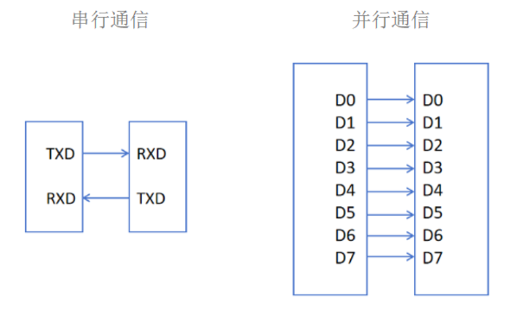

**（1）串行通信**：数据按位顺序依次传输，如8个数据位依次传输，速度慢，但占用引脚资源少。

> **补充：**
>
> - **单工**：数据传输只支持数据在一个方向上传输。（只收不发或者只发不收，模式固定）
> - **单双工**：允许数据在两个方向上传输，但是在某一时刻，只允许数据在一个方向上传输。（能发能收，但不能同时进行）
> - **全双工**：允许数据同时在两个方向上传输。（能发能收，且能同时进行）

**（2）并行通信**：数据各个位同时传输，如8个数据位同时传输，占用引脚资源多，但速度快。

#### 2.同步方式

​	通信按同步方式分类，可分为同步通信和异步通信两种，主要区别在于数据同步方式和时钟信号的使用。

##### （1）同步通信

* **时钟信号驱动**

​	同步通信依赖一个**共同的时钟信号**来同步发送方和接收方的数据传输。该时钟信号**通常由发送方提供**，并通过**单独的一根时钟线传输**。数据的采样时刻通常是**在时钟信号的上升沿或下降沿进行的**，确保了发送和接收过程中的同步性。

* **数据传输**

​	在同步通信中，由于数据传输是基于时钟信号进行同步的，传输的数据**大部分都是有效数据**，没有额外的同步标识符，这使得**同步通信的效率较高**。典型的同步通信协议包括SPI和I2C。

##### （2）异步通信

* **时钟信号驱动**

​	异步通信**不依赖外部时钟信号**，而是在数据流中**嵌入同步信息**，如起始位和停止位，以实现发送和接收的同步。数据传输速率通常在通信双方提前约定，并通过硬件或软件进行配置。

* **数据传输**

​	异步通信中的数据传输通常包含起始位、数据位、校验位和停止位。这些**额外的标识符**用于同步和错误检测，导致**数据传输效率相对较低**。UART是异步通信的一种典型协议。


### （三）USART的介绍

**简介：**

* USART是一种通用同步/异步收发器，也是一种串行通信接口。 
* USART是 STM32 内部集成的硬件外设，可根据数据寄存器的一个字节数据自动生成数据帧时序，从 Tx 引脚发送出去，也可自动接收 Rx 引脚的数据帧时序，拼接为一个字节数据存在数据寄存器里。
* 支持同步模式（clk 时钟输出），硬件流控制（防止接收端处理慢而导致数据丢失的问题）
* STM32F103C8T6 USART资源： USART1、 USART2、 USART3

**串口参数：**

> * 波特率：串口通信的速率，一般设置为9600/115200。
>
> * 起始位：标志一个数据帧的开始，固定为低电平
>
> * 数据位：数据帧的有效载荷，1为高电平，0为低电平，低位先行，可配置数据位长度（8/9）
>
> * 校验位：用于数据验证，根据数据位计算得来，可选检验位（无校验/奇校验/偶校验）
>
> * 停止位：用于数据帧间隔，固定为高电平，可配置停止位长度（0.5-2）


### （四）功能框图

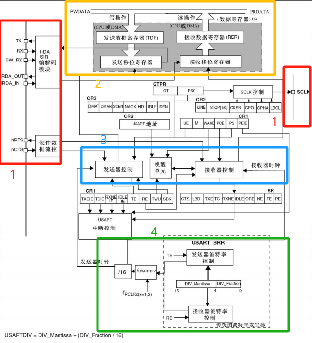

#### 1、功能引脚

>上图标1的框图部分各引脚功能解释如下：
>
>| 引脚  |                             功能                             |
>| :---: | :----------------------------------------------------------: |
>|  TX   |                       发送数据输出引脚                       |
>|  RX   |                       接收数据输入引脚                       |
>| SW_RX | 数据接收引脚，只用于单线和智能卡模式，属于内部引脚，没有具体外部引脚 |
>| nRTS  | 请求以发送 (Request To Send)，n 表示低电平有效。如果使能 RTS流控制，当 USART接收器准备好接收新数据时就会将 nRTS 变成低电平;当接收寄存器已满时，nRTS 将被设置为高电平。该引脚只适用于硬件流控制 |
>| nCTS  | 清除以发送 (Clear To Send)，n 表示低电平有效。如果使能 CTS 流控制，发送器在发送下一帧数据之前会检测 nCTS 引脚，如果为低电平，表示可以发送数据，如果为高电平则在发送完 当前数据帧之后停止发送。该引脚只适用于硬件流控制 |
>| SCLK  |         发送器时钟输出引脚。这个引脚仅适用于同步模式         |

#### 2、数据寄存器

>​	USART_DR 包含了已发送的数据或者接收到的数据。USART_DR 实际是包含了两个寄存器，一个专门用于发送的可写 TDR ，一个专门用于接收的可读 RDR。当进行发送操作时，往 USART_DR 写入数据会自动存储在 TDR 内；当进行读取操作时，向 USART_DR读取数据会自动提取 RDR 数据。
>
>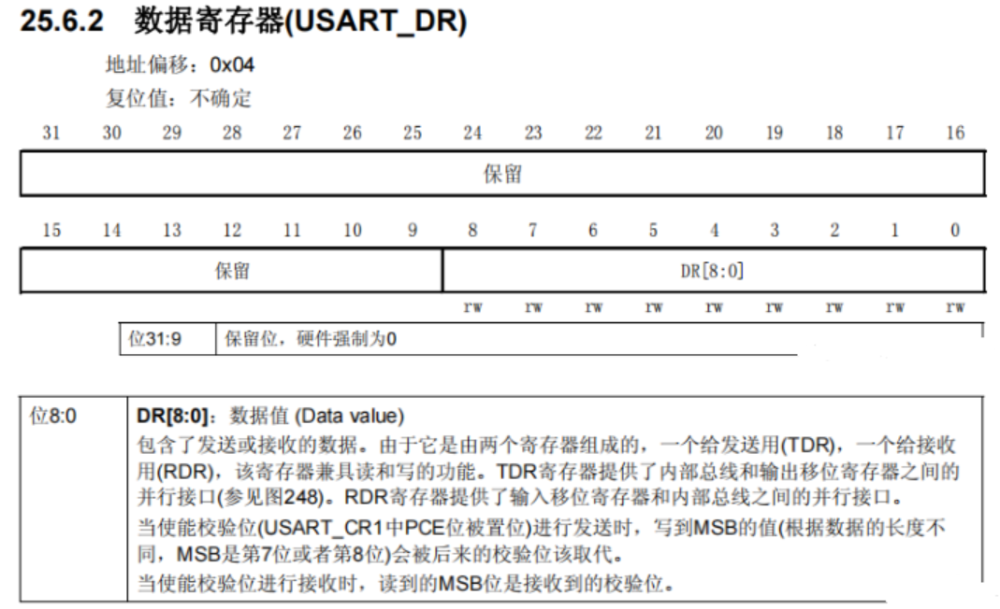
>
>​	TDR 和 RDR 都是介于系统总线和移位寄存器之间。串行通信是一个位一个位传输的，发送时把TDR 内容转移到发送移位寄存器，然后把移位寄存器数据每一位发送出去，接收时把接收到的每一位顺序保存在接收移位寄存器内然后才转移到 RDR。
>
>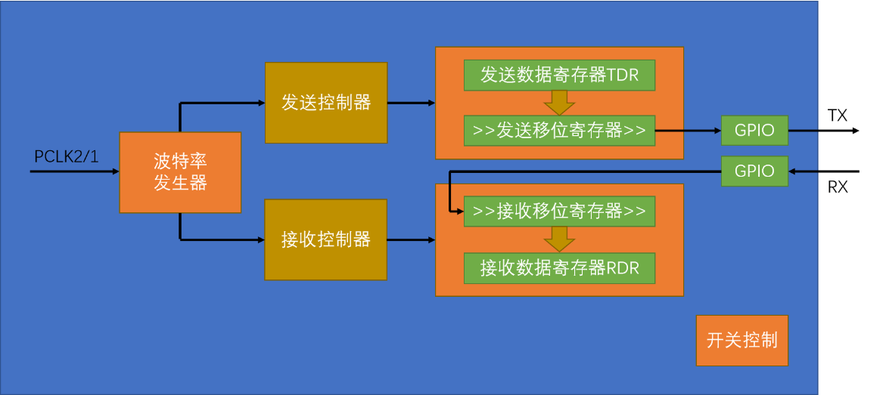

#### 3、控制器

> ​	USART 有专门控制发送的发送器、控制接收的接收器，还有唤醒单元、中断控制等等。使用 USART 之前需要向 USART_CR1 寄存器的 UE 位置 1 使能 USART，UE 位用来开启供给给串口的时钟。
>
> ​	USART 数据寄存器 (USART_DR) 只有低 9 位有效，并且第 9 位数据是否有效要取决于 USART 控制寄存器 1 (USART_CR1)的 M 位设置，当 M 位为 0 时表示 8 位数据字长，当M 位为 1 表示 9 位数据字长，我们一般使用 8 位数据字长。
>
> 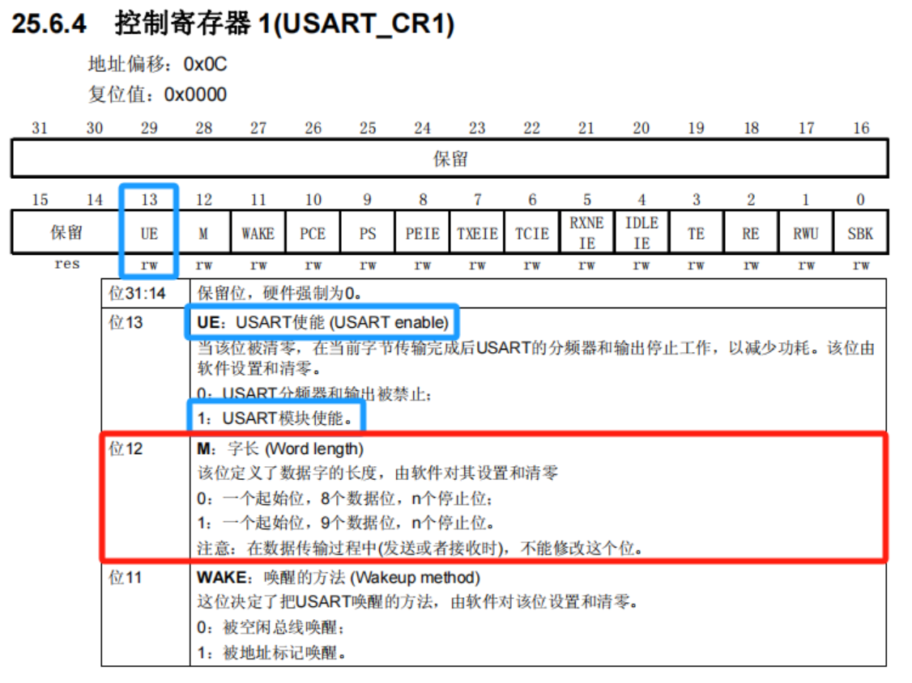
>
> **发送器**
>
> ​	当 USART_CR1 寄存器的发送使能位 TE 置 1 时，启动数据发送，发送移位寄存器的数据会在 TX 引脚输出，低位在前，高位在后。如果是同步模式 SCLK 也输出时钟信号。
>​        一个字符帧发送需要三个部分：起始位 + 数据帧 + 停止位。起始位是一个位周期的低电平，位周期就是每一位占用的时间；数据帧就是我们要发送的 8 位或 9 位数据，数据是从最低位开始传输的；停止位是一定时间周期的高电平。
> ​        停止位时间长短是可以通过 USART 控制寄存器 2(USART_CR2) 的 STOP[1:0] 位控制，可选 0.5个、1 个、1.5 个和 2 个停止位。默认使用 1 个停止位。2 个停止位适用于正常 USART 模式、单线模式和调制解调器模式。0.5 个和 1.5 个停止位用于智能卡模式。
> 
> ​	当选择 8 位字长，使用 1 个停止位时，具体发送字符时序图见下图。
>
> 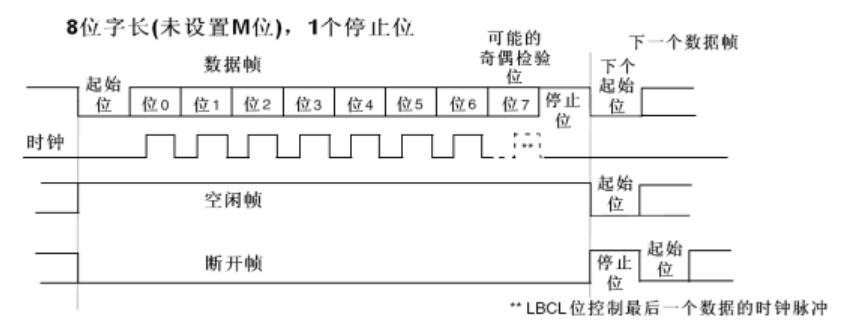
>
> 当发送使能位 TE 置 1 之后，发送器开始会先发送一个空闲帧 (一个数据帧长度的高电平)，接下来就可以往 USART_DR 寄存器写入要发送的数据。在写入最后一个数据后，需要等待 USART 状态寄存器 (USART_SR) 的 TC 位为 1，表示数据传输完成，如果 USART_CR1 寄存器的 TCIE 位置1，将产生中断。 
>
> 在发送数据时，编程的时候有几个比较重要的标志位我们来总结下。
>
> | 名称 | 描述                                   |
>| ---- | -------------------------------------- |
> | TE   | 发送使能                               |
> | TXE  | 发送寄存器为空，发送单个字节的时候使用 |
> | TC   | 发送完成，发送多个字节数据的时候使用   |
> | TXIE | 发送完成中断使能                       |
> 
> **接收器**
>
> ​	如果将 USART_CR1 寄存器的 RE 位置 1，使能 USART 接收，使得接收器在 RX 线开始搜索起始位。在确定到起始位后就根据 RX 线电平状态把数据存放在接收移位寄存器内。接收完成后就把接收移位寄存器数据移到 RDR 内，并把 USART_SR 寄存器的 RXNE 位置 1，同时如果USART_CR2 寄存器的 RXNEIE 置 1 的话可以产生中断。
>
> 在接收数据时，编程的时候有几个比较重要的标志位我们来总结下。
>
> | 名称   | 描述             |
>| ------ | ---------------- |
> | RE     | 接收使能         |
> | RXNE   | 读数据寄存器非空 |
> | RXNEIE | 接收完成中断使能 |
> 
> **对于这一部分大家可以去查一下手册，体会也更深。**

#### 4、波特率发生器

> ​	波特率是指每秒钟传输的符号数或信号单元的数量，单位是波特。一个波特可以包含一个或多个比特。而USART波特率计算公式如下:
>
> ​	Tx / Rx 波特率 = fCK / ( 16 * USARTDIV )
>
> * 这里的fCK指的是外设给的时钟（PCLK1用于USART2/3/4/5，PCLK2用于USART1）
>* USARTDIV 是一个存放在波特率寄存器 (USART_BRR)的一个无符号定点数。
> * 其中 DIV_Mantissa[11:0] 位 定义 USARTDIV 的 整数 部分，DIV_Fraction[3:0] 位定义 USARTDIV 的小数部分。
> 
> 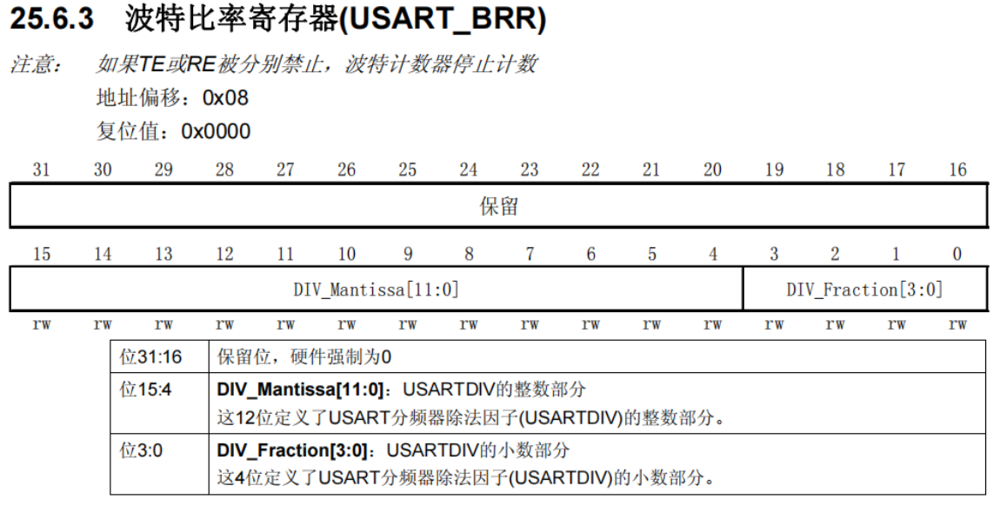


### （五）串口数据相关时序

#### 1、8数据位，无校验位，1位停止位

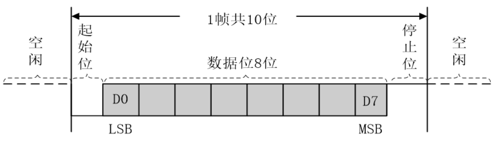

#### 2、9数据位，1校验位，1位停止位

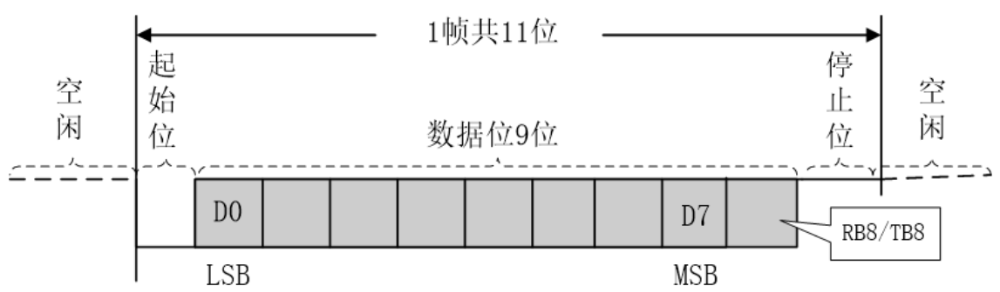

#### 3、字节设置/数据帧

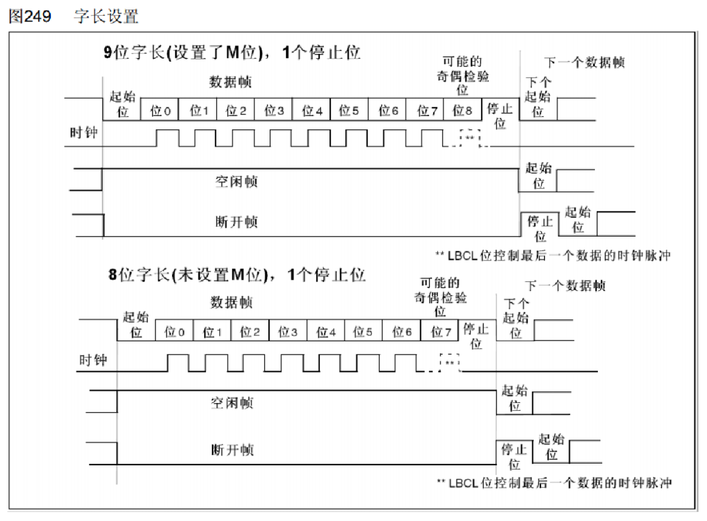

#### 4、停止位

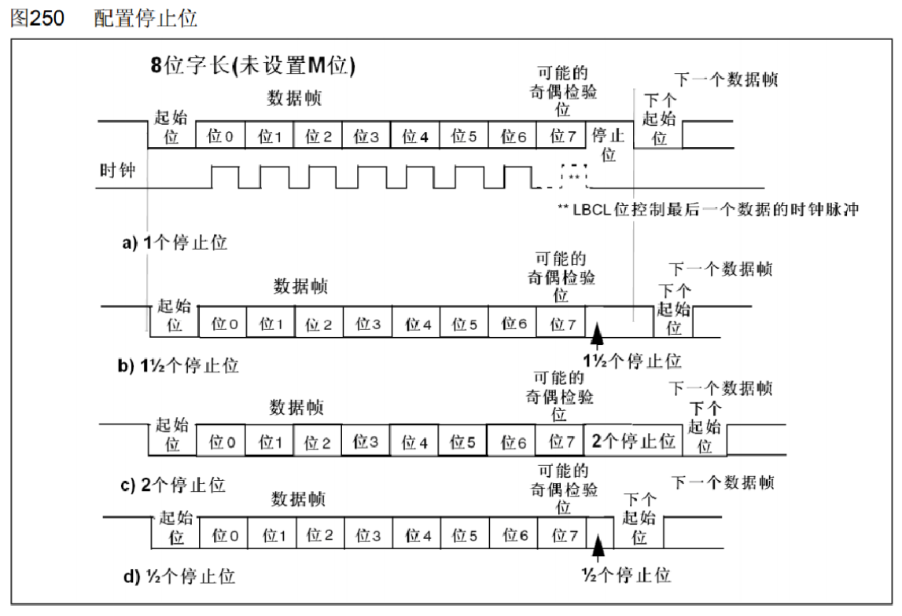

####  5、起始位侦测

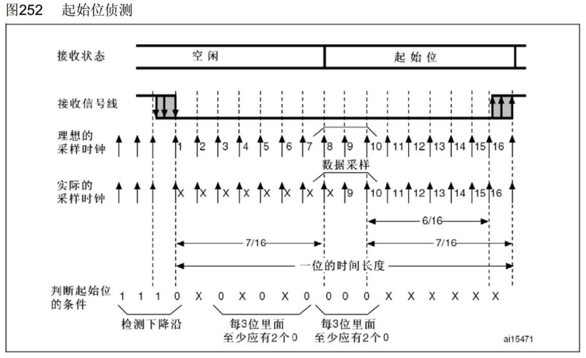


## 二、实验步骤（以下均以USART1为例，非重映射）

### （一）串口及中断配置

#### 1、配置GPIO

```C
/*开启时钟*/
//开启GPIOA的时钟
RCC_APB2PeriphClockCmd(RCC_APB2Periph_GPIOA, ENABLE);

/*GPIO初始化*/
GPIO_InitTypeDef GPIO_InitStructure;
//将PA9引脚初始化为复用推挽输出
GPIO_InitStructure.GPIO_Mode = GPIO_Mode_AF_PP;
GPIO_InitStructure.GPIO_Pin = GPIO_Pin_9;
GPIO_InitStructure.GPIO_Speed = GPIO_Speed_50MHz;
GPIO_Init(GPIOA, &GPIO_InitStructure);

//将PA10引脚初始化为上拉输入
GPIO_InitStructure.GPIO_Mode = GPIO_Mode_IPU;
GPIO_InitStructure.GPIO_Pin = GPIO_Pin_10;
GPIO_InitStructure.GPIO_Speed = GPIO_Speed_50MHz;
GPIO_Init(GPIOA, &GPIO_InitStructure);
```

#### 2、配置NVIC

```C
/*NVIC中断分组*/
//配置NVIC为分组2
NVIC_PriorityGroupConfig(NVIC_PriorityGroup_2);

/*NVIC配置*/
//定义结构体变量
NVIC_InitTypeDef NVIC_InitStructure;
//选择配置NVIC的USART1线
NVIC_InitStructure.NVIC_IRQChannel = USART1_IRQn;
//指定NVIC线路使能
NVIC_InitStructure.NVIC_IRQChannelCmd = ENABLE;
//指定NVIC线路的抢占优先级为1
NVIC_InitStructure.NVIC_IRQChannelPreemptionPriority = 1;
//指定NVIC线路的响应优先级为1
NVIC_InitStructure.NVIC_IRQChannelSubPriority = 1;
//将结构体变量交给NVIC_Init，配置NVIC外设
NVIC_Init(&NVIC_InitStructure);
```

#### 3、配置USART

```C
/*开启时钟*/
//开启USART1的时钟
RCC_APB2PeriphClockCmd(RCC_APB2Periph_USART1, ENABLE);

/*USART初始化*/
//定义结构体变量
USART_InitTypeDef USART_InitStructure;
//波特率
USART_InitStructure.USART_BaudRate = 9600;
//硬件流控制，不需要
USART_InitStructure.USART_HardwareFlowControl = USART_HardwareFlowControl_None;
//模式，发送模式和接收模式均选择
USART_InitStructure.USART_Mode = USART_Mode_Tx | USART_Mode_Rx;
//奇偶校验，不需要
USART_InitStructure.USART_Parity = USART_Parity_No;
//停止位，选择1位
USART_InitStructure.USART_StopBits = USART_StopBits_1;
//字长，选择8位
USART_InitStructure.USART_WordLength = USART_WordLength_8b;	
//将结构体变量交给USART_Init，配置USART1
USART_Init(USART1, &USART_InitStructure);
	
/*中断输出配置*/
//开启串口接收数据的中断
USART_ITConfig(USART1, USART_IT_RXNE, ENABLE);

/*USART使能*/
//使能USART1，串口开始运行
USART_Cmd(USART1, ENABLE);
```

> **USART结构体参数（异步模式）：**
>
> ```C
> typedef struct
> {
>  uint32_t USART_BaudRate;             // 波特率
>  uint16_t USART_WordLength;           // 字长
>  uint16_t USART_StopBits;             // 停止位
>  uint16_t USART_Parity;               // 校验位
>  uint16_t USART_Mode;                 // USART 模式
>  uint16_t USART_HardwareFlowControl;  // 硬件流控制
> } USART_InitTypeDef;
> ```
>
> | 参数                      | 相关说明                                                     |
> | ------------------------- | ------------------------------------------------------------ |
> | USART_BaudRate            | 波特率设置。一般设置为 9600、115200。标准库函数会根据设定值计算得到 USARTDIV 值，从而设置USART_BRR寄存器值 |
> | USART_WordLength          | 数据帧字长，可选 8 位或 9 位。它设定 USART_CR1 寄存器的 M 位的值。如果没有使能奇偶校验控制，一般使用 8 数据位；如果使能了奇偶校验则一般设置为 9 数据位 |
> | USART_StopBits            | 停止位设置，可选 0.5 个、1 个、1.5 个和 2 个停止位，它设定 USART_CR2寄存器的 STOP[1:0] 位的值，一般我们选择 1 个停止位 |
> | USART_Parity              | 奇偶校验控制选择，可选 USART_Parity_No(无校验)、USART_Parity_Even(偶校验) 以及 USART_Parity_Odd(奇校验)，它设定 USART_CR1 寄存器的 PCE 位和 PS 位的值 |
> | USART_Mode                | USART 模式选择，有 USART_Mode_Rx 和 USART_Mode_Tx，允许使用逻辑或运算选择两个，它设定 USART_CR1 寄存器的 RE 位和 TE 位 |
> | USART_HardwareFlowControl | 硬件流控制选择，只有在硬件流控制模式才有效，可选有 使能RTS、使能CTS、同时使能 RTS 和 CTS、不使能硬件流 |
>
> **USART时钟结构体参数（同步模式/时钟需再配置以下参数）：**
>
> ```C
> typedef struct 
> {
>     uint16_t USART_Clock;    // 时钟使能控制
>     uint16_t USART_CPOL;     // 时钟极性
>     uint16_t USART_CPHA;     // 时钟相位
>     uint16_t USART_LastBit;  // 最尾位时钟脉冲
> } USART_ClockInitTypeDef;
> ```
>
> ​	 一般我们用的最多的就是 USART 的异步通讯，同步通讯和利用时钟的实验和项目不多。

### （二）串口发送函数

这里主要给出了发送字节、数组还有字符串的相关函数。

```c
/**
  * 函    数：串口发送一个字节
  * 参    数：Byte 要发送的一个字节
  * 返 回 值：无
  */
void Serial_SendByte(uint8_t Byte)
{
	//将字节数据写入数据寄存器，写入后USART自动生成时序波形
	USART_SendData(USART1, Byte);
	//等待发送完成
	while (USART_GetFlagStatus(USART1, USART_FLAG_TXE) == RESET);
	/*下次写入数据寄存器会自动清除发送完成标志位，故此循环后，无需清除标志位*/
}
```

```c
/**
  * 函    数：串口发送一个数组
  * 参    数：Array 要发送数组的首地址
  * 参    数：Length 要发送数组的长度
  * 返 回 值：无
  */
void Serial_SendArray(uint8_t *Array, uint16_t Length)
{
	uint16_t i;
	for (i = 0; i < Length; i ++)
	{
		//依次调用Serial_SendByte发送每个字节数据
		Serial_SendByte(Array[i]);
	}
}
```

```c
/**
  * 函    数：串口发送一个字符串
  * 参    数：String 要发送字符串的首地址
  * 返 回 值：无
  */
void Serial_SendString(char *String)
{
	uint8_t i;
	if(String == NULL)
    {
        //对传进来的字符指针进行判断，空跳出，非空则继续执行后续操作
        return ;
    }
	//遍历字符数组（字符串），遇到字符串结束标志位后停止
	for (i = 0; String[i] != '\0'; i ++)
	{
		//依次调用Serial_SendByte发送每个字节数据
		Serial_SendByte(String[i]);
	}
}
```


### （三）串口接收中断

```c
uint8_t Serial_RxData;		//定义串口接收的数据变量
uint8_t Serial_RxFlag;		//定义串口接收的标志位变量

/**
  * 函    数：获取串口接收标志位
  * 参    数：无
  * 返 回 值：串口接收标志位，范围：0~1，接收到数据后，标志位置1，读取后标志位自动清零
  */
uint8_t Serial_GetRxFlag(void)
{
	if (Serial_RxFlag == 1)		//如果标志位为1
	{
		Serial_RxFlag = 0;
		return 1;				//则返回1，并自动清零标志位
	}
	return 0;					//如果标志位为0，则返回0
}

/**
  * 函    数：获取串口接收的数据
  * 参    数：无
  * 返 回 值：接收的数据，范围：0~255
  */
uint8_t Serial_GetRxData(void)
{
	//返回接收的数据变量
	return Serial_RxData;
}

/**
  * 函    数：USART1中断函数
  * 参    数：无
  * 返 回 值：无
  * 注意事项：此函数为中断函数，无需调用，中断触发后自动执行
  *           函数名为预留的指定名称，可以从启动文件复制
  *           请确保函数名正确，不能有任何差异，否则中断函数将不能进入
  */
void USART1_IRQHandler(void)
{
    //判断是否是USART1的接收事件触发的中断
	if (USART_GetITStatus(USART1, USART_IT_RXNE) == SET)
	{
        //读取数据寄存器，存放在接收的数据变量
		Serial_RxData = USART_ReceiveData(USART1);
        //置接收标志位变量为1
		Serial_RxFlag = 1;
        //清除USART1的RXNE标志位
		USART_ClearITPendingBit(USART1, USART_IT_RXNE);
		//读取数据寄存器会自动清除此标志位
		//如果已经读取了数据寄存器，也可以不执行此代码
	}
}

```


## 三、实操代码

### （一）非分任务形式

以下代码块分别为main.c  Serial.c  Serial.h

**main.c**

```C
#include "stm32f10x.h"	// Device header
#include "Serial.h"

uint8_t RxData;			//定义用于接收串口数据的变量

int main(void)
{	
	/*串口初始化*/
	Serial_Init();		//串口初始化

	while (1)
	{
         //检查串口接收数据的标志位
		if (Serial_GetRxFlag() == 1)
		{
         	//获取串口接收的数据
			RxData = Serial_GetRxData();
         	//串口将收到的数据回传回去，用于测试
			Serial_SendByte(RxData);
		}
	}
}

```
**Serial.c**

```c
#include "stm32f10x.h"		// Device header
#include <stdio.h>
#include <stdarg.h>

uint8_t Serial_RxData;		//定义串口接收的数据变量
uint8_t Serial_RxFlag;		//定义串口接收的标志位变量

/**
  * 函    数：串口初始化
  * 参    数：无
  * 返 回 值：无
  */
void Serial_Init(void)
{
	/*开启时钟*/
	RCC_APB2PeriphClockCmd(RCC_APB2Periph_USART1, ENABLE);	//开启USART1的时钟
	RCC_APB2PeriphClockCmd(RCC_APB2Periph_GPIOA, ENABLE);	//开启GPIOA的时钟

	/*GPIO初始化*/
	GPIO_InitTypeDef GPIO_InitStructure;
    //将PA9引脚初始化为复用推挽输出
	GPIO_InitStructure.GPIO_Mode = GPIO_Mode_AF_PP;
	GPIO_InitStructure.GPIO_Pin = GPIO_Pin_9;
	GPIO_InitStructure.GPIO_Speed = GPIO_Speed_50MHz;
	GPIO_Init(GPIOA, &GPIO_InitStructure);
	//将PA10引脚初始化为上拉输入
	GPIO_InitStructure.GPIO_Mode = GPIO_Mode_IPU;
	GPIO_InitStructure.GPIO_Pin = GPIO_Pin_10;
	GPIO_InitStructure.GPIO_Speed = GPIO_Speed_50MHz;
	GPIO_Init(GPIOA, &GPIO_InitStructure);

	/*USART初始化*/
    //定义结构体变量
	USART_InitTypeDef USART_InitStructure;
    //波特率
	USART_InitStructure.USART_BaudRate = 9600;
    //硬件流控制，不需要
	USART_InitStructure.USART_HardwareFlowControl = USART_HardwareFlowControl_None;
    //模式，发送模式和接收模式均选择
	USART_InitStructure.USART_Mode = USART_Mode_Tx | USART_Mode_Rx;
    //奇偶校验，不需要
	USART_InitStructure.USART_Parity = USART_Parity_No;
    //停止位，选择1位
	USART_InitStructure.USART_StopBits = USART_StopBits_1;
    //字长，选择8位
	USART_InitStructure.USART_WordLength = USART_WordLength_8b;
    //将结构体变量交给USART_Init，配置USART1
	USART_Init(USART1, &USART_InitStructure);

	/*中断输出配置*/
    //开启串口接收数据的中断
	USART_ITConfig(USART1, USART_IT_RXNE, ENABLE);

	/*NVIC中断分组*/
    //配置NVIC为分组2
	NVIC_PriorityGroupConfig(NVIC_PriorityGroup_2);

	/*NVIC配置*/
    //定义结构体变量
	NVIC_InitTypeDef NVIC_InitStructure;
    //选择配置NVIC的USART1线
	NVIC_InitStructure.NVIC_IRQChannel = USART1_IRQn;
    //指定NVIC线路使能
	NVIC_InitStructure.NVIC_IRQChannelCmd = ENABLE;
    //指定NVIC线路的抢占优先级为1
	NVIC_InitStructure.NVIC_IRQChannelPreemptionPriority = 1;
    //指定NVIC线路的响应优先级为1
	NVIC_InitStructure.NVIC_IRQChannelSubPriority = 1;
    //将结构体变量交给NVIC_Init，配置NVIC外设
	NVIC_Init(&NVIC_InitStructure);

	/*USART使能*/
    //使能USART1，串口开始运行
	USART_Cmd(USART1, ENABLE);
}

/**
  * 函    数：串口发送一个字节
  * 参    数：Byte 要发送的一个字节
  * 返 回 值：无
  */
void Serial_SendByte(uint8_t Byte)
{
    //将字节数据写入数据寄存器，写入后USART自动生成时序波形
	USART_SendData(USART1, Byte);
    //等待发送完成
	while (USART_GetFlagStatus(USART1, USART_FLAG_TXE) == RESET);
	/*下次写入数据寄存器会自动清除发送完成标志位，故此循环后，无需清除标志位*/
}

/**
  * 函    数：串口发送一个数组
  * 参    数：Array 要发送数组的首地址
  * 参    数：Length 要发送数组的长度
  * 返 回 值：无
  */
void Serial_SendArray(uint8_t *Array, uint16_t Length)
{
	uint16_t i;
	for (i = 0; i < Length; i ++)
	{
        //依次调用Serial_SendByte发送每个字节数据
		Serial_SendByte(Array[i]);
	}
}

/**
  * 函    数：串口发送一个字符串
  * 参    数：String 要发送字符串的首地址
  * 返 回 值：无
  */
void Serial_SendString(char *String)
{
	uint8_t i;
	if(String == NULL)
    {
        //对传进来的字符指针进行判断，空跳出，非空则继续执行后续操作
        return ;
    }
	//遍历字符数组（字符串），遇到字符串结束标志位后停止
	for (i = 0; String[i] != '\0'; i ++)
	{
		//依次调用Serial_SendByte发送每个字节数据
		Serial_SendByte(String[i]);
	}
}

/**
  * 函    数：次方函数（内部使用）
  * 返 回 值：返回值等于X的Y次方
  */
uint32_t Serial_Pow(uint32_t X, uint32_t Y)
{
	uint32_t Result = 1;	//设置结果初值为1
	while (Y --)			//执行Y次
	{
		Result *= X;		//将X累乘到结果
	}
	return Result;
}

/**
  * 函    数：串口发送数字
  * 参    数：Number 要发送的数字，范围：0~4294967295
  * 参    数：Length 要发送数字的长度，范围：0~10
  * 返 回 值：无
  */
void Serial_SendNumber(uint32_t Number, uint8_t Length)
{
	uint8_t i;
    //根据数字长度遍历数字的每一位
	for (i = 0; i < Length; i ++)
	{
        //依次调用Serial_SendByte发送每位数字
		Serial_SendByte(Number / Serial_Pow(10, Length - i - 1) % 10 + '0');
	}
}

/**
  * 函    数：使用printf需要重定向的底层函数
  * 参    数：保持原始格式即可，无需变动
  * 返 回 值：保持原始格式即可，无需变动
  */
int fputc(int ch, FILE *f)
{
    Serial_SendByte(ch);		//将printf的底层重定向到自己的发送字节函数
	return ch;
}

/**
  * 函    数：自己封装的prinf函数
  * 参    数：format 格式化字符串
  * 参    数：... 可变的参数列表
  * 返 回 值：无
  */
void Serial_Printf(char *format, ...)
{
	char String[100];				//定义字符数组
	va_list arg;					//定义可变参数列表数据类型的变量arg
	va_start(arg, format);			//从format开始，接收参数列表到arg变量
	vsprintf(String, format, arg);	//使用vsprintf打印格式化字符串和参数列表到字符数组中
	va_end(arg);					//结束变量arg
	Serial_SendString(String);		//串口发送字符数组（字符串）
}

/**
  * 函    数：获取串口接收标志位
  * 参    数：无
  * 返 回 值：串口接收标志位，范围：0~1，接收到数据后，标志位置1，读取后标志位自动清零
  */
uint8_t Serial_GetRxFlag(void)
{
	if (Serial_RxFlag == 1)		//如果标志位为1
	{
		Serial_RxFlag = 0;
		return 1;				//则返回1，并自动清零标志位
	}
	return 0;					//如果标志位为0，则返回0
}

/**
  * 函    数：获取串口接收的数据
  * 参    数：无
  * 返 回 值：接收的数据，范围：0~255
  */
uint8_t Serial_GetRxData(void)
{
	//返回接收的数据变量
	return Serial_RxData;
}

/**
  * 函    数：USART1中断函数
  * 参    数：无
  * 返 回 值：无
  * 注意事项：此函数为中断函数，无需调用，中断触发后自动执行
  *           函数名为预留的指定名称，可以从启动文件复制
  *           请确保函数名正确，不能有任何差异，否则中断函数将不能进入
  */
void USART1_IRQHandler(void)
{
    //判断是否是USART1的接收事件触发的中断
	if (USART_GetITStatus(USART1, USART_IT_RXNE) == SET)
	{
        //读取数据寄存器，存放在接收的数据变量
		Serial_RxData = USART_ReceiveData(USART1);
        //置接收标志位变量为1
		Serial_RxFlag = 1;
        //清除USART1的RXNE标志位
		USART_ClearITPendingBit(USART1, USART_IT_RXNE);
		//读取数据寄存器会自动清除此标志位
		//如果已经读取了数据寄存器，也可以不执行此代码
	}
}

```

**Serial.h**

```c
#ifndef __SERIAL_H
#define __SERIAL_H

#include <stdio.h>

void Serial_Init(void);
void Serial_SendByte(uint8_t Byte);
void Serial_SendArray(uint8_t *Array, uint16_t Length);
void Serial_SendString(char *String);
void Serial_SendNumber(uint32_t Number, uint8_t Length);
void Serial_Printf(char *format, ...);

uint8_t Serial_GetRxFlag(void);
uint8_t Serial_GetRxData(void);

#endif

```

### （二）分任务形式

以下代码块分别为system. c    systick.h

【main.c  config.h  system. h  systick.c 同 systick 那一讲】

【Serial.c  Serial.h 两个文件同上，代码这里就不重复放置了】

**system. c**

```c
#define USART1RecProcessPeriod 15

extern uint8_t Serial_RxData;		//声明串口接收的数据变量
extern uint8_t Serial_RxFlag;		//声明串口接收的标志位变量

void SysInit(void)
{
	CPU_INT_ENABLE();		//开总中断
	NVIC_PriorityGroupConfig(NVIC_PriorityGroup_2);		//设置中断优先级分组
	SystickInit();		//滴答时钟初始化
    
	TaskInit();
	UsartInit();
}

void TaskInit(void)
{
	USART1RecProcessTimer = USART1RecProcessPeriod;		
}

void USART1RecProcessTask(void)
{
	if(USART1RecProcessTimer) return;
	USART1RecProcessTimer = USART1RecProcessPeriod;

	//检查串口接收数据的标志位
	if (Serial_GetRxFlag() == 1)
	{
		//获取串口接收的数据
		RxData = Serial_GetRxData();
		//串口将收到的数据回传回去，用于测试
		Serial_SendByte(RxData);
    }
}

```

**systick.h**

```c
#ifndef __SYSTICH_H__
#define __SYSTICH_H__

#include "config.h"

#define MAX_TIMER 2

extern u32 sysTimer[MAX_TIMER];
#define DelayTimer 				sysTimer[0]
#define USART1RecProcessTimer	sysTimer[1]

void SystickInit(void);
void SystickDelayMs(u32 nms);

#endif

```

【**至此，串口常用的发送与接收已结束，下方补充为串口的一些特定的收发形式**】


## 四、数据包

### （一）数据模式

HEX模式/十六进制模式/二进制模式：以原始数据的形式显示

文本模式/字符模式：以原始数据编码后的形式显示

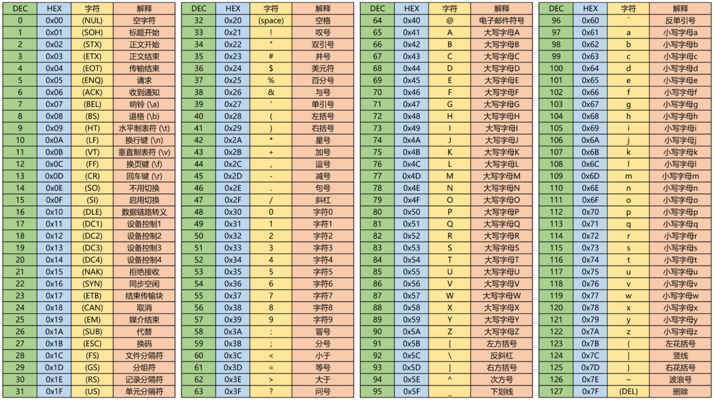

### （二）收发HEX数据包

​	在实际应用中，我们常常需要连续发送或接收数据，有时需要对连续的数据进行分割和打包，我们才可以正确处理数据；使用数据包发送和接收数据还可以实现简单的人机交互设计。
​	打包和分割数据的方法可以自行设计（如把每个数据的最高位当作标志位来进行分割），串口的数据包采用添加包头和包尾的方式实现。

#### 1、HEX数据包

【**HEX数据包适合发送最原始的数据**，例如一些使用串口通信的陀螺仪、温湿度传感器等】

* 固定包长，含包头包尾。即每个数据包的长度都固定不变，数据包前面的是包头，后面的是包尾

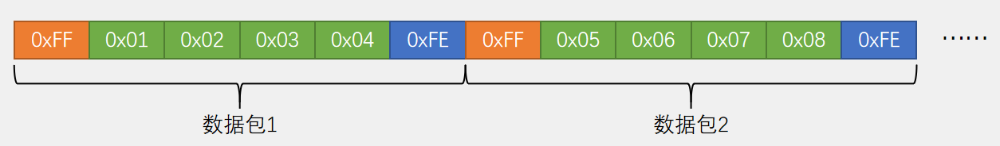

这里规定了一批数据有4个字节，在这4个字节首尾加上包头包围，比如规定0xFF为包头，0xFE为包围（类似一个标志位作用）

* 可变包长，含包头包尾。每个数据包的长度可以是不一样的

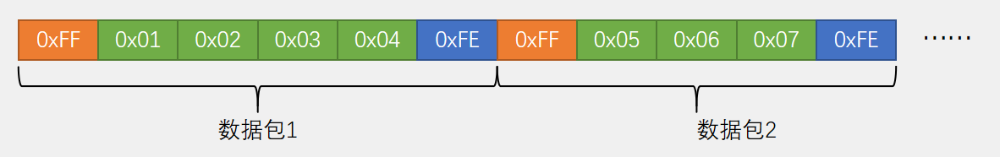

* 补充说明

> 1、HEX数据包可能出现的问题：当载荷数据存在与包头包尾**重复**的情况，会产生误判，解决方式如下：
>
> （1）规定有效载荷数据的范围（例如只发送0~100）
>
> （2）增加包头包尾的数量，尽量使其产生载荷数据中不会出现的格式
>
> （3）尽量采用固定包长发送数据包，在接收数据时，我们不关心有效数据是否和包头包尾重复，我们只关心应该是包头包尾的位置是否是包头包尾
>
> 2、在实际使用时，如果载荷数据不会和包头包尾重复，可以二者留其一，例如只添加包头或者只添加包尾
>
> 3、固定包长和可变包长的选择问题
>
> （1）对HEX来说，若载荷出现和包头包尾**重复**的情况，最好选择**固定包长**，避免接受错误
> （2）若**不重复**，可以选择**可变包长**
>
> 4、各种数据转化为数据流的问题
>
> ​	数据包都是一个字节一个字节组成的，若想发送16位int、32位int，float、double、甚至是结构体（其内部都是由一个字节一个字节组成的），只需要用一个uint8_t的指针指向它，把数据当作字节数组发送即可

#### 2、接收HEX数据包

​	根据之前代码，每收到一个字节程序都会进一遍中断，在中断函数里我们可以拿到这一个字节，但拿到之后就要退出中断了，所以每拿到一个数据都是一个独立的过程。而对于数据包来说，它具有前后关联性，对于包头、数据、包尾这三种状态我们需要不同的处理逻辑，所以在程序中，我们需要设计一个能记住不同状态的机制，在不同的状态执行不同的操作，同时还要进行状态的合理转移，这种程序思维叫做“状态机”
​	要想设计好的“状态机”程序，画一个以下的状态转移图很有必要：

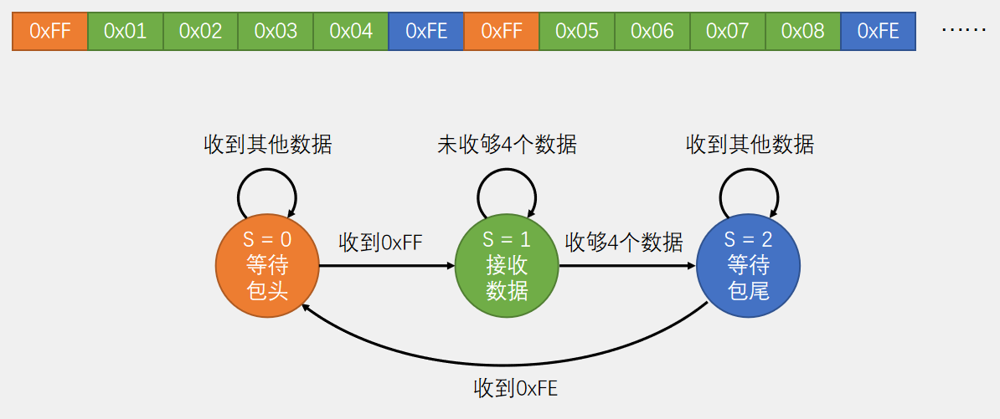

​	【此流程图以“固定包长，含包头包尾”为例】

​	每收到一个字节，函数都会进入一次中断，在中断函数中，可以拿到一个字节，但拿到字节之后，就得退出中断，故每拿到一个数据，都是一个独立的过程，而对数据包来说，有数据、包头、包尾三种状态，根据状态不同处理也不同

#### 3、执行流程

（1）最开始 S = 0，收到一个数据，进中断，根据 S = 0 进入第一个状态的程序，判断数据是不是包头 FF，如果是 FF 则代表收到包头，之后置 S = 1 退出中断，结束。这样下次再进中断，根据 S = 1 就可以进行接收数据的程序了。如果在第一个状态收到的不是 FF，就说明数据包未对齐，这时应该等待数据包包头的出现，S 仍是 0，下次进中断仍是执行判断包头的逻辑，直到出现 FF 才可进入下一个状态。
（2）到接收数据的状态后，收到数据就把它存在数组中，再用一个变量记录接收了多少数据，没到 4 个就一直是这个接收数据状态，收够了就置 S = 2，进入下一个状态。
（3）最后等待包尾，判断数据是否为 FE，是的话就置 S = 0 回到最初状态，开始下一轮回。也有可能不是 FE，比如数据于包头重复，导致前面包头位置判断错误，就可能导致包尾不是 FE，这时就可进入重复等待包尾的状态，直到接收到真正包尾。

### （三）收发文本数据包

#### 1、文本数据包

​	在HEX数据包里，数据都是以原始的字节数据本身呈现，在文本数据包里，每个字节经过了一层编码和译码，最终表现出来的就是文本格式。所以实际上每个文本字符背后都是一个字节的HEX数据：

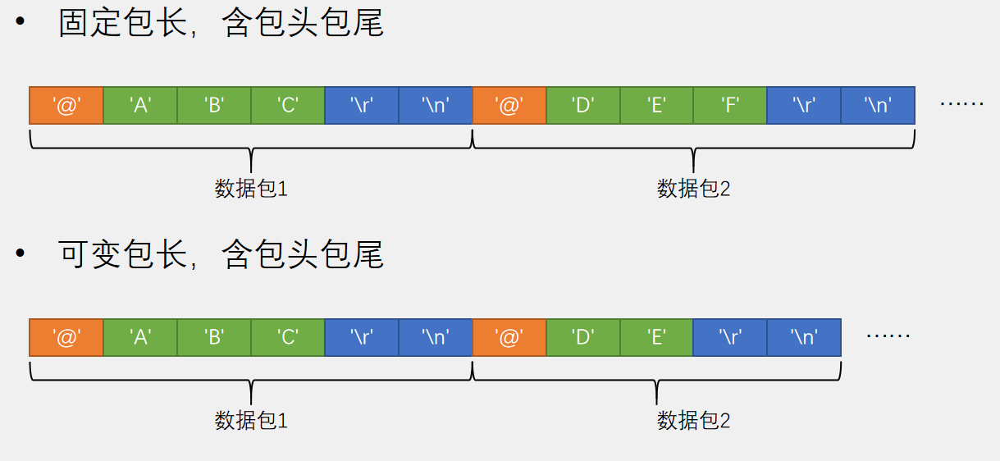

​	由于数据译码成为字符形式，所以存在大量字符可作为包头包尾，可有效避免数据与包头包尾重复的问题。这里以@作为包头，\r和\n作为包尾，当我们接收到载荷数据之后得到就是一个字符串，在软件中再对字符串进行操作和判断，就可实现各种指令控制功能，且字符串数据包表达的意义很明显，可发送到串口助手在电脑显示打印，所以常以\n换行符作为包尾，这样打印是就可一行一行显示。

#### 2、接收文本数据包

​	数据包的发送过程很简单，如HEX数据包发送，先定义一个数组，填充数据，然后用上一节写过USART_SendArray函数；文本数据包同理，写一个字符串，调用上一节写的USART_SendString函数。之所以简单是因为发送过程完全自主可控，想发什么就发什么，上一节串口也可体会到发送比接收简单多了。
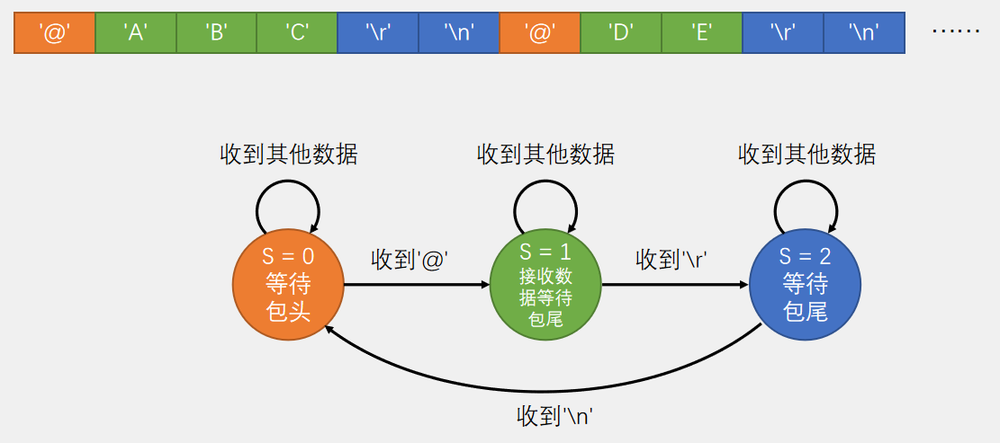

#### 3、执行流程

​	可变包长，接受数据的状态（S = 1）在进行数据接收的逻辑时，还要兼具等待包尾的功能：收到一个数据判断是否为 \r，如果不是 \r 则正常接收数据；如果是 \r 则不接收数据，同时跳到下一个状态（S = 2），等待包尾\n。因为这里设置了两个包尾 \r 和 \n，所以需要第三个状态（S = 2），如果只有一个包尾 \r，那么在S = 1状态中逻辑判断出现包尾\r，后就可直接回到初始状态。

### （四）HEX数据包和文本数据包对比

（1）在HEX数据包中，数据都是以原始的字节数据本身呈现的
（2）在文本数据包中，每个字节就经过一层编码和译码，最终表现出文本格式（文本背后还是一个字节的HEX数据）
（3）HEX数据包：传输直接、解析数据简单，适合一些模块发送原始的数据，比如一些使用串口通信的陀螺仪、温湿度传感器，但是灵活性不足、载荷容易和包头包尾重复
（4）文本数据包：数据直观易理解、灵活，适合一些输入指令进行人机交互，如蓝牙模块常使用的AT指令、CNC和3D打印机，但解析效率低.
（5）发送100，HEX直接发送一个字节100，而文本发送三个字节 ’1’、‘0’、‘0’，收到之后还要把字符转换程数据，才能得到100。

### （五）部分代码示例（分任务形式）

以下代码块分别为 Serial.c  Serial.h  system. c  systick.h

**Serial.c**（此处仅列出与前文提供代码的差异部分）

```c
uint8_t Serial_TxPacket[4];		//FF 01 02 03 04 FE
uint8_t Serial_RxPacket[4];
uint8_t Serial_RxFlag;

//新增部分--发送数据包（含包头包尾，固定包长为4）
void Serial_SendPacket(void)
{
	Serial_SendByte(0xFF);
	Serial_SendArray(Serial_TxPacket, 4);
	Serial_SendByte(0xFE);
}

uint8_t Serial_GetRxFlag(void)
{
	if (Serial_RxFlag == 1)
	{
		Serial_RxFlag = 0;
		return 1;
	}
	return 0;
}

//修改部分--中断函数内部转变为“状态机”的思想
void USART1_IRQHandler(void)
{
	static uint8_t RxState = 0;
	static uint8_t pRxPacket = 0;
	if (USART_GetITStatus(USART1, USART_IT_RXNE) == SET)
	{
		uint8_t RxData = USART_ReceiveData(USART1);
		
		if (RxState == 0)
		{
			if (RxData == 0xFF)
			{
				RxState = 1;
				pRxPacket = 0;
			}
		}
		else if (RxState == 1)
		{
			Serial_RxPacket[pRxPacket] = RxData;
			pRxPacket ++;
			if (pRxPacket >= 4)
			{
				RxState = 2;
			}
		}
		else if (RxState == 2)
		{
			if (RxData == 0xFE)
			{
				RxState = 0;
				Serial_RxFlag = 1;
			}
		}
		USART_ClearITPendingBit(USART1, USART_IT_RXNE);
	}
}
```

**Serial.h**

```c
#ifndef __SERIAL_H
#define __SERIAL_H

#include <stdio.h>

void Serial_Init(void);
void Serial_SendByte(uint8_t Byte);
void Serial_SendArray(uint8_t *Array, uint16_t Length);
void Serial_SendString(char *String);
void Serial_SendNumber(uint32_t Number, uint8_t Length);
void Serial_Printf(char *format, ...);

void Serial_SendPacket(void);		//新增部分
uint8_t Serial_GetRxFlag(void);		//修改部分

#endif

```

**system. c**

```c
#define USARTPeriod 1000

extern uint8_t Serial_RxData;		//声明串口接收的数据变量
extern uint8_t Serial_RxFlag;		//声明串口接收的标志位变量
extern uint8_t Serial_TxPacket[];
extern uint8_t Serial_RxPacket[];

void SysInit(void)
{
	CPU_INT_ENABLE();		//开总中断
	NVIC_PriorityGroupConfig(NVIC_PriorityGroup_2);		//设置中断优先级分组
	SystickInit();		//滴答时钟初始化
    
	TaskInit();
	UsartInit();
    
    //初始化发送数据包的数据，本处发送的数据在本程序内固定不做修改，仅供参考
    Serial_TxPacket[0] = 0x01;
	Serial_TxPacket[1] = 0x02;
	Serial_TxPacket[2] = 0x03;
	Serial_TxPacket[3] = 0x04;
}

void TaskInit(void)
{
	USARTTimer = USARTPeriod;
}

void USART1RecProcessTask(void)
{
	if(USARTTimer) return;
	USARTTimer = USARTPeriod;

    //发送数据包
	Serial_SendPacket();
}

```
**systick.h**

	#ifndef __SYSTICH_H__
	#define __SYSTICH_H__
	
	#include "config.h"
	
	#define MAX_TIMER 2
	
	extern u32 sysTimer[MAX_TIMER];
	#define DelayTimer 				sysTimer[0]
	#define USARTTimer				sysTimer[1]
	
	void SystickInit(void);
	void SystickDelayMs(u32 nms);
	
	#endif


## 五、空闲中断

### （一）空闲中断介绍

​	STM32的IDLE的中断在串口无数据接收的情况下，是不会一直产生的，产生的条件是这样的，当清除IDLE标志位后，必须有接收到第一个数据后，才开始触发，一但接收的数据断流，没有接收到数据，即产生IDLE中断。IDLE位不会再次被置高直到RXNE位被置起（即又检测到一次空闲总线）。RXNE接收中断可以不用开启，减少进中断的次数。

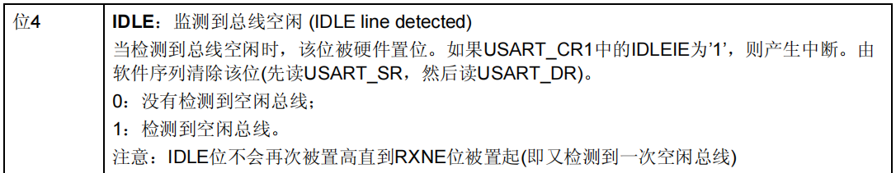

​	注意看手册说明，中断标志位由硬件触发，软件清零，清零方法是读取一遍USART_SR寄存器然后读取一遍USART_DR寄存器，也就是不能简单的用USART_ClearITPendingBit()来清除就完事。

### （二）部分代码示例

【此处仅展示Serial.c、main.c的部分代码】

**Serial.c**

```c
void Serial_Init(void)
{
    
    DMA_InitTypeDef DMA_InitStruct;
 
    RCC_AHBPeriphClockCmd(RCC_AHBPeriph_DMA1, ENABLE);      // 使能DMA
    RCC_APB2PeriphClockCmd(RCC_APB2Periph_GPIOA, ENABLE);   // 使能GPIOA
    RCC_APB2PeriphClockCmd(RCC_APB2Periph_USART1,ENABLE);   // 使能时钟 复用USART
 
    GPIO_InitTypeDef GPIO_InitStruct;
    GPIO_InitStruct.GPIO_Mode = GPIO_Mode_AF_PP;
    GPIO_InitStruct.GPIO_Pin = GPIO_Pin_9;
    GPIO_InitStruct.GPIO_Speed = GPIO_Speed_10MHz;
    GPIO_Init(GPIOA,&GPIO_InitStruct);
 
    GPIO_InitStruct.GPIO_Mode = GPIO_Mode_IN_FLOATING;
    GPIO_InitStruct.GPIO_Pin = GPIO_Pin_10;
    GPIO_InitStruct.GPIO_Speed = GPIO_Speed_10MHz;
    GPIO_Init(GPIOA,&GPIO_InitStruct);
 
    USART_InitTypeDef USART_InitStruct;
    USART_InitStruct.USART_BaudRate = 9600;
    USART_InitStruct.USART_HardwareFlowControl = USART_HardwareFlowControl_None;
    USART_InitStruct.USART_Mode = USART_Mode_Rx | USART_Mode_Tx;
    USART_InitStruct.USART_Parity = USART_Parity_No;
    USART_InitStruct.USART_StopBits = USART_StopBits_1;
    USART_InitStruct.USART_WordLength = USART_WordLength_8b;
    USART_Init(USART1,&USART_InitStruct);   //初始化 USART
 
//	USART_ITConfig(USART1, USART_IT_RXNE, ENABLE);  // 开启 USART 接收缓冲区非空中断
//	USART_ITConfig(USART1, USART_IT_TXE, ENABLE);   // 开启 USART 发送缓冲区空中断
 
    USART_ITConfig(USART1, USART_IT_IDLE, ENABLE);  //开启 USART1 总线空闲中断
    
    NVIC_PriorityGroupConfig(NVIC_PriorityGroup_2);             // 初始化中断优先级分组
 
    NVIC_InitTypeDef NVIC_InitStruct;
    NVIC_InitStruct.NVIC_IRQChannel = USART1_IRQn;
    NVIC_InitStruct.NVIC_IRQChannelCmd = ENABLE;
    NVIC_InitStruct.NVIC_IRQChannelPreemptionPriority = 1;
    NVIC_InitStruct.NVIC_IRQChannelSubPriority = 1;
    NVIC_Init(&NVIC_InitStruct);   
    
    DMA_DeInit(DMA1_Channel5);
    DMA_InitStruct.DMA_PeripheralBaseAddr = (uint32_t)(&USART1->DR);    //外设--->内存
    DMA_InitStruct.DMA_MemoryBaseAddr = (uint32_t)RxBuffer;
    DMA_InitStruct.DMA_MemoryInc = DMA_MemoryInc_Enable;
    DMA_InitStruct.DMA_PeripheralInc = DMA_PeripheralInc_Disable;
    DMA_InitStruct.DMA_BufferSize = BufferSize;
    DMA_InitStruct.DMA_DIR = DMA_DIR_PeripheralSRC;
    DMA_InitStruct.DMA_M2M = DMA_M2M_Disable;
    DMA_InitStruct.DMA_MemoryDataSize = DMA_MemoryDataSize_Byte;
    DMA_InitStruct.DMA_PeripheralDataSize = DMA_PeripheralDataSize_Byte;
    DMA_InitStruct.DMA_Priority = DMA_Priority_Medium;
    DMA_InitStruct.DMA_Mode = DMA_Mode_Normal;
    DMA_Init(DMA1_Channel5, &DMA_InitStruct);
 
    DMA_Cmd(DMA1_Channel5, ENABLE);
    USART_DMACmd(USART1, USART_DMAReq_Rx, ENABLE);		// 使能 USART1接收DMA
	USART_Cmd(USART1, ENABLE);			//使能USART中断
}

void USART1_IRQHandler(void)
{
    uint8_t clear = 0;  // 用来消除编译器的“没有用到”的提醒
    uint8_t data = 0;
 
    if(USART_GetITStatus(USART1, USART_IT_IDLE) == SET)
    {
        clear = USART1->SR;
        clear = USART1->DR;
 
//      RxCounter = BufferSize - DMA1_Channel5->CNDTR;//缓存中的字节数
        RxCounter = BufferSize - DMA_GetCurrDataCounter(DMA1_Channel5);//缓存中的字节数
 
//      USART_ITConfig(USART1, USART_IT_IDLE, ENABLE);
 
        RxStatus = 1;   //标记接收到一帧
        USART_ClearITPendingBit(USART1, USART_IT_IDLE); // 清除空闲中断
 
        DMA_Cmd(DMA1_Channel5, DISABLE);                // 停止DMA，清除DMA缓存
    }
}

```

**main.c**

```c
int main(void)
{
    uint8_t i = 0;
 
    Serial_Init();
 
    while(1)
    {
        if(RxStatus == 1)
        {
            RxStatus = 0;
            i = 0;
 
            while(RxCounter--)
            {
                USART_SendData(USART1, RxBuffer[i++]);
                while(USART_GetFlagStatus(USART1, USART_FLAG_TC) != SET);
            }
 
            memset(RxBuffer, 0, i); // 清除缓存
            RxCounter = 0;
 
//          DMA1_Channel5->CNDTR = BufferSize;
            DMA_SetCurrDataCounter(DMA1_Channel5, BufferSize);
            DMA_Cmd(DMA1_Channel5, ENABLE);     
        }
    }
}
```


## 六、环形缓冲

### （一）环形缓冲区介绍

#### 1、为什么要用环形缓冲区

​	当有大量数据的时候，我们不能存储所有的数据，那么计算机处理数据的时候，只能先处理先来的，处理之后就会把数据释放掉，再处理下一个。那么已经处理的数据的内存就会被浪费掉。因为后来的数据只能往后排队，如果要将剩余的数据都往前移动一次，那么效率就会低下了，肯定不现实，所以，环形队列就出现了。

​	环形缓冲区是一项很好的技术，不用频繁的分配内存，而且在大多数情况下，内存的反复使用也使得我们能用更少的内存块做更多的事。

​	例如在串口数据接受中，外设某次发送的报文最大是100个字节，如果使用普通接收方式则需要申请一个100字节的数组。而外设并不是每次都是发送100个字节，当发送50个字节的时候，剩余的50个字节就会被浪费掉。因此引入环形缓冲区，mcu接收到一个数据在串口中断往环形缓冲区里面写一个数据，另一个线程就读一个数据，互相追逐，使用这种方式接收100字节的报文或许只需要20个字节的环形缓冲区，大大节省了内存。

```c
typedef struct {
    volatile unsigned int pW; //写位置
    volatile unsigned int pR; //读位置
    volatile unsigned char buff[RING_BUFF_SIZE];//缓冲区
}RingBuff;
```

#### 2、优点

（1）节省内存：环形缓冲区可以循环使用，因此不需要一直分配固定大小的内存空间。当缓冲区已满时，新的数据将覆盖最早的数据，从而减少了内存的占用。这对于处理大量数据或者有限的内存资源非常重要。
（2）高性能：环形缓冲区可以提高数据读取和写入的效率。由于数据在缓冲区中是循环存储的，读/写指针只需要不断移动，而不需要频繁地分配和释放内存。这使得环形缓冲区非常适合处理高速数据流，例如网络传输或实时数据处理。
（3）适用于并发场景：环形缓冲区可以支持多个读者和写者同时访问。当多个线程需要同时读取或写入数据时，可以通过互斥锁或其他同步机制来确保数据的正确性和一致性。这使得环形缓冲区非常适合并发处理和多线程编程。

#### 3、缺点

（1）数据覆盖：当缓冲区已满时，新的数据将覆盖最早的数据，这可能导致数据丢失或重要信息被覆盖。在某些应用场景下，这种数据覆盖可能会导致问题，需要特别注意。
（2）数据不一致：由于环形缓冲区的特性，数据的读取和写入是循环进行的，这可能会导致数据的不一致性。例如，当多个线程同时读取和写入数据时，可能会出现数据冲突或数据错乱的情况。
（3）难以扩展：环形缓冲区的容量是固定的，无法动态扩展。当缓冲区已满时，如果需要处理更多的数据，必须重新分配更大的内存空间，这可能会导致性能下降或内存占用增加的问题。
（4）指针管理复杂：由于环形缓冲区的特殊性质，读/写指针需要特殊管理，以确保数据的正确性和一致性。这可能会增加代码的复杂度，并引入潜在的错误风险。
（5）并发控制开销：在多线程环境下，环形缓冲区需要使用同步机制（如互斥锁）来保护数据的读取和写入操作。这可能会导致并发控制开销增加，并可能降低系统的性能。

#### 4、环形缓冲区实现原理

​	环形缓冲区通常有一个表示读位置的变量和写位置的变量。读位置指向环形缓冲区可读的数据，写位置只想环形缓冲区可写的数据。我们只需要移动读写位置就可以获实现缓冲区的读写。初始化时读写位置都为0。

```c
void RingBuffInitial(RingBuff *dst_buff)
{
    dst_buff->pW = 0;
    dst_buff->pR = 0;
}
```

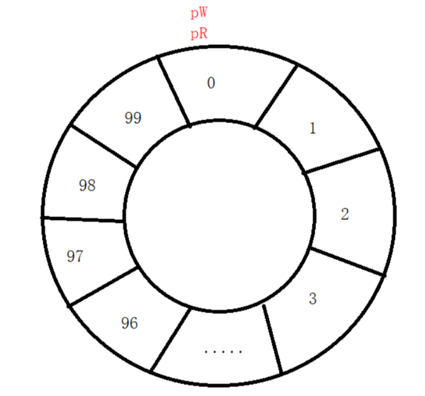

#### 5、写数据

​	往环形缓冲区里面写数据数据时要考虑缓冲区是否已经满了，如果满了就放弃这次的数据。每写入成功一个数据pW位置都要更新W

​	判断环形缓冲区满的条件是 pR == (pW + 1) % RING_BUFF_SIZE 则为满

```c
void RingBuffWrite(RingBuff *dst_buff, unsigned char dat)
{
 
    int i;
    i = (dst_buff->pW + 1)%RING_BUFF_SIZE;
    if(i != dst_buff->pR)
    {
        dst_buff->buff[dst_buff->pW] = dat;
        dst_buff->pW = i; //更新pW位置
    }
}
```

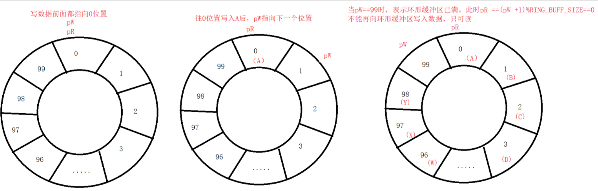

#### 6、读数据

​	读取数据要考虑环形缓冲区是否为空。判断条件是 pW == pR 则为空，读取成功返回 0，失败返回 -1

​	每读取成功一个数据 pR 位置都要更新

```c
int RingBuffRead(RingBuff *dst_buff, unsigned char *dat)
{
 
    if(dst_buff->pW == dst_buff->pR)
    {
        return -1;
    }
    else
    {
        *dat = dst_buff->buff[dst_buff->pR];
        dst_buff->pR = (dst_buff->pR+1)%RING_BUFF_SIZE; 更新pW位置
        return 0;
    }
}
```

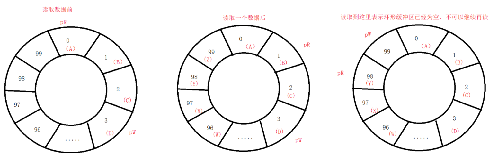

​	可以看出来，读取位置和写位置一直在互相追逐，当读位置追上写位置的时候，表示环形缓冲区数据为空。反过来则表示为满。

### （二）代码示例

```c
#include <stdio.h>
 
#define RING_BUFF_SIZE 10
 
typedef struct {
    volatile unsigned int pW;
    volatile unsigned int pR;
    volatile unsigned char buff[RING_BUFF_SIZE];
}RingBuff;
 
 
void RingBuffInitial(RingBuff *dst_buff)
{
    dst_buff->pW = 0;
    dst_buff->pR = 0;
}
 
void RingBuffWrite(RingBuff *dst_buff, unsigned char dat)
{
 
    int i;
    i = (dst_buff->pW + 1) % RING_BUFF_SIZE;
    if(i != dst_buff->pR)
    {
        dst_buff->buff[dst_buff->pW] = dat;
        dst_buff->pW = i;
    }
}
 
int RingBuffRead(RingBuff *dst_buff, unsigned char *dat)
{
 
    if(dst_buff->pW == dst_buff->pR)
    {
        return -1;
    }
    else
    {
        *dat = dst_buff->buff[dst_buff->pR];
        dst_buff->pR = (dst_buff->pR+1)%RING_BUFF_SIZE; //更新pW位置
        return 0;
    }
}
 
int main()
{
    int i=0;
    int ret;
    unsigned char read_dat;
    RingBuff RecvBuff;
    RingBuffInitial(&RecvBuff);
 
    printf("当前位置RecvBuff.pW = %d, RecvBuff.pR = %d\n",RecvBuff.pW,RecvBuff.pR);
    for(i = 0; i < 5; i++)
    {
        RingBuffWrite(&RecvBuff,'A'+i);
        printf("RecvBuff.pW = %d ,RecvBuff.pR = %d ,RecvBuff.buff[%d] = %c\n",\
               RecvBuff.pW,RecvBuff.pR,i,RecvBuff.buff[i]);
    }
    printf("当前位置RecvBuff.pW = %d, RecvBuff.pR = %d\n",RecvBuff.pW,RecvBuff.pR);
    for(i = 0; i < 5; i++)
    {
        ret = RingBuffRead(&RecvBuff,&read_dat);
        if(!ret)
            printf("read_dat = %c\n",read_dat);
        else
            printf("read err\n");
    }
    printf("当前位置RecvBuff.pW = %d, RecvBuff.pR = %d\n",RecvBuff.pW,RecvBuff.pR);
    for(i = 0; i < 5; i++)
    {
        ret = RingBuffRead(&RecvBuff,&read_dat);
        if(!ret)
            printf("read_dat = %c\n",read_dat);
        else
            printf("read err\n");
    }
    printf("当前位置RecvBuff.pW = %d, RecvBuff.pR = %d\n",RecvBuff.pW,RecvBuff.pR);
    for(i = 5; i < 10; i++)
    {
        RingBuffWrite(&RecvBuff,'A'+i);
        printf("RecvBuff.pW = %d ,RecvBuff.pR = %d ,RecvBuff.buff[%d] = %c\n",\
               RecvBuff.pW,RecvBuff.pR,i,RecvBuff.buff[i]);
    }
    printf("当前位置RecvBuff.pW = %d, RecvBuff.pR = %d\n",RecvBuff.pW,RecvBuff.pR);
        for(i = 0; i < 5; i++)
    {
        ret = RingBuffRead(&RecvBuff,&read_dat);
        if(!ret)
            printf("read_dat = %c\n",read_dat);
        else
            printf("read err\n");
    }
    printf("当前位置RecvBuff.pW = %d, RecvBuff.pR = %d\n",RecvBuff.pW,RecvBuff.pR);
    return 0;
}
```

