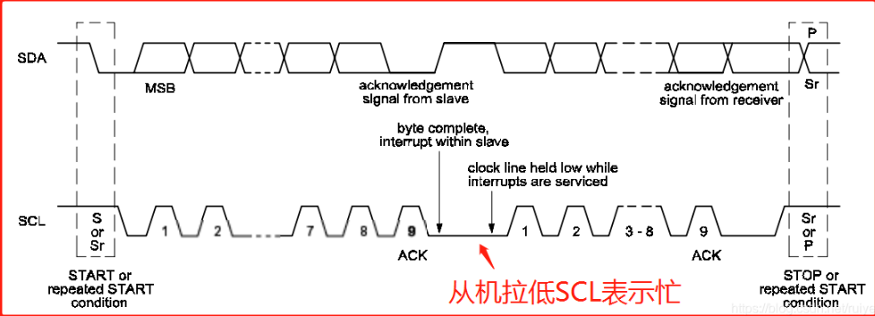
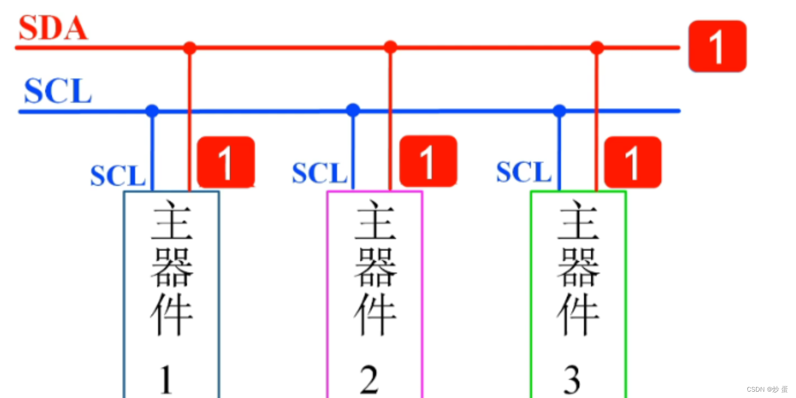

# iic学习教程

## 一、什么是IIC

​        IIC（Inter-Integrated Circuit）是 IIC Bus 简称，中文叫集成电路总线。它是一种串行通信总线，使用多主从架构，由飞利浦公司在1980年代为了让主板、嵌入式系统或手机用以连接低速周边设备而发展。
  IIC使用两根信号线进行通信：一根时钟线SCL，一根数据线SDA。其中 SDA（Serial Data）线用于双向数据传输，而 SCL（Serial Clock）线则用于同步数据传输的时钟信号。通信始终由主设备（Master）控制，从设备（Slave）被动接收和回应。IIC将SCL处于高时SDA拉低的动作作为开始信号，SCL处于高时SDA拉高的动作作为结束信号；传输数据时，SDA在SCL低电平时改变数据，在SCL高电平时保持数据，每个SCL脉冲的高电平传递1位数据。

​        I2C 协议具有广泛的应用范围，如连接传感器、存储器、显示器等设备，常用于微控制器和嵌入式系统中，因为它使用的引脚较少，可以同时连接多个设备，并且具有简单的硬件和软件实现。

## 二、IIC总线的物理层

### **2.1 IIC主要特点：**

数据线：SDA,用于主机和从机之间的数据发送和接收。
时钟线：SCL,，承载时钟信号，由I2C主机产生。

两线式串行总线，可发送和接收数据。IIC是同步(带时钟)串行 半双工(发送或接收)通信方式 。

IIC可以连接多个设备(保证设备地址不同)，支持多主机多从机连接模式。所有接到I2C总线设备上的串行数据SDA都接到总线的SDA上，各设备的时钟线SCL接到总线的SCL上。I2C总线上的每个设备都自己一个唯一的地址，来确保不同设备之间访问的准确性。


### **2.2 IIC的高阻态：**

IIC 的 GPIO 为开漏模式，支持线与功能。开漏模式，不提供输入电流，保护其他设备；开漏模式无法输出高电平(当输出为高电平时，输出端口处于高阻态)，所以需要外部上拉两条线上接有上拉电阻，保证空闲状态处于稳定的高电平。

## 三、IIC总线的逻辑电平与数据有效性


- **数据有效性**：在SCL为高电平时，SDA上的数据必须保持稳定，此时数据有效。SDA只有在SCL为低电平时才能改变状态。SCL线的高电平用于传输有效数据，在高电平期间数据被读取或写入。

- **空闲状态**：两条信号线同时处于高电平。两个线都接有上拉电阻，保证其空闲状态处于`稳定高电平`。

- **起始信号**：SCL为高电平时，SDA由高到低跳变，标志一次数据传输的开始。

- **停止信号**：SCL为高电平时，SDA由低到高跳变，标志一次数据传输的结束。

  IIC协议规定，在时钟（SCL）为高电平的时候，数据总线（SDA）必须保持稳定，数据总线（SDA）在时钟（SCL）为低电平的时候才能改变。

## 四、IIC总线的**时序列总结**、应答机制、插入等待及注意点

### 4.1IIC的时序列总结：


### **4.2 IIC应答机制**：

<u>IIC总线上的所有数据都是以8位字节传送的，发送器每发送一个字节，就在第九个时钟脉冲期间释放数据线，由接收器反馈一个应答信号。</u>从机应答主机所需要的时钟仍是主机提供的，应答出现在每一次主机完成8个数据位传输后紧跟着的时钟周期，低电平0表示应答，1表示非应答。主机SCL拉高，读取从机SDA的电平，为低电平表示产生应答。

当发送高电平时，发送方会产生上述的停止信号来结束数据的发送。每当主机向从机发送完一个字节的数据，主机总是需要等待从机给出一个应答信号，以确认从机是否成功接收到了数据，因此一个完整的字节数据传输需要9个时钟脉冲。如果从机作为接收方向主机发送非应答信号，主机方就认为此次数据传输失败;如果是主机作为接收方，在从机发送器发送完一个字节数据后，向从机发送了非应答信号，从机就认为数据传输结束，并释放SDA线。不论是以上哪种情况都会终止数据传输，这时主机或是产生停止信号释放总线或是产生重新开始信号，开始一次新的通信。SDA是一根线，线上被所有主机和从机占着，不是一个主机一直霸占着线，所以从机可以发信号。


图解：SCL高电平期间，主机SDA从高到低跳变，为起始信号S准备开始传输数据;SCL高电平，传输数据稳定，低电平期间发送变化(传输其他值)以此串行传输完一个字节后；从机ACK可以在SCL高电平期间，发出ACK应答，表示可继续传输数据。当发送高电平(非ACK应答)时，发送方会产生的停止信号来结束数据的发送。


**注意1：**NOT ACK一般在什么时候用呢？在“主机-接收器”接收数据时，接收完数据想通知“从机-发送器”释放SDA线时，会回复NACK，“从机-发送器”收到NACK后就会释放SDA，从而允许主机产生一个停止条件或重复起始条件。比如MCU（主机）从AT24C02（从机）读取数据，如下图：


**注意2：**虽说SCL上的时钟脉冲是由主机提供，但从机也有控制SCL的时候，且，有且仅有一种情况下从机会控制时钟，就是它忙的时候，会拉低SCL，表示忙，不能收发数据。如下图：




## 五、IIC总线的地址与寻址

- **地址**：IIC总线上的每个设备都有唯一的地址，用于标识通信目标。地址可以是7位或10位，但7位地址更为常见。

- **寻址方式**：主机发送地址时，总线上每个从机都将其与自己的地址相比较，以确定自己是否为发送器或接收器。

  照从机地址位数可以分为7bits或10bits

  **详细**：D1-D7地址位；D0控制数据方向位，0：向从机写数据，1：向从机读数据

  
  
  当主机发送7位地址到数据线上后，从机将会与其进行地址配对。数据传输方向则被D0位控制。7位从机地址一般可由4位固定地址和3位可编程地址组成，那么因此可得到，一共可挂载寻址8个从机(3位的二进制为8)。理论上可挂载2^8=128个设备(地址0x00不用),所以是127个设备，但是由于驱动有限，不可能挂那么多。
  补：10位寻址最多可挂1024个设备。

## 六、IIC总线的通信过程

- **主从方式**：主机主动取得联系从机，从机被动回应数据。

- **方向控制**：地址帧的最后一位是数据传送方向位，0表示主机发送数据，1表示主机接收数据。

- **数据传输**：每个字节8位数，数据传送先传送最高位，每个字节后必须跟随一位应答位（即8+1，9位）。

  **详解：**IIC在SDA线上传输的是广义的数据(包括地址数据和数据信号)，起始信号后，必须发送地址数据。
  1、主机向从机发送数据，数据传送方向在整个传送过程中不变

  

  解释：灰色块为主机产生的信号，首先主机产生起始信号S，然后第一个数据发送从机地址，因为是发送数据，最低控制位为0；红色块为SDA(从机)发送ACK应答，则表示可继续传输数据，最后当主机接收到非ACK时或者即便从机发送ACK时，数据已经发完，那么最后主机产生终止信号P结束传输。

  2、主机(在第一个字节即:地址后)从从机中读取数据

  

  解释：主机产生起始信号S，第一个数据为发送从机地址，最低控制位为1，表示读取数据。从机发送ACK应答，然后从机通过SDA线(SDA线是共用的)发送数据给主机，此时主机产生ACK应答，从机则继续发送数据，当主机产生非ACK应答时，主机再发送停止信号P结束传输。

  3、在传送过程中，当需要改变传送方向时，起始信号和从机地址都被重复产生一次，但两次读写方向位正好相反

  

  解释：主机产生起始信号S开始通信，第一个字节(7位从机地址+0)主机向从机发送地址，从机产生ACK应答，主机发送数据，那么此时从机若发送ACK应答，可以继续进行传输数据。
  此时主机若需要读取从机数据时，则起始信号和从机地址都被重复产生一次后，从机产生ACK应答，主机接收到数据后，发送非ACK，表示不需要再接收数据，发送停止信号S。

## 七、IIC发送数据帧

### 7.1发送一帧

起始条件+要发送到的地址（0，发送数据）+接收应答位+发送的8位数据+接收应答位+…+停止条件


### 7.2 接收一帧

起始条件+发送要读取的地址（0，为发送数据）+接收应答位+读取的8位数据+发送应答位（0， 应答）+…+读取的8位数据+应答位（1，不应答，因为想停止读取）+停止条件


### 7.3随机读，先发送要读取的寄存器地址，再接收该地址数据

起始条件+要发送到的地址（1， 读取数据）+接收应答位+发送的8位数据+接收应答位+起始条件+要读取的地址（0，为发送数据）+接收应答位+读取的8位数据+发送应答位（0， 应答）+…+读取的8位数据+发送应答位（1，不应答，因为想停止读取）+停止条件

### 7.4字节写

起始条件+要发送到的设备地址（0，为发送数据）+应答位+要发送到要写入的地址+应答位+发送的8位数据+应答位+…+停止条件


## 八 、IIC同步

 什么是线与，就是所有连接到该线的电平均为1才为1，有一个为0则为0。

1.当发送数据都为1时候，数据线的呈现的逻辑为高电平。



2.当发送数据有0的时候，数据线的呈现的逻辑为低电平。

线与逻辑如何实现仲裁


```
 通过线与逻辑就可以仲裁主机，如下图所示，在第四个红框的时候，主器件A和主器件B发送的数据为高电平，主器件C为低电平。此时数据线呈现低电平，A和B与数据线电平不相同，退出竞争。C相同获得数据线的归属权。
```


```
 时钟同步只会在仲裁时发生。SCL是由主机产生的时钟信号，用于和从机确定数据发送和采样的时间点。倘若处在仲裁期间，会有多个主机同时发送往SCL上发送时钟信号。两个主机配置的通信速率可能不同，因此时钟频率必然不同；即使配置了相同的通信速率，两者开始发送数据的时间也不同。这就要使用时钟同步来完成。

1.时钟同步是通过连接到SCL总线的I2C接口“线与”实现

2.SCL线上的低电平时间是由时钟低电平最长的器件决定，SCL的高电平则是由高电平时间最短的期间决定   

3.时钟同步解决了I2C总线设备间的速度同步

   总结： 时钟同步是在主设备冲突的时候发生的，在仲裁期间，会有多个主机同时发送往SCL上发送时钟信号，需要时钟同步调整速率一致，具体来说就是SCL线上的低电平时间是由时钟低电平最长的设备决定，SCL的高电平则是由高电平时间最短的期间决定 ，通过这一方法可以同步所有设备的时钟，更好的实现仲裁。
```


## 九、IIC仲裁    

​     IIC的仲裁是通过线与逻辑实现仲裁的，比较主机发送的数据和数据线上的数据。发送的数据一致，继续竞争，数据不一致，退出竞争。仲裁只有在系统使用多个主设备时才需要，而从设备（slave）不参与仲裁程序。当然，只有在主线空闲的情况下，主设备才可以发起传输。两个主机可以在启动条件的最小保持时间内生成一个启动条件，从而在总线上生成一个有效的传输启动条件，然后仲裁程序决定哪一个主设备可以完成它的传输。下面就是仲裁的规则：

```
谁现在SDA线上发送低电平，谁就掌握对总线的控制权。

IIC总线的控制权完全取决于竞争主设备发送的地址和数据，因此没有中央主设备，总线上也没有任何优先级顺序。
```


仲裁的步骤：

```
1.当两个master对同一个地址的slave进行传输时，多个master会都能进入数据周期，仲裁会单比特对单比特进行比较。
2.在SCL为高的每一个比特位期间，每个主设备检查SDA线的电平是否与它所发送的相匹配。这个过程很可能需要比对很多位。
3.如果传输的数据时完全相同的，则这个主设备可以完成地发送整个事务。
```
当主设备发送的比特位与SDA线不匹配时，例如图中DATA1在SCL线的第三个周期，此时DATA1拉高，而DATA2W为低，DATA1和DATA2在线与后SDA为低，匹配不成功。当主设备1检测到一个与自身不相符的低电平，这时会关闭主设备1的SDA传输驱动，另一个主设备2会继续完成传输。


```
    总结： IIC的仲裁是发生在多个主设备想要利用总线产生总线冲突时，按“低电平优先”的原则，把总线判给在数据线上先发送低电平的器件，当主设备发现总线电平与自己不一致的时候就会退出竞争。
```


## 十、时钟拉伸

​       时钟拉伸就是完成时钟同步中的事，将主从设备间数据传输同步。时钟拉伸是通过保持SCL信号拉低来暂停事务的，期间传输不能继续，直到SCL信号再次被拉高。时钟拉伸需要设备包含SCL驱动程序，而大多数的从设备不包含SCL驱动程序，所以他们无法拉伸时钟。

```
     在字节传输级别，设备可能能够以较快地速度接受字节数据，但是需要更多的时间来存储接受到的字节或准备传输另一个字节。在字节发送ACK位之后，从设备可以拉低SCL总线，迫使主设备进入等待状态，直到设备准备好下一个字节的传输。

     在比特级别，无论是否为I2C总线提供有限的硬件，都可以通过延长每个时钟的低周期来降低总线时钟时钟的速度。

   总结： 时钟拉伸是用于调整主从设备速率不一致的时候发生的，当从设备速度较慢或需要处理其他事情的时候，从设备主动拉低SCL线通知主设备，直到SCL释放SCL，主设备才进入下一个时许，时钟拉伸解决了I2C主从设备的数率同步问题，使得数据传输更可靠。
```

## 十一、IIC 通信实验

### **11.1 IIC结构体**

```

typedef struct {
 uint32_t I2C_ClockSpeed; /*!< 设置 SCL 时钟频率，此值要低于 400000*/
 uint16_t I2C_Mode; /*!< 指定工作模式，可选 I2C 模式及 SMBUS 模式 */
 uint16_t I2C_DutyCycle; /* 指定时钟占空比，可选 low/high = 2:1 及 16:9 模式*/
 uint16_t I2C_OwnAddress1; /*!< 指定自身的 I2C 设备地址 */
 uint16_t I2C_Ack; /*!< 使能或关闭响应 (一般都要使能) */
 uint16_t I2C_AcknowledgedAddress; /*!< 指定地址的长度，可为 7 位及 10 位 */
} I2C_InitTypeDef;              
```

### **11.2 软件IIC**

  就是用两个 GPIO 模拟 IIC 的 SDA 和 SCL 总线，用软件拉高拉低的它们的电平，模拟出 IIC 协议。

```
/*
*********************************************************************************************************
*	函 数 名: i2c_Delay
*	功能说明: I2C总线位延迟，最快400KHz
*	形    参：无
*	返 回 值: 无
*********************************************************************************************************
*/
static void i2c_Delay(void)
{
	uint8_t i;
 
	/*　
	 	下面的时间是通过逻辑分析仪测试得到的。
    工作条件：CPU主频72MHz ，MDK编译环境，1级优化
  
		循环次数为10时，SCL频率 = 205KHz 
		循环次数为7时，SCL频率 = 347KHz， SCL高电平时间1.5us，SCL低电平时间2.87us 
	 	循环次数为5时，SCL频率 = 421KHz， SCL高电平时间1.25us，SCL低电平时间2.375us 
	*/
	for (i = 0; i < 10; i++);
}
 
/*
*********************************************************************************************************
*	函 数 名: i2c_Start
*	功能说明: CPU发起I2C总线启动信号
*	形    参：无
*	返 回 值: 无
*********************************************************************************************************
*/
void i2c_Start(void)
{
	/* 当SCL高电平时，SDA出现一个下跳沿表示I2C总线启动信号 */
	EEPROM_I2C_SDA_1();
	EEPROM_I2C_SCL_1();
	i2c_Delay();
	EEPROM_I2C_SDA_0();
	i2c_Delay();
	EEPROM_I2C_SCL_0();
	i2c_Delay();
}
 
/*
*********************************************************************************************************
*	函 数 名: i2c_Stop
*	功能说明: CPU发起I2C总线停止信号
*	形    参：无
*	返 回 值: 无
*********************************************************************************************************
*/
void i2c_Stop(void)
{
	/* 当SCL高电平时，SDA出现一个上跳沿表示I2C总线停止信号 */
	EEPROM_I2C_SDA_0();
	EEPROM_I2C_SCL_1();
	i2c_Delay();
	EEPROM_I2C_SDA_1();
}
 
/*
*********************************************************************************************************
*	函 数 名: i2c_SendByte
*	功能说明: CPU向I2C总线设备发送8bit数据
*	形    参：_ucByte ： 等待发送的字节
*	返 回 值: 无
*********************************************************************************************************
*/
void i2c_SendByte(uint8_t _ucByte)
{
	uint8_t i;
 
	/* 先发送字节的高位bit7 */
	for (i = 0; i < 8; i++)
	{		
		if (_ucByte & 0x80)
		{
			EEPROM_I2C_SDA_1();
		}
		else
		{
			EEPROM_I2C_SDA_0();
		}
		i2c_Delay();
		EEPROM_I2C_SCL_1();
		i2c_Delay();	
		EEPROM_I2C_SCL_0();
		if (i == 7)
		{
			 EEPROM_I2C_SDA_1(); // 释放总线
		}
		_ucByte <<= 1;	/* 左移一个bit */
		i2c_Delay();
	}
}
 
/*
*********************************************************************************************************
*	函 数 名: i2c_ReadByte
*	功能说明: CPU从I2C总线设备读取8bit数据
*	形    参：无
*	返 回 值: 读到的数据
*********************************************************************************************************
*/
uint8_t i2c_ReadByte(void)
{
	uint8_t i;
	uint8_t value;
 
	/* 读到第1个bit为数据的bit7 */
	value = 0;
	for (i = 0; i < 8; i++)
	{
		value <<= 1;
		EEPROM_I2C_SCL_1();
		i2c_Delay();
		if (EEPROM_I2C_SDA_READ())
		{
			value++;
		}
		EEPROM_I2C_SCL_0();
		i2c_Delay();
	}
	return value;
}
 
/*
*********************************************************************************************************
*	函 数 名: i2c_WaitAck
*	功能说明: CPU产生一个时钟，并读取器件的ACK应答信号
*	形    参：无
*	返 回 值: 返回0表示正确应答，1表示无器件响应
*********************************************************************************************************
*/
uint8_t i2c_WaitAck(void)
{
	uint8_t re;
 
	EEPROM_I2C_SDA_1();	/* CPU释放SDA总线 */
	i2c_Delay();
	EEPROM_I2C_SCL_1();	/* CPU驱动SCL = 1, 此时器件会返回ACK应答 */
	i2c_Delay();
	if (EEPROM_I2C_SDA_READ())	/* CPU读取SDA口线状态 */
	{
		re = 1;
	}
	else
	{
		re = 0;
	}
	EEPROM_I2C_SCL_0();
	i2c_Delay();
	return re;
}
 
/*
*********************************************************************************************************
*	函 数 名: i2c_Ack
*	功能说明: CPU产生一个ACK信号
*	形    参：无
*	返 回 值: 无
*********************************************************************************************************
*/
void i2c_Ack(void)
{
	EEPROM_I2C_SDA_0();	/* CPU驱动SDA = 0 */
	i2c_Delay();
	EEPROM_I2C_SCL_1();	/* CPU产生1个时钟 */
	i2c_Delay();
	EEPROM_I2C_SCL_0();
	i2c_Delay();
	EEPROM_I2C_SDA_1();	/* CPU释放SDA总线 */
}
 
/*
*********************************************************************************************************
*	函 数 名: i2c_NAck
*	功能说明: CPU产生1个NACK信号
*	形    参：无
*	返 回 值: 无
*********************************************************************************************************
*/
void i2c_NAck(void)
{
	EEPROM_I2C_SDA_1();	/* CPU驱动SDA = 1 */
	i2c_Delay();
	EEPROM_I2C_SCL_1();	/* CPU产生1个时钟 */
	i2c_Delay();
	EEPROM_I2C_SCL_0();
	i2c_Delay();	
}
```


## **推荐学习链接**

[IIC通信详解——STM32 IIC实验(野火指南者)_iic smba-CSDN博客](https://blog.csdn.net/2301_76655007/article/details/137338978?ops_request_misc=&request_id=&biz_id=102&utm_term=IIC的实验步骤&utm_medium=distribute.pc_search_result.none-task-blog-2~all~sobaiduweb~default-0-137338978.142^v100^pc_search_result_base9&spm=1018.2226.3001.4187)

【一次讲透I2C总线时序图，单片机IIC通信协议底层【洋桃电子大百科P28】】 https://www.bilibili.com/video/BV1RzxJeMEdy/?share_source=copy_web&vd_source=d6f20181973ffe7797a640c257e64e6e

【SPI、UART、RS232、RS485、IIC 5种嵌入式经典通信总线协议精讲「附赠课件资料&项目源码」】 https://www.bilibili.com/video/BV1SK4y1X7jp/?share_source=copy_web&vd_source=d6f20181973ffe7797a640c257e64e6e

[I2C的硬件实现_硬件iic-CSDN博客](https://blog.csdn.net/m0_74460550/article/details/133758478?ops_request_misc=%7B%22request%5Fid%22%3A%22171466095716800215079318%22%2C%22scm%22%3A%2220140713.130102334..%22%7D&request_id=171466095716800215079318&biz_id=0&utm_medium=distribute.pc_search_result.none-task-blog-2~all~top_click~default-4-133758478-null-null.142^v100^pc_search_result_base1&utm_term=硬件IIC&spm=1018.2226.3001.4187)

[STM32硬件I2C与软件模拟I2C超详解_stm32 i2c-CSDN博客](https://blog.csdn.net/k666499436/article/details/124686559?utm_medium=distribute.pc_relevant.none-task-blog-2~default~baidujs_utm_term~default-4-124686559-blog-117093698.235^v43^pc_blog_bottom_relevance_base7&spm=1001.2101.3001.4242.3&utm_relevant_index=7)

[I2C中的时钟同步与仲裁_iic从机时钟-CSDN博客](https://blog.csdn.net/stephenbruce/article/details/131253881?utm_medium=distribute.pc_relevant.none-task-blog-2~default~baidujs_utm_term~default-4-131253881-blog-134375639.235^v43^pc_blog_bottom_relevance_base7&spm=1001.2101.3001.4242.3&utm_relevant_index=7)

[【接口协议】04.IIC_牛客网](https://www.nowcoder.com/discuss/491880772643651584?sourceSSR=search)
