# GIT的简单入门

## 一.什么是git？

Git 是一个开源的**分布式版本控制系统**，用于**跟踪文件更改**、**管理代码版本**以及**协作开发**。它主要由 Linus Torvalds 于 2005 年创建，最初是为 Linux 内核开发而设计的。如今，Git 已经成为现代软件开发中最流行的版本控制系统之一。

简单的来说就是git能够帮你保存对一些文件操作的记录并且能够跟他人协同开发。

## 二.git的安装及配置

### 安装

地址：https://git-scm.com/downloads

选择合适自己的操作系统的版本，这边我们以windos 为例，选择64位的版本。

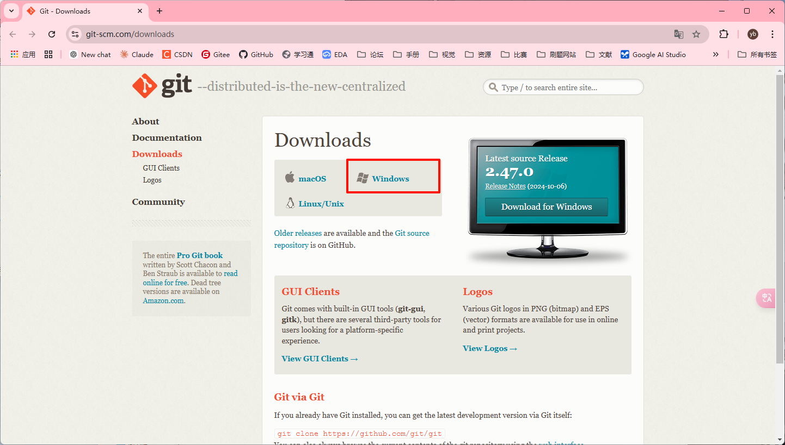

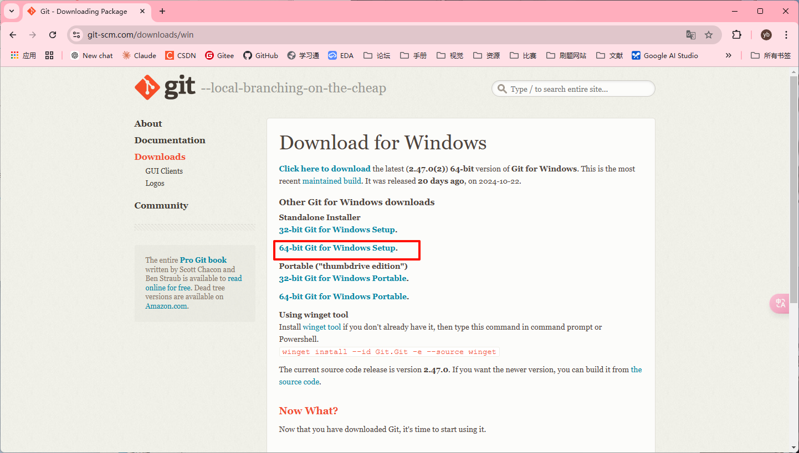

接下来选择你想安装的位置，其他的默认即可。

安装成功之后，可以看到鼠标右击，可以看到 `git bash`,下面我们使用的命令都是用这个操作的。

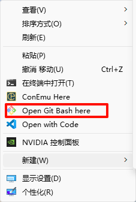

### 配置

配置用户名

~~~shell
git config --global user.name "name"
~~~

配置邮箱地址

~~~shell
git config --global user.email "email"
~~~

## 三、git的基础操作

* 初始化仓库

~~~shell
git init
~~~

* 克隆远程仓库

~~~shell
git clone <url>
~~~

* 查看当前状态

~~~shell
git status
~~~

* 添加更改

~~~shell
git add <file>
~~~

* 提交更改

~~~shell
git commit -m "commit message"
~~~

* 推送更改到远程仓库

~~~shell
git push origin <branch-name>
~~~

* 拉取远程仓库的更改

~~~shell
git pull origin <branch-name>
~~~

* 查看提交历史

~~~shell
git log
~~~

* 创建新的分支

~~~shell
git branch <branch-name>
~~~

* 切换分支

~~~shell
git checkout <branch-name> or git switch <branch-name>
~~~

* 合并分支

~~~shell
git merge <branch-name>
~~~

## 四.git的工作区域

​	Git 的工作区域分为四个主要部分，它们分别是：**工作区（Working Directory）**、**暂存区（Staging Area）**、**本地仓库（Local Repository）** 和 **远程仓库（Remote Repository）**。每个区域在文件管理和版本控制中扮演不同的角色。以下是它们的作用和工作流程：

### 1. 工作区（Working Directory）

- **描述**：这是我们日常操作文件的地方，即项目的文件夹。所有创建、编辑、删除的文件都发生在这里。
- **特点**：文件修改后会被 Git 识别为“已修改（modified）”状态，但这些修改还没有被提交，也不会被追踪为历史记录。

### 2. 暂存区（Staging Area）

- **描述**：暂存区也称为“索引（Index）”或“缓存（Cache）”。它是一个临时区域，用来保存那些准备好提交但尚未提交的修改。
- **特点**：当你使用 `git add <file>` 命令时，文件会从工作区被添加到暂存区。暂存区允许你在提交之前精确控制哪些修改会被包含在下一个提交中。

### 3. 本地仓库（Local Repository）

- **描述**：本地仓库是存放所有提交的历史记录的地方。每次使用 `git commit` 命令，暂存区的内容会被提交到本地仓库，生成一个新的提交（commit）。
- **特点**：在本地仓库中，你可以查看提交历史、回滚到之前的版本等操作。

### 4. 远程仓库（Remote Repository）

- **描述**：远程仓库通常托管在像 GitHub、GitLab、Bitbucket 等平台上。它可以供团队成员之间共享代码，并实现协作开发。
- **特点**：通过 `git push` 命令可以将本地的提交上传到远程仓库，`git pull` 可以从远程仓库获取最新的提交到本地。

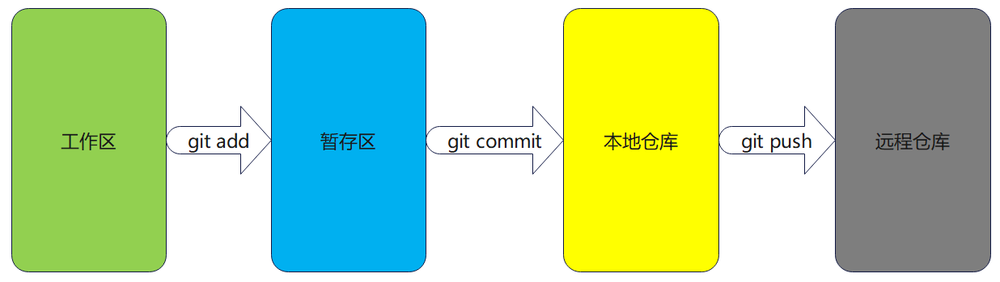

## 五、git的文件状态

Git 的文件状态表示文件在版本控制中的当前状态。主要有四种文件状态，帮助我们理解文件处于哪个区域（工作区、暂存区、本地仓库），并指导我们下一步要对文件执行的操作。以下是四种常见的文件状态：

### 1. **未跟踪（Untracked）**

- **描述**：文件在工作区中，但 Git 并没有跟踪它们。它们还没有被添加到版本控制中。
- **特点**：这些文件在执行 `git status` 时会显示为未跟踪的文件。Git 不会对这些文件进行版本管理。
- **操作**：可以使用 `git add <file>` 将它们添加到暂存区，使其进入“已暂存”状态。

### 2. **未修改（Unmodified）**

- **描述**：文件已经被 Git 跟踪，并且当前内容与最近的提交记录一致，未发生任何修改。
- **特点**：未修改状态的文件不会出现在 `git status` 的“已修改”列表中。
- **操作**：若文件没有任何更改，可以直接提交。若需要修改，可以编辑文件，它将变为“已修改”状态。

### 3. **已修改（Modified）**

- **描述**：文件已被 Git 跟踪过，但内容在工作区中发生了变化，尚未添加到暂存区。
- **特点**：文件在工作区中有更改，但这些更改还没有被添加到下一个提交中。
- **操作**：可以使用 `git add <file>` 将修改的内容添加到暂存区，文件将进入“已暂存”状态。若不希望提交这些修改，也可以使用 `git checkout -- <file>` 撤销更改，使其回到未修改状态。

### 4. **已暂存（Staged）**

- **描述**：文件的修改已添加到暂存区，准备提交。
- **特点**：在 `git status` 中显示为“将要提交的更改”。
- **操作**：可以使用 `git commit -m "message"` 提交暂存区的内容。提交后，文件将回到“未修改”状态。

**文件状态的转变流程**

1. **新文件**：文件最初是“未跟踪”状态。
2. **添加到暂存区**：`git add <file>` 将未跟踪或已修改文件添加到暂存区，文件进入“已暂存”状态。
3. **提交更改**：`git commit -m "message"` 提交已暂存的内容，文件状态变为“未修改”。
4. **修改文件**：对文件再次编辑后，文件状态变为“已修改”。

**检查文件状态**

可以使用 `git status` 命令查看文件的当前状态。这是了解工作区、暂存区和本地仓库中文件状态的重要工具。

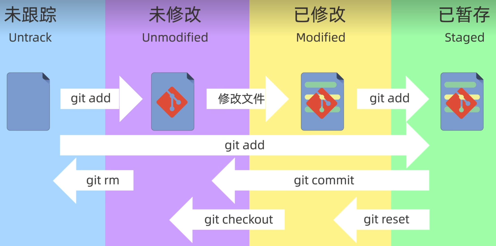

## 六、文件的添加和提交

* 创建仓库

  ~~~shell
  git init
  ~~~

  使用`git init` git就会追踪此仓库,可以看到当前文件夹会多出一个文件夹`.git`。

* 查看仓库的状态

  ~~~shell
  git status
  ~~~

  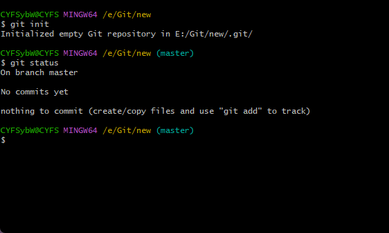

  因为当前没有文件，所以可以看到他提示什么都没有，我们可以新建一个文件，此时在使用`git status`就可以发现，提示有未追踪的文件。

  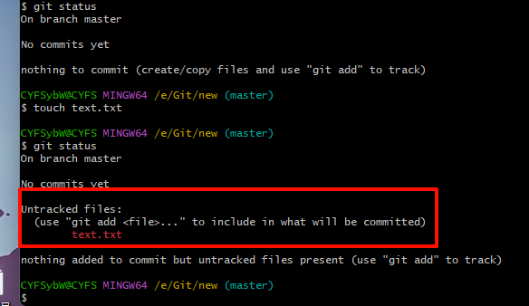

* 添加到暂存区

  ~~~shell
  git add text.txt
  ~~~

  此时在使用`git status`就可以看到文件已经在暂存区了

  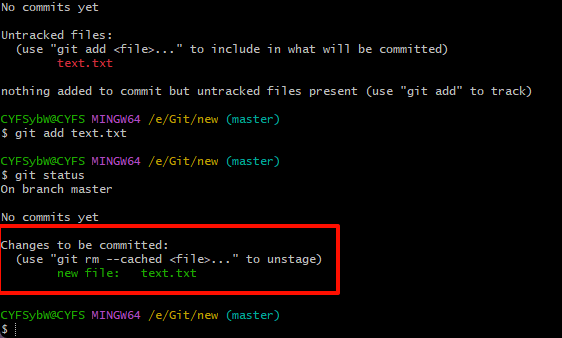

* 提交

  ~~~shell
  git commit -m "add text.txt"
  ~~~

  文件就已经被提交到本地仓库

  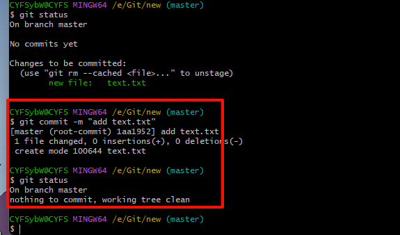

对于文件的添加和提交，其实很简单只需要熟悉`add`和`commit`的命令就可。

## 七、Git log

`git log` 命令用于查看 Git 仓库的提交历史。它提供了每个提交的详细信息，包括提交的哈希值、作者、日期和提交消息。`git log` 是调试和跟踪项目历史、定位特定更改的重要工具。以下是一些 `git log` 的常用选项和示例：

### 基本用法

```bash
git log
```

不加选项的 `git log` 命令会按时间顺序列出提交记录，从最近的提交开始，每条记录包括以下信息：

- 提交哈希值（commit ID）
- 作者（Author）
- 日期（Date）
- 提交消息（Commit message）

### 常用选项

1. **限制输出的提交数量**
   ```bash
   git log -n <number>
   ```
   显示最近的 `n` 条提交记录。例如：
   ```bash
   git log -n 5
   ```
   只显示最近的 5 次提交。

2. **简化输出格式**

   - **单行输出**：使用 `--oneline` 选项，将每个提交显示为一行，包含简短的哈希值和提交消息。
     ```bash
     git log --oneline
     ```
   - **图形化输出**：使用 `--graph` 选项，显示分支和合并历史的 ASCII 图形。
     ```bash
     git log --graph --oneline
     ```

3. **显示文件改动**

   - **显示每次提交的改动详情**：
     ```bash
     git log -p
     ```
     此选项显示每次提交的代码差异，具体修改内容。
   
   - **显示统计信息**：使用 `--stat` 选项，列出每个提交中修改的文件以及插入和删除的行数。
     ```bash
     git log --stat
     ```

4. **过滤提交记录**

   - **按作者过滤**：使用 `--author` 选项，只显示特定作者的提交记录。
     ```bash
     git log --author="Author Name"
     ```
   
   - **按日期过滤**：使用 `--since` 和 `--until` 选项，只显示特定时间段内的提交。
     ```bash
     git log --since="2023-01-01" --until="2023-12-31"
     ```
   
   - **按提交信息关键字过滤**：使用 `--grep` 选项，只显示提交信息中包含特定关键字的记录。
     ```bash
     git log --grep="bug fix"
     ```

5. **查看特定文件的提交历史**
   ```bash
   git log <file>
   ```
   这个命令会显示指定文件的提交记录，便于追踪文件的更改历史。

### 组合示例

- **查看图形化的简洁历史**：
  ```bash
  git log --oneline --graph --all
  ```
  显示所有分支的图形化简洁历史。

- **查看特定作者在最近 10 次提交中的改动统计**：
  ```bash
  git log -n 10 --author="Author Name" --stat
  ```

- **查看过去一个月的提交记录及其更改内容**：
  ```bash
  git log --since="1 month ago" -p
  ```

### 总结

`git log` 提供了丰富的选项，帮助我们以不同方式查看项目的提交历史。通过指定过滤条件、格式化输出、查看特定文件或作者的提交记录，`git log` 可以精确地展示我们想要的提交信息。

## 八、回退版本

`git reset` 是 Git 中一个非常重要且强大的命令，用于撤销操作、移动提交记录指针和修改文件状态。它的主要作用包括：

1. **撤销提交**：可以将提交记录回退到某个指定的提交。
2. **重置暂存区**：可以将暂存区的文件恢复到上一个提交的状态。
3. **修改工作区文件状态**：可以撤销工作区中的更改。

`git reset` 的三种主要模式

`git reset` 命令有三种主要模式，每种模式在工作区、暂存区和本地仓库上的影响不同：

#### 1. `--soft` 模式

- **作用**：只移动提交记录的指针，不改变暂存区和工作区的内容。
- **用途**：通常用于撤销最近的一个或多个提交，但保留文件的修改。
- **用法**：
  ```bash
  git reset --soft <commit>
  ```
  执行此命令后，指定提交之后的所有提交都会被取消，但文件内容保持不变，所有更改保留在暂存区，等待再次提交。

#### 2. `--mixed` 模式（默认模式）

- **作用**：将提交记录的指针和暂存区重置到指定的提交，但不影响工作区。
- **用途**：撤销提交并清空暂存区的修改，保留工作区的更改。
- **用法**：
  ```bash
  git reset --mixed <commit>
  ```
  如果没有指定模式，`git reset` 默认会使用 `--mixed` 模式。此操作会撤销提交并将所有更改保留在工作区中。

#### 3. `--hard` 模式

- **作用**：将提交记录的指针、暂存区和工作区都重置到指定的提交。
- **用途**：彻底删除指定提交之后的所有更改，恢复到指定提交的状态。
- **用法**：
  ```bash
  git reset --hard <commit>
  ```
  **注意**：`--hard` 模式会永久删除指定提交后的所有改动，请谨慎使用，因为这些改动在重置后无法直接恢复。

### `git reset` 用法示例

1. **撤销最后一次提交（保留更改）**
   ```bash
   git reset --soft HEAD~1
   ```
   这会将上一次提交撤销，并将所有更改保留在暂存区。

2. **撤销提交并清空暂存区（保留工作区更改）**
   ```bash
   git reset --mixed HEAD~1
   ```
   这会将上一次提交撤销，并将更改保留在工作区中，但清空暂存区。

3. **彻底撤销所有更改**
   ```bash
   git reset --hard HEAD~1
   ```
   这会将 HEAD 指针回退到上一个提交，并丢弃所有未提交的更改。

### `git reset` 的其他用法

- **指定文件重置**：将指定文件从暂存区重置回工作区的状态（仅影响暂存区）。
  ```bash
  git reset <file>
  ```
  这样可以将文件从暂存区移除，但工作区中的更改不会被删除。

### 总结

- `--soft`：回退提交记录，保留暂存区和工作区的更改。
- `--mixed`：回退提交记录和暂存区，更改保留在工作区。
- `--hard`：回退提交记录、暂存区和工作区，丢弃所有未提交的更改。 

`git reset` 是强大的工具，能有效管理提交记录和文件状态。

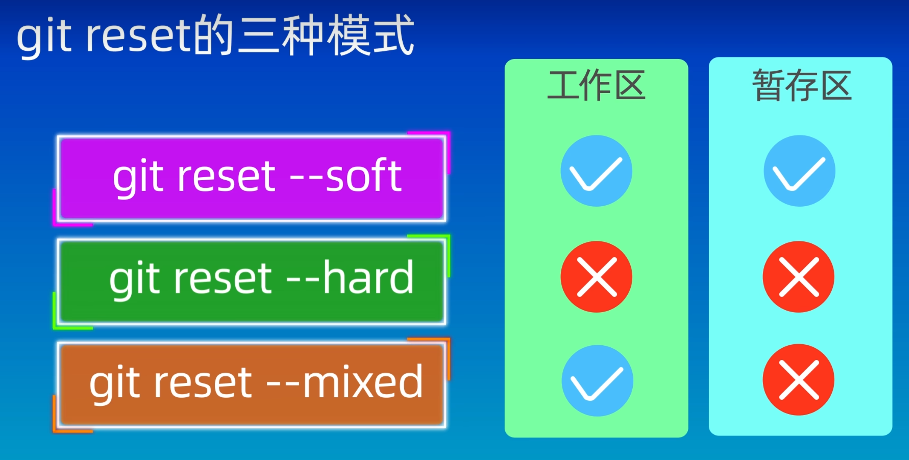

## 九、比较文件的改动

`git diff` 是 Git 用来比较文件改动的命令。它主要用于查看工作区、暂存区和提交之间的差异。在项目开发过程中，`git diff` 可以帮助我们跟踪文件的具体改动，了解未提交的更改内容。以下是一些常用的 `git diff` 用法：

### 基本用法

1. **查看工作区未暂存的更改**
   ```bash
   git diff
   ```
   这个命令会显示自上次提交以来，工作区中未暂存的文件改动。它可以帮助你查看还没有被 `git add` 到暂存区的更改内容。

2. **查看暂存区和最后一次提交之间的更改**
   ```bash
   git diff --cached
   ```
   或者：
   ```bash
   git diff --staged
   ```
   这会显示所有已暂存的改动，即已使用 `git add` 添加到暂存区的文件改动，但还未提交的部分。这些改动会在下一次提交中包含。

3. **查看工作区和最近提交之间的所有更改**
   ```bash
   git diff HEAD
   ```
   该命令会比较工作区与最新提交之间的差异，包括暂存区和未暂存的文件改动。它可以帮助你全面了解本地的更改。

### 高级用法

1. **比较两个提交之间的差异**
   ```bash
   git diff <commit1> <commit2>
   ```
   这会比较两个提交之间的差异，比如：
   ```bash
   git diff 123abc 456def
   ```
   你可以使用提交哈希、分支名、标签等来指定这两个提交。

2. **查看特定文件的改动**
   ```bash
   git diff <file>
   ```
   该命令会显示指定文件自上次提交以来的更改情况。

3. **比较分支之间的差异**
   ```bash
   git diff <branch1> <branch2>
   ```
   这个命令会比较两个分支之间的所有差异。可以用来查看当前分支与目标分支之间的差别。例如：
   ```bash
   git diff main feature-branch
   ```

4. **查看提交的具体差异**
   ```bash
   git diff <commit>^ <commit>
   ```
   如果想查看某个特定提交的更改情况，可以使用上一个提交和这个提交之间的差异。例如：
   ```bash
   git diff 123abc^ 123abc
   ```

5. **忽略空白字符差异**
   ```bash
   git diff -w
   ```
   使用 `-w` 选项可以忽略由于空白字符（例如空格、制表符）引起的差异，仅显示实际内容的更改。

### 示例

- **查看暂存区和工作区之间的变化**
  ```bash
  git diff --cached
  ```

- **查看最新一次提交与工作区之间的所有改动**
  ```bash
  git diff HEAD
  ```

- **查看两个分支的差异**
  ```bash
  git diff main feature-branch
  ```

### 总结

- `git diff` 可以灵活查看未提交的更改、暂存区的内容以及提交之间的差异。
- 常用选项有 `--cached`、文件路径、分支名、提交哈希等，可以根据需求选择合适的用法。

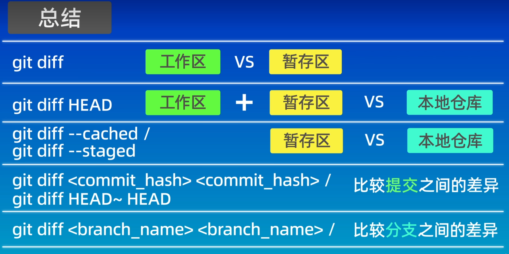

## 十、git rm

`git rm` 命令用于从 Git 仓库中删除文件。它不仅会从工作区删除指定的文件，还会将删除操作放入暂存区，以便在下一次提交时记录文件的删除。这个命令常用于项目中清理或移除不再需要的文件。

### 基本用法

1. **删除文件并暂存更改**
   ```bash
   git rm <file>
   ```
   例如：
   ```bash
   git rm example.txt
   ```
   这将删除 `example.txt` 文件，并将删除操作添加到暂存区。

2. **删除文件但保留本地副本**
   ```bash
   git rm --cached <file>
   ```
   此选项只将文件从暂存区移除，但保留在工作区中。文件将不再受 Git 的版本控制。适用于希望移除文件版本控制但保留文件本地副本的情况。

3. **递归删除文件夹**
   ```bash
   git rm -r <directory>
   ```
   `-r` 选项允许递归删除文件夹。例如：
   ```bash
   git rm -r old_directory
   ```
   这会删除文件夹 `old_directory` 及其所有内容。

### 常用选项

- `--cached`：仅从暂存区移除文件，但保留本地文件。
- `-r`：递归删除文件夹，适用于文件夹或包含子文件夹的目录。
- `-f`：强制删除文件，适用于已修改且未提交的文件。

### 示例

1. **从版本控制中移除文件但保留在本地**
   ```bash
   git rm --cached config.json
   ```
   移除 `config.json`，但保留工作区副本。这对保密或配置文件很有用，尤其是将文件添加到 `.gitignore` 以避免再次提交。

2. **递归删除文件夹和所有内容**
   ```bash
   git rm -r logs/
   ```
   删除 `logs` 文件夹及其内容，准备在下一次提交时记录这些删除操作。

3. **强制删除修改过但未暂存的文件**
   ```bash
   git rm -f outdated_file.txt
   ```
   删除已修改但未提交的 `outdated_file.txt` 文件。

### 提交删除操作

执行 `git rm` 后，删除操作会添加到暂存区，之后可以使用以下命令提交更改：

```bash
git commit -m "Remove unnecessary files"
```

这样，文件删除将记录到项目的历史中。

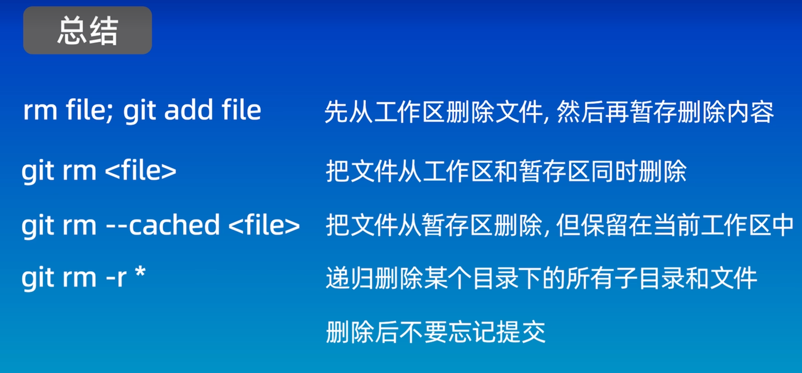

## 十一、忽略规则

`.gitignore` 文件用于告诉 Git 在版本控制中忽略哪些文件或文件夹。这个文件通常放在仓库的根目录中，定义了哪些文件不需要被 Git 追踪或提交。常见用途包括忽略编译生成的文件、临时文件、配置文件、敏感信息等。

### 基本用法

在 `.gitignore` 文件中，每一行都可以定义一个忽略的文件或路径模式，例如：

- **忽略单个文件**：
  ```plaintext
  config.json
  ```
  忽略项目根目录下的 `config.json` 文件。

- **忽略文件夹**：
  ```plaintext
  /build/
  ```
  忽略根目录下的 `build` 文件夹及其所有内容。

- **忽略特定文件类型**：
  ```plaintext
  *.log
  ```
  忽略所有 `.log` 结尾的日志文件。

- **忽略特定文件夹内的文件**：
  ```plaintext
  logs/*.txt
  ```
  忽略 `logs` 文件夹中的 `.txt` 文件，但保留其他类型文件。

### 常用规则

- **忽略临时文件**：
  ```plaintext
  *.tmp
  *.swp
  ```

- **忽略编译生成的文件和文件夹**：
  ```plaintext
  /bin/
  /obj/
  *.o
  *.exe
  ```

- **忽略环境特定文件**：
  ```plaintext
  .DS_Store     # macOS
  Thumbs.db     # Windows
  ```

- **忽略版本控制敏感文件**：
  ```plaintext
  .env
  ```

### 例外规则

使用 `!` 可以取消忽略指定的文件或文件夹。例如：

```plaintext
*.log
!important.log
```

这里会忽略所有 `.log` 文件，但保留 `important.log`。

### 示例 `.gitignore` 文件

以下是一个典型的 `.gitignore` 文件示例，适用于常见的项目结构：

```plaintext
# 忽略 Python 编译文件
__pycache__/
*.pyc

# 忽略日志文件
*.log

# 忽略环境文件
.env

# 忽略 node_modules 文件夹
node_modules/

# 忽略构建文件
/dist/
/build/

# 保留特定文件
!.gitignore
```

### `.gitignore` 生效条件

1. `.gitignore` 只能对未被 Git 追踪的文件生效。
2. 如果某个文件已经被提交到仓库中，再将它添加到 `.gitignore` 中不会生效。此时可以通过以下命令将其移出暂存区：

   ```bash
   git rm --cached <file>
   ```

`.gitignore` 是一个简单而强大的工具，可以帮助我们保持仓库的整洁和安全。

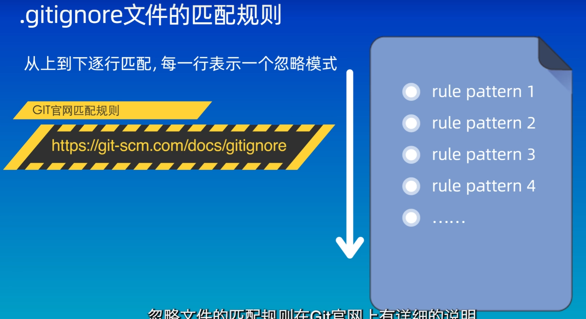


## 十二、SSH的配置和克隆仓库

### 生成SSH 密钥对

SSH 使用公钥（`id_rsa.pub`）和私钥（`id_rsa`）进行加密认证。可以使用以下命令生成一对新的密钥：

```shell
ssh-keygen -t rsa -b 4096 -C "your_email@example.com"
```

- `-t rsa`：指定加密类型为 RSA。
- `-b 4096`：生成一个 4096 位的密钥（更高的位数意味着更高的安全性）。
- `-C "your_email@example.com"`：添加注释，通常是你的邮箱地址，便于标识。

按提示完成密钥生成过程，生成的密钥默认保存在 `~/.ssh/` 目录中。

windos在用户的路径下：比如`C:\Users\<name>\.ssh`,name:是你的用户名。

当然也可以直接在git bash中输入

~~~shell
cat ~/.ssh/id_rsa.pub
~~~

这样就可以直接查看到公钥

### 添加公钥

这边以github为例子，进入设置，点击`SSH and GPG keys`，新建一个SSH 密钥。把刚才查看到的公钥的内容复制进入key中，接下来验证密码即可。

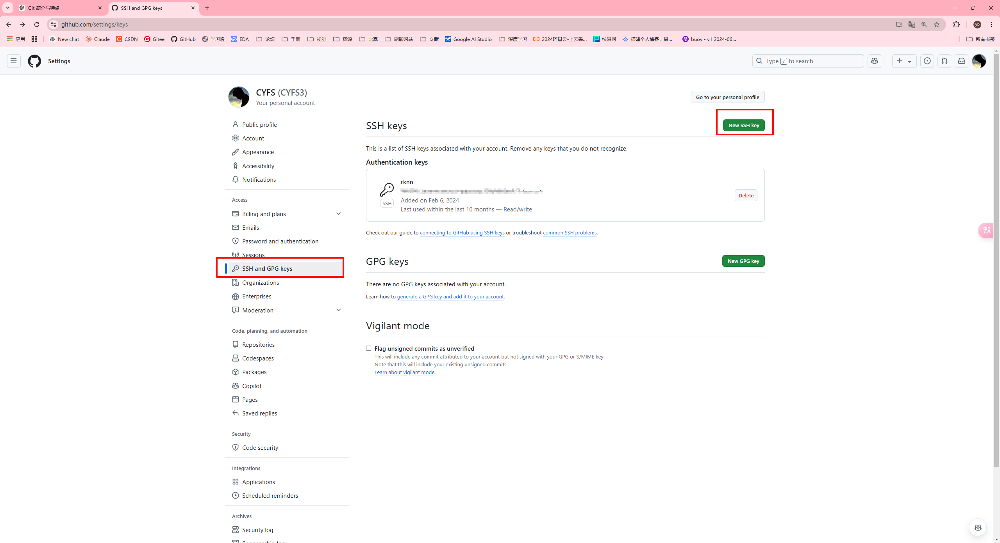

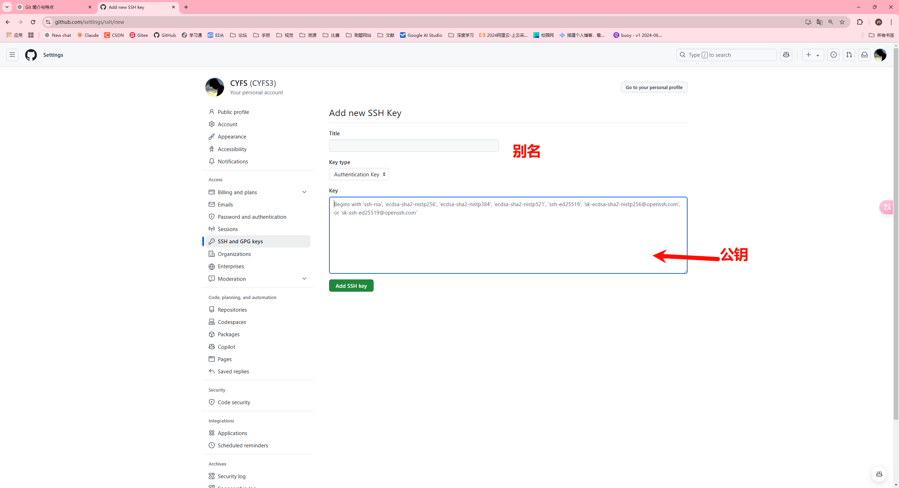

### 克隆仓库

~~~shell
git clone <url>
~~~

可以克隆开源的项目或者是自己在github上面新建的仓库。

### 添加远程仓库

如果原本本地有仓库的话，想要提交到远程和小伙伴一起开发的话，就可以使用`git remote`

~~~shell
git remote add <远程仓库别名> <远程仓库url>
~~~

### 推送到远程仓库

~~~shell
git push <远程仓库> <本地分支名>:<远程分支名字>
~~~

* 远程仓库：可以使用`git remote`添加的远程仓库别名。
* 如果本地分支和远程分支名字一直就可以直接`git push origin master`

### 拉取远程仓库

当和小伙伴协同开发的时候，小伙伴对远程仓库进行了推送，你要同他更新的内容，使用`git pull`

~~~shell
git pull <远程仓库>
~~~

* 远程仓库：可以使用`git remote`添加的远程仓库别名。

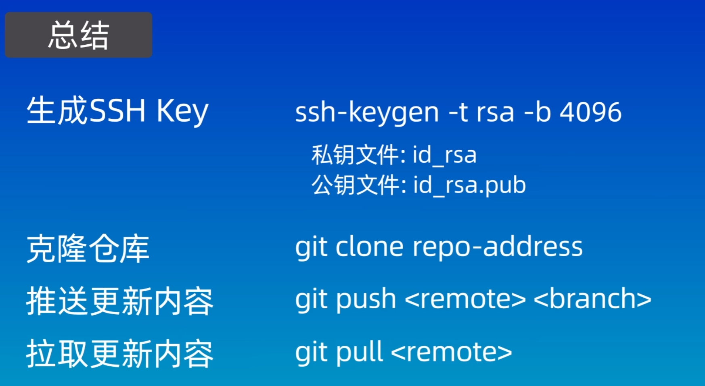


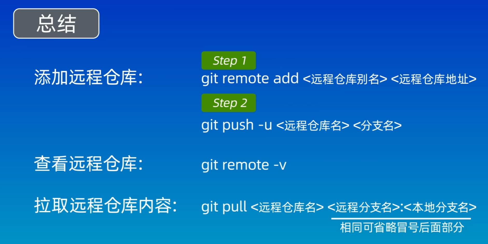

在有些gui界面的文件标示

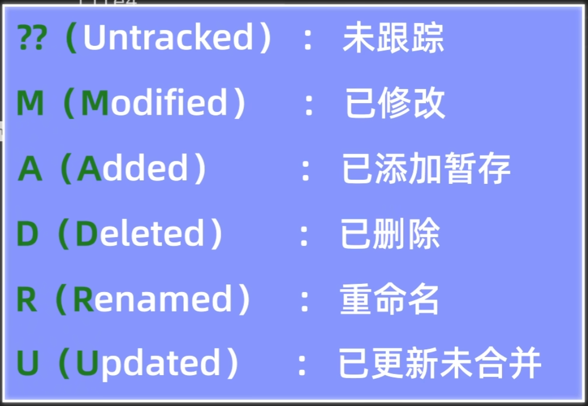

## 十三、分支

### Git 分支简介

Git 的分支（Branch）是版本控制中的一个非常重要的概念。它允许你在同一个仓库中独立地工作于不同的任务或功能，不同的分支可以并行开发，互不干扰。

分支允许你进行如下操作：
- 独立开发功能，不影响主分支。
- 修复 bug 或进行实验，不影响其他开发人员。
- 在合并之前进行代码审查和测试。

### 基本概念

- **主分支**（通常是 `main` 或 `master`）：默认的主要分支，通常包含生产环境的代码。
- **功能分支**（Feature Branches）：用于开发新特性的分支。
- **开发分支**（Develop Branches）：集成新特性和修复的分支，通常用于团队协作。
- **修复分支**（Hotfixes / Bugfixes）：修复紧急 bug 的分支。

### 常用 Git 分支命令

#### 1. 查看分支
查看本地所有分支：

```bash
git branch
```

查看本地和远程所有分支：

```bash
git branch -a
```

查看远程分支：

```bash
git branch -r
```

#### 2. 创建新分支
```bash
git branch <branch-name>
```

例如，创建一个名为 `feature1` 的分支：

```bash
git branch feature1
```

#### 3. 切换分支
切换到指定分支：

```bash
git checkout <branch-name>
or
git switch <branch-name> //优先使用
```

例如，切换到 `feature1` 分支：

```bash
git switch feature1
```

#### 4. 创建并切换到新分支
你可以通过 `-b` 选项在创建分支时直接切换到该分支：

```bash
git checkout -b <branch-name>
```

例如，创建并切换到 `feature2` 分支：

```bash
git checkout -b feature2
```

#### 5. 合并分支
将某个分支的更改合并到当前分支：

```bash
git merge <branch-name>
```

例如，将 `feature1` 分支合并到当前分支：

```bash
git merge feature1
```

#### 6. 删除分支

- 删除本地分支：
  ```bash
  git branch -d <branch-name>
  ```
  使用 `-d` 会检查分支是否已完全合并，如果没有合并，则会拒绝删除。如果确定要删除，使用 `-D` 强制删除。

  ```bash
  git branch -D <branch-name>
  ```

- 删除远程分支：
  ```bash
  git push origin --delete <branch-name>
  ```

#### 7. 推送分支
将本地分支推送到远程仓库：

```bash
git push origin <branch-name>
```

如果是新分支并且你希望将其与远程分支关联，可以使用 `-u` 参数：

```bash
git push -u origin <branch-name>
```

#### 8. 拉取远程分支
从远程仓库获取分支到本地：

```bash
git fetch origin <branch-name>
```

#### 9. 重命名分支
- 重命名当前分支：
  ```bash
  git branch -m <new-branch-name>
  ```

- 重命名远程分支：
  ```bash
  git push origin :<old-branch-name> <new-branch-name>
  git push origin -u <new-branch-name>
  ```

### 合并策略

在多人协作的项目中，合并分支时有几种常见的策略：

1. **Fast-forward** 合并：
   如果目标分支没有新的提交，Git 会进行 fast-forward 合并，直接将目标分支指向当前分支的提交。

2. **Merge Commit** 合并：
   如果目标分支有提交，则会创建一个合并提交，将两者的提交历史合并。

3. **Rebase** 合并：
   通过 rebase 可以避免合并提交，直接将分支上的提交应用到目标分支的末尾，保持更清晰的提交历史。

   ```bash
   git rebase <branch-name>
   ```

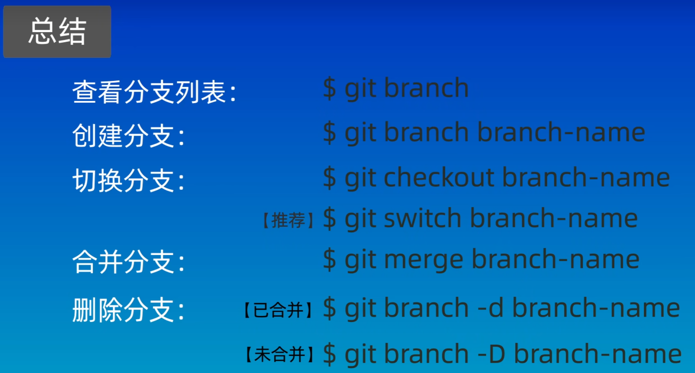

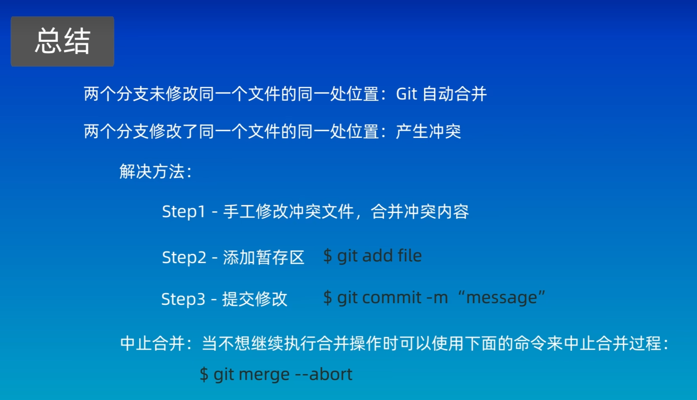

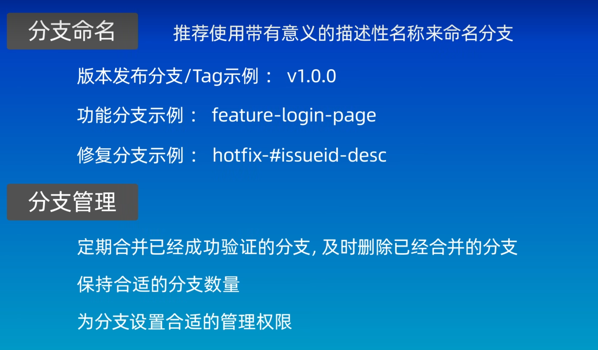

## 十四、PR流程

对开源项目提供自己的代码

### fork

首先需要有github的账户，将官方的仓库fork到自己的账号。

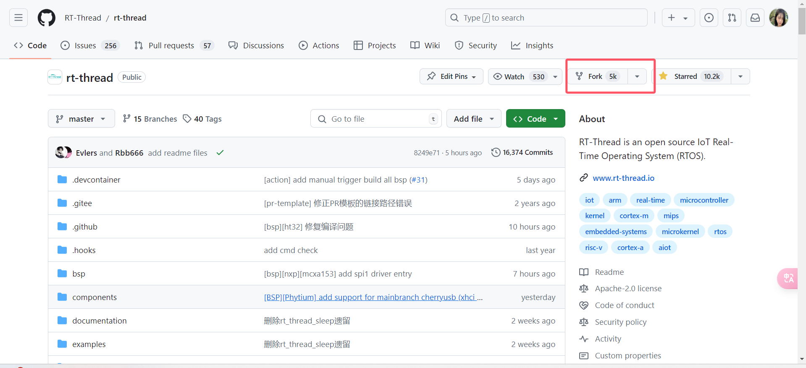

接下来就可以将仓库克隆到本地。

* 如果之前克隆过的话就可以添加一个远程的仓库就行

~~~ shell
git remote add <fork> <url>
~~~

for：是远程仓库的别名

url：fork过后自己的仓库地址

* 如果之前没有克隆过的就可以直接克隆fork的仓库地址

### 新建分支

一般我们要向一个开源仓库提交一个pr的话，都需要新建一个分支。

~~~ shell
git checkout -b <new-branch>
~~~

这个时候就会创建一个<new-branch>的分支，并且切换到该分支，此时我们就可以在该分支上开发。

### commit push

  1 、当我们开发完成的时候，想把代码推送到远端时，可以使用 `git status`查看一下我们更改了那些东西，并决定要提交哪些文件。

2. 使用`git add <file>`添加想要提交的文件

3. 使用`git commit -m "xxx"`为此次的提交写上一些注释

   4.此时我们就可以把本地的更改推送我们fork之后的仓库

~~~shell
git push <fork> <new-branch>
~~~

fork是远程仓库的别名。可以使用`git remote -v`查看

### 创建PR

此时登录github，在fork的仓库就可以看到

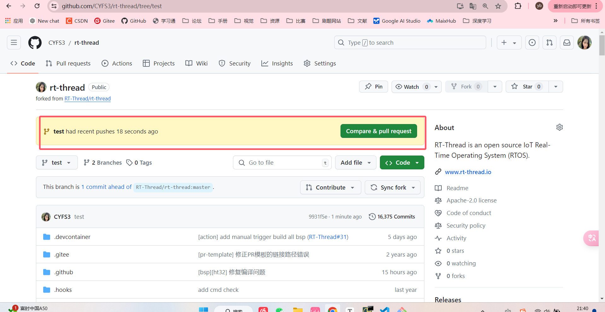

只需要点击绿色按钮就可以进行pr

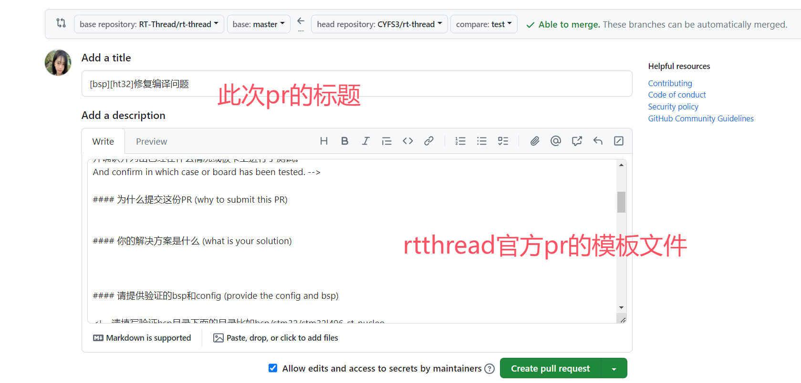

因为此次pr是根据下面的这个issue，#<issue的编号>


所以我们就可以在模板文件中关联issue

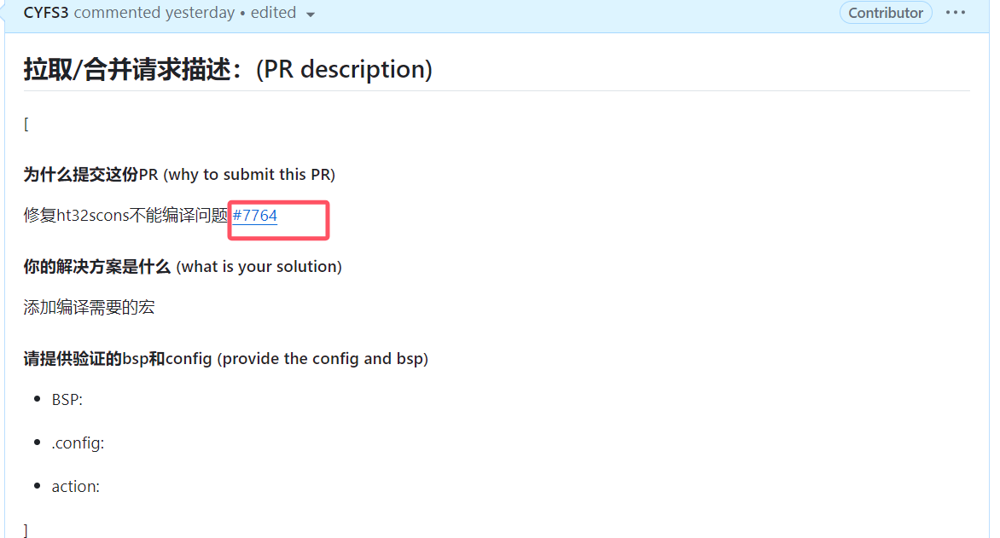

最后点击创建pr就行

此时开源项目的审查人就会对你的pr进行审查，在此期间可以和大佬多沟通。

如果顺利的话，最终 PR 能够被认可，那么我们的修改就可以合并到官方仓库了！

如果需要修改内容，只需要修改完推送到跟此次pr的分支，无需在此重新创建pr。

### 删除此次pr的分支

删除本地分支

~~~shell
$ git branch -D <new-brach>
~~~

删除远程fork仓库的分支

~~~shell
git push origin --delete <new-brach>
~~~

同步fork的分支和本地的

~~~shell
git pull
~~~

下次如果想重新提交一个pr的话，就可以在建一个新的分支。

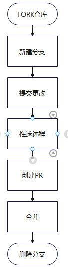


## 资源推荐

* GeekHour大佬的视频[【GeekHour】一小时Git教程](https://www.bilibili.com/video/BV1HM411377j?vd_source=8c1bf9924f2718d7b70c1876a083a32e),本文章的很多图片来源都是大佬的视频中。
* [progit](https://git-scm.com/book/zh/v2/%e8%b5%b7%e6%ad%a5-%e5%85%b3%e4%ba%8e%e7%89%88%e6%9c%ac%e6%8e%a7%e5%88%b6)
* [git的游戏](https://learngitbranching.js.org/?locale=zh_CN)