# 蓝桥杯外设配置

**作者：22物联-吴艺彬**

## 一、新建工程

选择File->new project

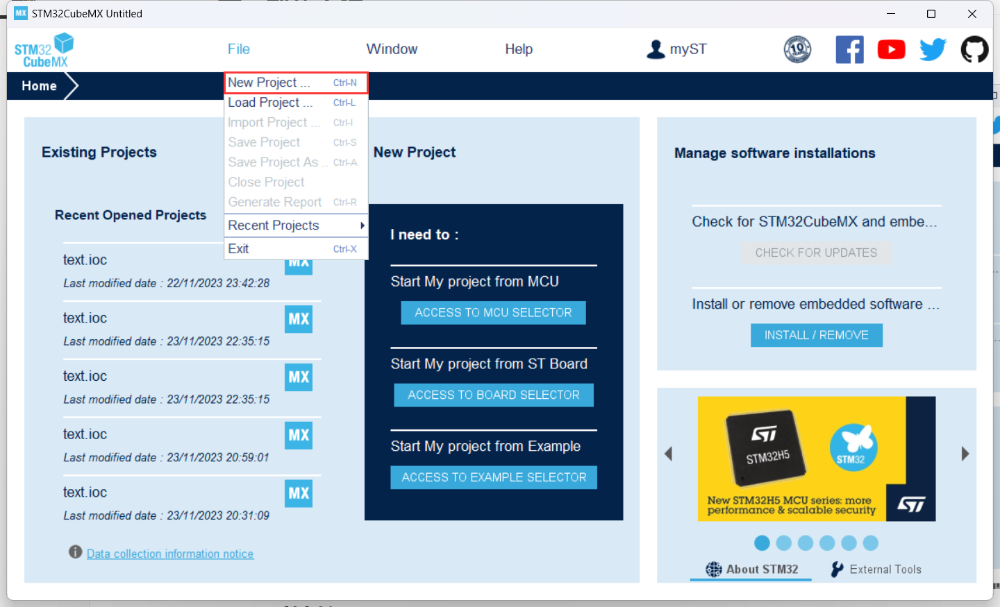

由资源配置表可以看到MCU的型号是STM32G431RBT6

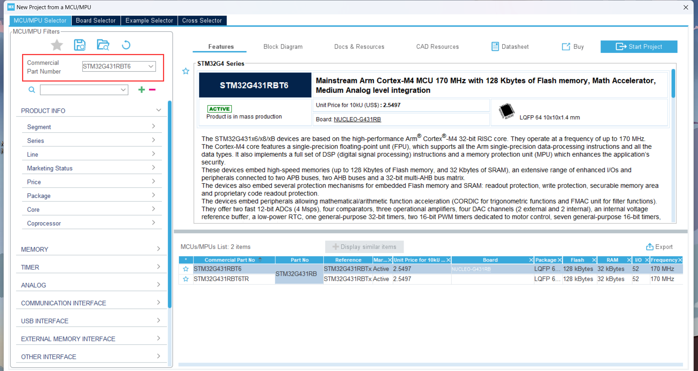

在Commercial Part Number 中输入STM32G431RBT6。

选择第一个就行

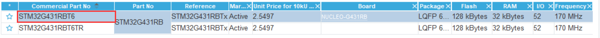

下载方式改为通过串行线

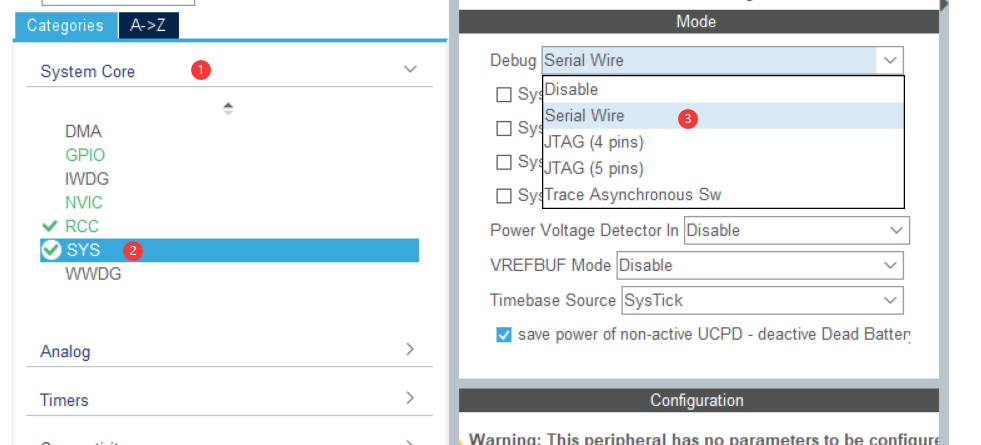

配置工程

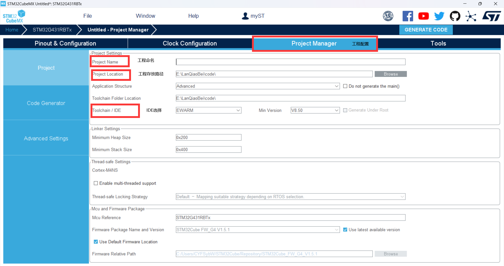

==注意：工程的命名以及存放路径必须是英文不然会导致cubemx导出失败。==

至于IDE的选择，因为我用的是keil所以这里选择MDK-ARM

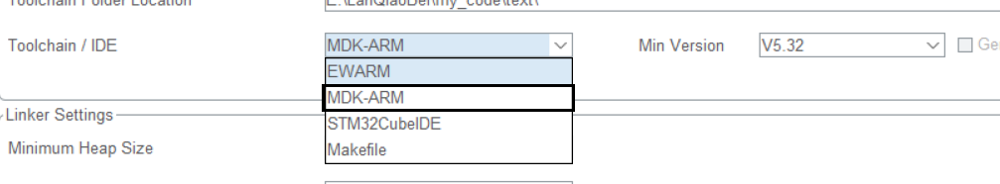

至于生成的代码配置，只需要把为每一个外设生产.c.h,其他默认不变。

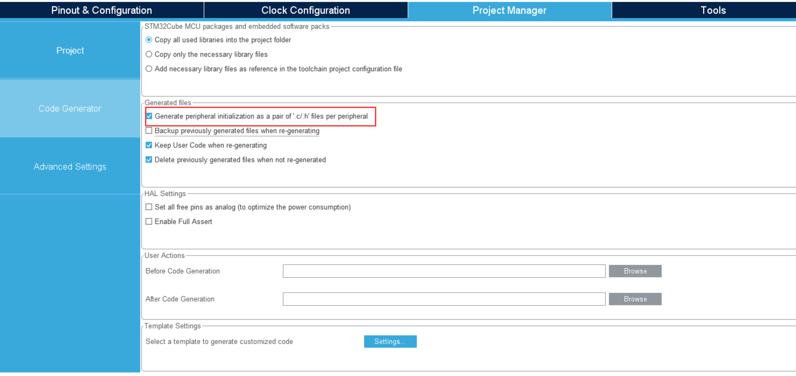

打开所生成的文件。

我们可以新建一个文件夹Bsp（板载支持），用于存放我们自己的模块代码。

## 二、时钟的配置

设置外部的高速时钟

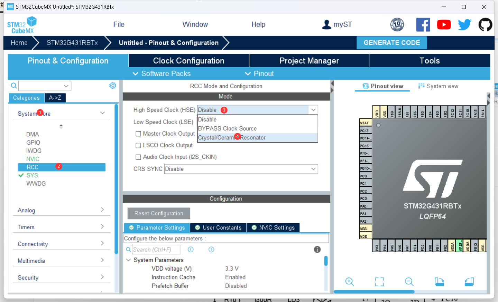

此时可以看到PF0和PF1已经作为外部晶振的输入口

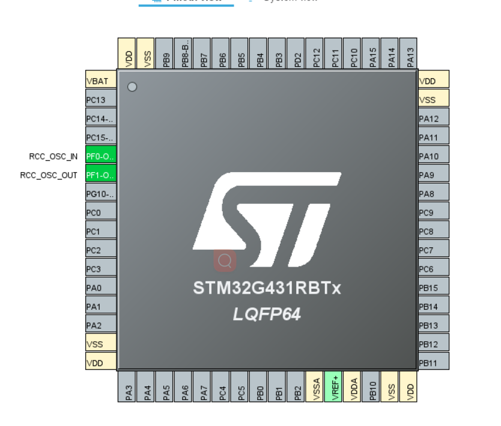

接下去还需要配置时钟总线

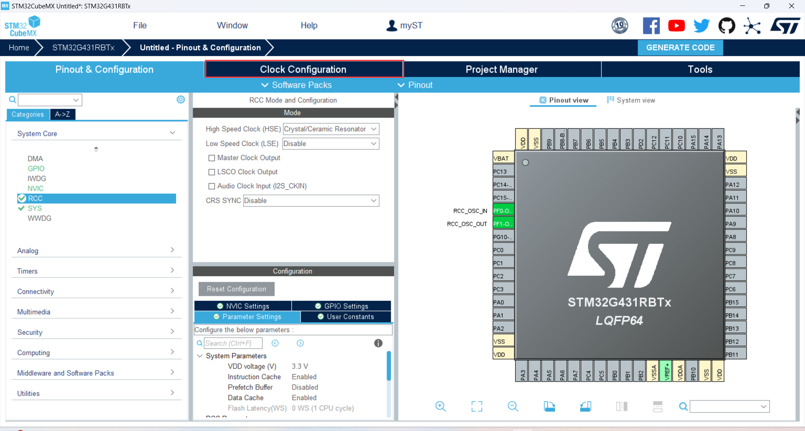

通过产品手册我们可以发现，板载的外部时钟为24MHZ

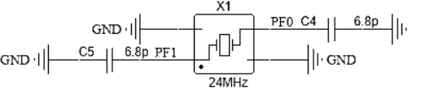

所以我们要把外部时钟改为24MHZ，并且把时钟源改为外部时钟。

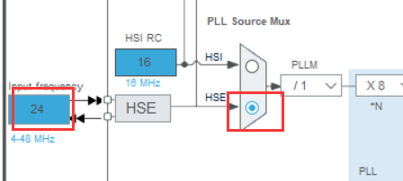

把System Clock Mux改为PLLCLK

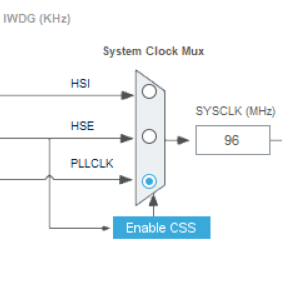

在把AHB总线的时钟频率配置成80MHZ然后回车就行

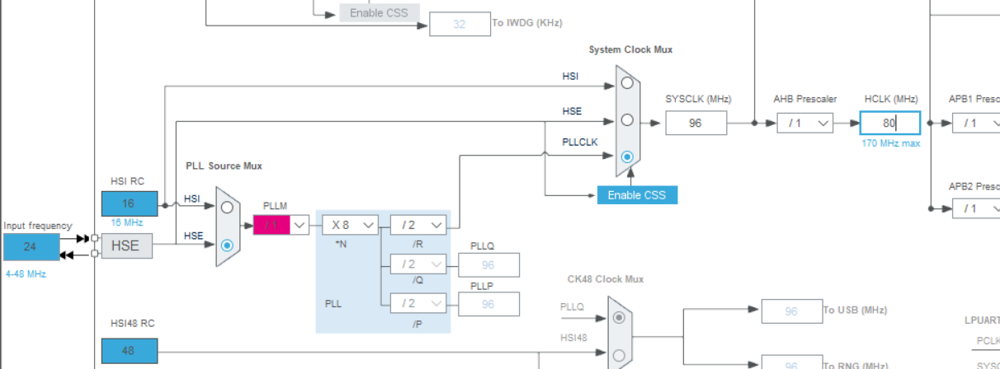

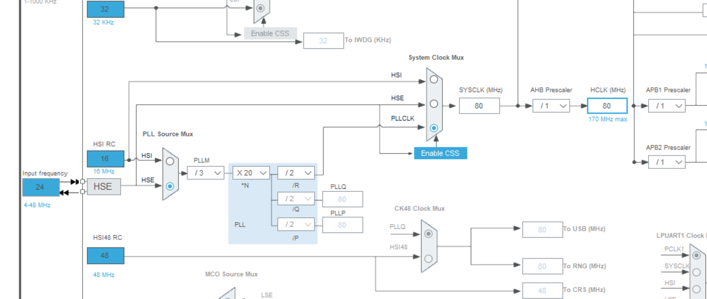

基本的配置都已经好了，这时候我们只需要点击生成代码就行。

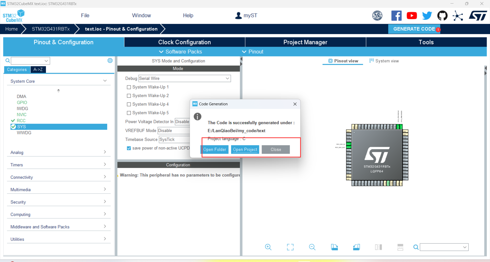

打开工程文件这时候就可以看到，cubemx已经自动帮我们生成了一下文件。

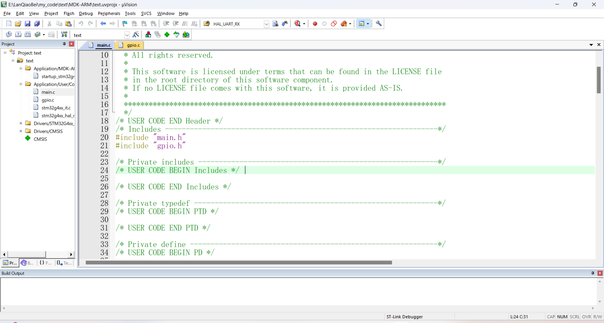

## 三、编写代码的注意事项

自己的代码必须写在规定的范围里，不然每次用cubemx重新生成代码时，自己所编写的代码可能被覆盖掉。

cubemx生成的main.c文件规范了，我们所编写代码存放的地方。

**1.头文件**

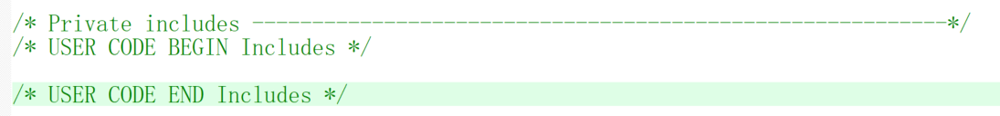

**2.类型定义**

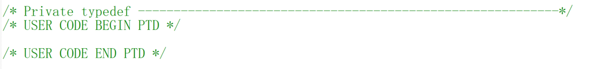

**3.宏定义**

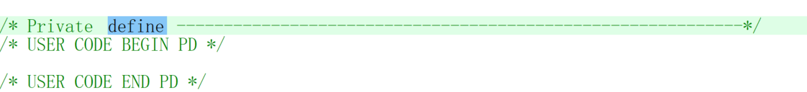

**4.宏实现**

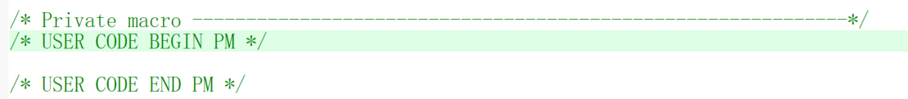

**5.变量**

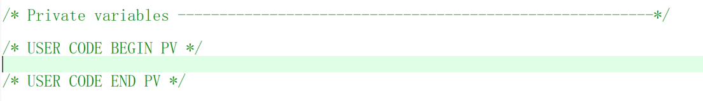

**6.函数声明**

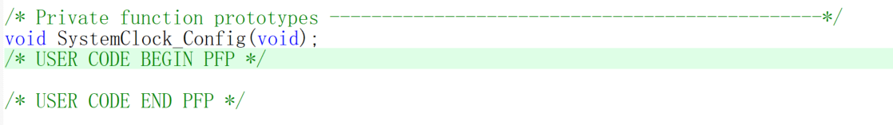

**7.用户的代码**

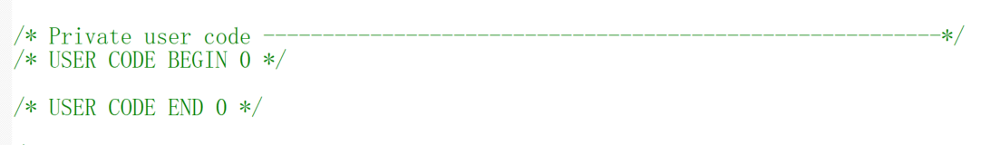

==自己编写的代码必须在 USER CODE BEGIN之后 USER CODE END之前。==

## 四、采用分任务的方式

这里我们利用滴答时钟来实现分任务，我们可以新建一个数组，来表示任务多久时间运行一次，然后在`SysTick_Handler`中把这个数组的值减减，当这个时间数组的值为0是就运行这个任务，可能语言描述有点难以理解，这边直接用代码来理解。

这边假设有两个任务，一个是LCD的任务，一个是LCD的任务。

~~~c
#define TASK_MAX 2
#define LEDTaskTimer sysTimer[0]
#define LCDTaskTimer sysTimer[1]

u32 sysTimer[TASK_MAX];//u32需要包含官方提供的lcd.h

void SysTick_Handler(void)//注意该函数在CubeMx生成代码的时候就会有，所以要在对应的stm32g4xx_it.c把他拷贝过来自己对应的.c文件
{
    HAL_IncTick();
    for(u8 i = 0;i < TASK_MAX;i++)
    {
        if(sysTimer[i])
        {
            sysTimer[i]--;
        }
    }
}
~~~

这个就是我们具体的分任务实现，那么任务该怎么写呢？

~~~c
void LED_Task(void)
{
    if(LEDTaskTimer)return;
    LEDTaskTimer = 100;
    /* 进行LED的任务逻辑*/
    
    
    
}
~~~

为了方便我们也可以把想什么时候运行一次的时间，用宏定义，方便修改

~~~~c
#define LEDTaskTimerPorid 100
#define LCDTaskTimerPorid 10
~~~~

因为`SysTick_Handler`是1ms进一次中断，所以对应的任务时间数组，要经过对应的时间，才会被清0，才能进入对应的任务逻辑。

题目对应的模块我们就可以为他们依次建一个任务来运行，这样逻辑性比较强，而且也方便实现。

## 五、LED的配置

### 1.CubeMX的配置

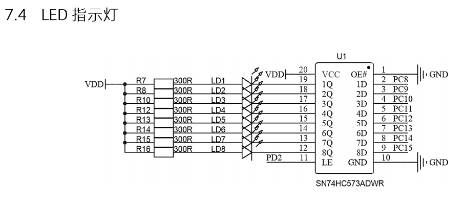

可以看到板载的LED灯是间接连接到PC8—PC15的，还要通过D 型锁存器（SN74HC573ADWR），D 型锁存器特别适用于实现缓冲寄存器、I/O 端口、双向总线驱动程序和工作寄存器。==所以会发现直接操作PC8—PC15,LED灯是没有作用的，还要把锁存器打开。==

当锁存使能 (LE) 输入一个由低变高的脉冲时。
Q 输出响应数据 (D) 输入。 当 LE 没有检测到脉冲时，输出被锁存以保留设置的数据。

用CubeMX配置所需要的引脚，把PC8—PC15和PD2的引脚配置为GPIO_Output.

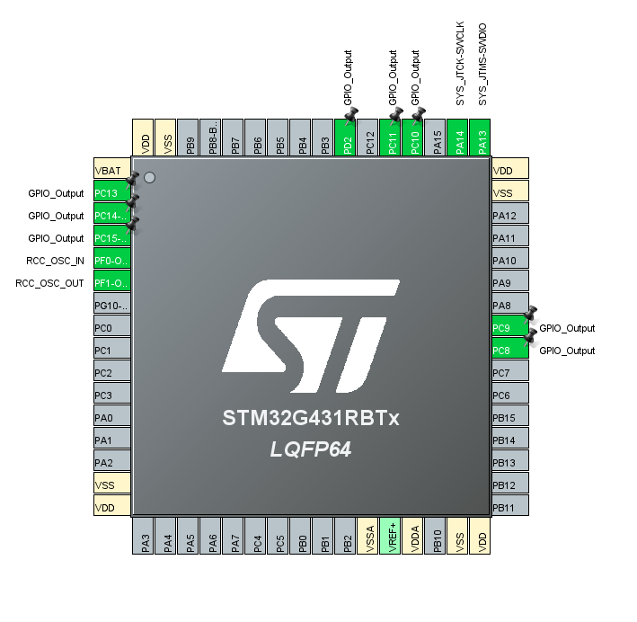

初始化状态灯应该是熄灭的，根据LED的的电路图，要把LED的引脚制高电平。

可以按住shift全选LED的引脚，设置为高电平。

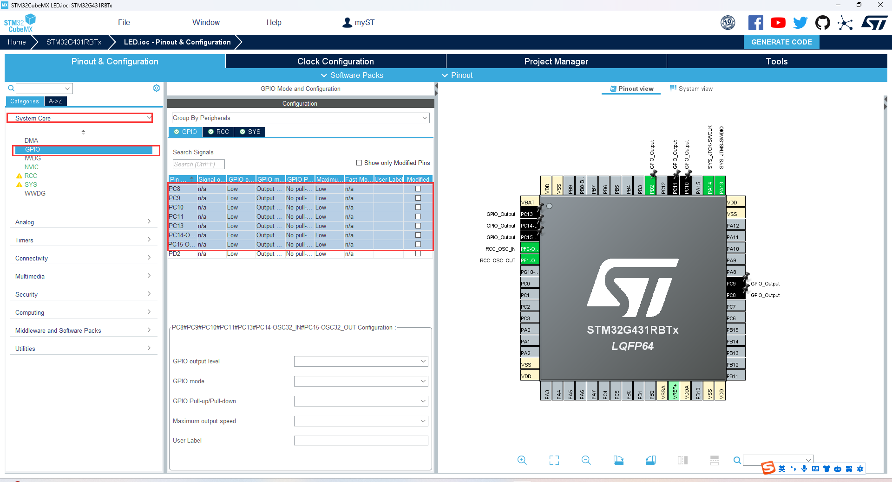

这样就完成LED灯的初始化。

### 2.代码部分

接下来我将介绍如何让LED灯亮。

我先介绍一个HAL库函数。

~~~c
void HAL_GPIO_WritePin(GPIO_TypeDef *GPIOx, uint16_t GPIO_Pin, GPIO_PinState PinState);
~~~

我们可以看到函数的参数有三个。

见名思意第一个参数是GPIO的端口。比如：GPIOA、GPIOB。

第二个参数是GPIO引脚。比如：GPIO_PIN_0，或者可以多个引脚组合GPIO_PIN_0 | GPIO_PIN_1（应该每一个引脚对应的二进制的每一个位）。

第三个参数就是引脚的输出状态了。GPIO_PIN_RESET（低电平）或者GPIO_PIN_SET（高电平）。

点亮LED灯只需要所对应的引脚置低电平，并且刷新一下锁存器。

所以我们可以建立一下专门控制LED灯亮灭的函数。

~~~c
void LED_Disp(char pin)
{
     GPIOC->ODR = ~(pin << 8);
    //刷新锁存器
    HAL_GPIO_WritePin(GPIOD,GPIO_PIN_2,GPIO_PIN_SET);
    HAL_GPIO_WritePin(GPIOD,GPIO_PIN_2,GPIO_PIN_RESET);   
}
~~~

解释一下`~（pin<<8）`

* 这行代码将 GPIOC 端口的输出数据寄存器（ODR，Output Data Register）的值设置为 `~(pin << 8)`。
* `pin` 左移 8 位，然后将其取反，即将高位置0，低位置1。这个值被写入 GPIOC 的 ODR 寄存器，以控制相应的引脚输出低电平。

这样我们就完成对LED灯的控制。

### 3.分任务的形式

我们可以创建一个分任务用于控制LED，因为很多时候题目都是要求LED灯在特定的条件下做出提示。

所以我们就可以定义一个LED灯状态的值，通过分任务的形式来控制LED灯的闪烁或者常亮。

~~~c
#define LEDTaskTimerPorid 100
char LEDState = 0x00;

void LED_Task(void)
{
    if(LEDTaskTimer)return;
    LEDTaskTimer = LEDTaskTimerPorid;
    /* 进行LED的任务逻辑*/
    
    if(flag)//假设某种状态下LED1要0.1 秒为间隔亮、灭闪烁
    {
        LEDState ^= 0x01;
    }
    else
    {
        LEDState &= ~0x01;
    }
    LED_Disp(LEDState);
}
~~~

## 六、LCD

### 1.LCD移植

在考试的时候，官方会提供给我们一个文件。

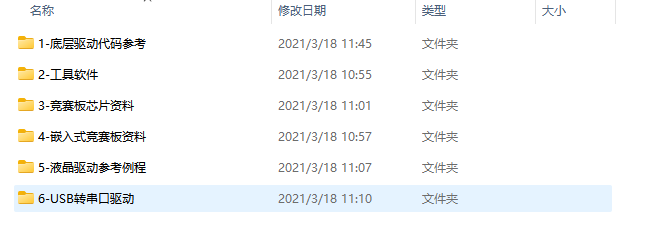

可以看到有一个液晶驱动参考历程。

点进去就会发现有个hal库的历程。

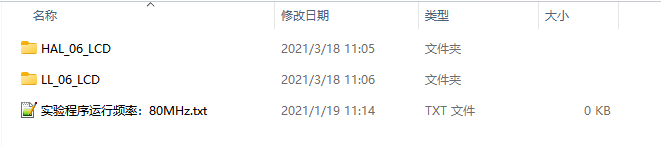

点进去可以看到有工程文件夹，在Inc中把lcd.h、fonts.h 和 Src 的lcd.c复制移植到我们的bsp文件中。

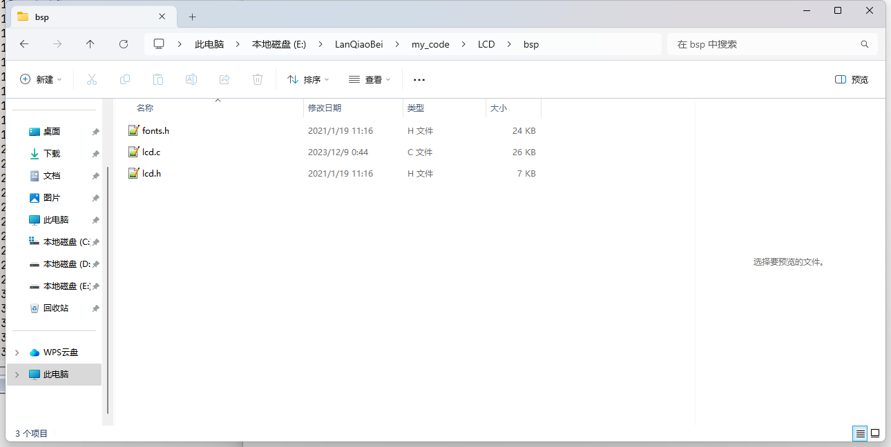

接下来我们来看看官方给的历程是如何使用LCD的。

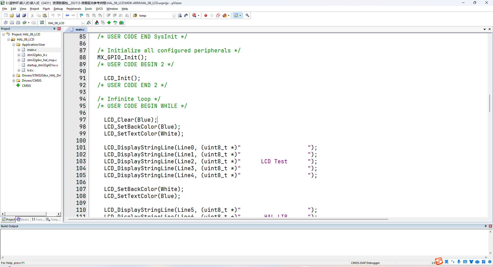

* 可以看到先调用LCD_Init()对LCD进行初始化
* 调用LCD_Clear(Blue)对LCD屏进行清屏（用蓝色填充）
* 调用LCD_SetBackColor(Blue)设置背景颜色为蓝色
* 再调用LCD_SetTextColor(White)设置字体的颜色为白色
* 以及LCD的显示函数

所以在我们的代码中只需要跟着照做就行，先对lcd进行初始化，然后并清屏设置自己所需要的颜色。

接下来带大家了解一下官方提供了那些LCD的函数以及宏。

先来看一下官方提供了那些颜色

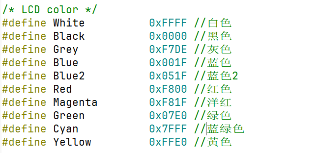

大家可以自己尝试一下这个颜色都是什么样的，下面我带大家看一下这些颜色，顺序是跟上面对应的。

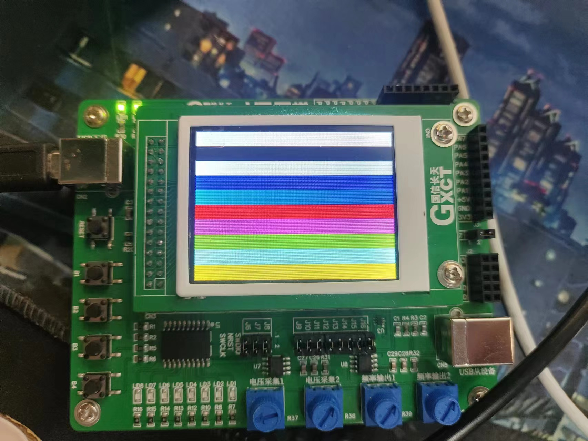

下面是行号和显示状态（水平或者垂直）

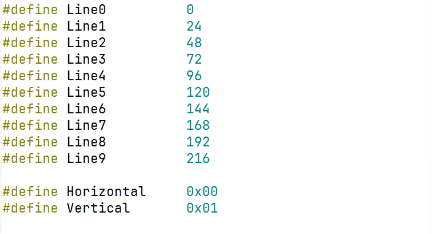

下面是提供的方法，大家可以自己尝试一下具体的作用。

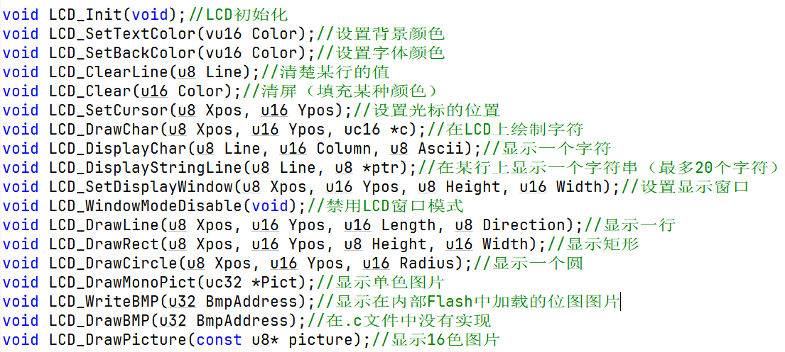

### 2.分任务的形式

同上面一样，我们也采用分任务的形式来显示题目对应的内容，因为有时候题目要求我们要显示一个变化的值，这时候我们就可以采用c语言的库函数`sprintf`，他和`printf`的区别就是他多了个参数，用于接收对应的内容，`printf`是把我们输入的内容打印到标准的输出流，也就是屏幕，而`sprintf`是把对应的内容输出到数组中去，所以我们就可以利用这个特性来比较简单的显示一些变量。

~~~c
#define LCDTaskTimerPorid 200//只是方便展示，这个对应的任务时间应该放在一起，方便修改
char view = 0;
float fre = 100;//其他任务更新这个值
char text[30];
void LCD_Task(void)
{
    if(LCDTaskTimer)return;
    LCDTaskTimer = LCDTaskTimerPorid;
    if(view == 0)//不同的界面
    {
        sprintf(text,"   fre : %.2f   ",fre);
        LCD_DisplayStringLine(Line0,(u8*)text);
    }
    else if(view == 1)
    {
        sprintf(text,"                     ");//如果对应的第二个界面这一行不用显示，
                                              //不要用清屏函数，直接用空白字符覆盖进行就行
        LCD_DisplayStringLine(Line0,(u8*)text);
        /* 显示其他内容 */
    }  
    
}
~~~

### 3.LCD翻转

* 垂直方向

	改变LCD的R1

    ~~~c
    //从上到下
    LCD_WriteReg(R1,0x0000);

    //从下到上
    LCD_WriteReg(R1,0x0100);
    ~~~

* 水平方向

  改变LCD的R96

  ~~~c
  //从左到右
  LCD_WriteReg(R96,0x2700);
  
  //从右到左
  LCD_WriteReg(R96,0xA700);
  ~~~

## 七、Timer定时的配置

### 1.CubeMX的配置

选择一个Timer，可以看到STM32G431RBT6的Timer资源很丰富。

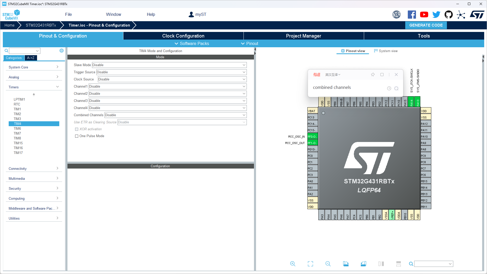

我们选择任意一个Timer来完成定时功能。这里我选择TIM3。

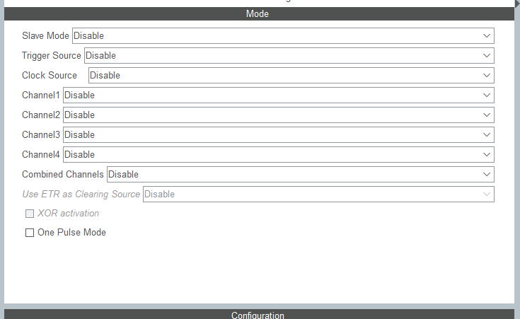

可以看到定时器有很多配置：Slave Mode（从模式）、Trigger  Source（触发源）、Clock Source（时钟源）以及通道的配置。

作为定时功能只需配置时钟源和开启中断就行。

那么定时多少进一次中断，是如何配置的呢。

定时器进入中断的频率取决于定时器的配置，具体来说是定时器的分频器（prescaler）、重载值（reload value）以及系统时钟频率。计算中断频率的公式如下：

$中断频率 = \frac{CKPSC}{（PSC + 1）*（ARR+1）}=\frac{时钟频率}{（分频系数+1）*（重装值+1）}$

$t=\frac{1}{中断频率}=\frac{(PSC+1)*(ARR+1)}{CKPSC}$

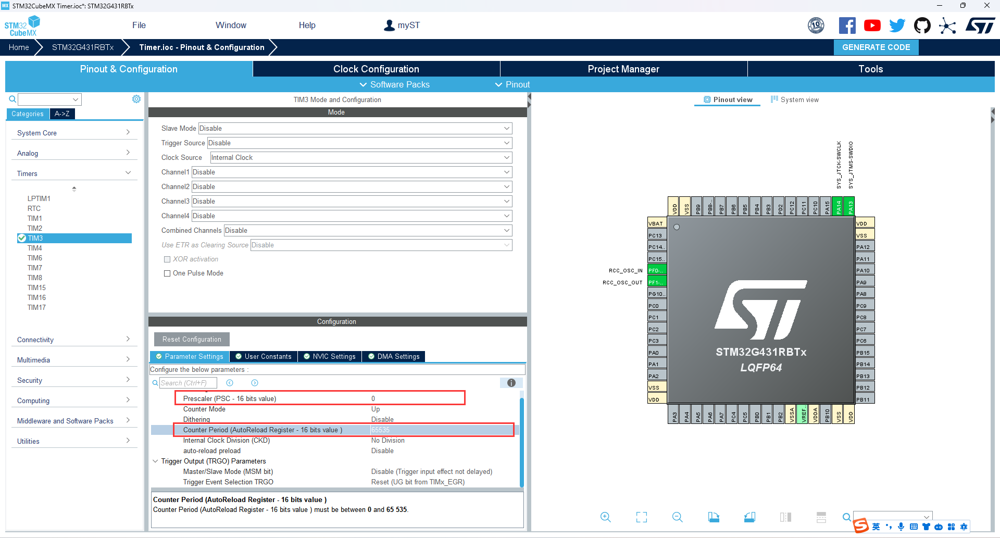

在一开始的时钟配置的时候，我们把CK_PSC设为80MHZ。

如果我要10ms进一次中断，那么psc的值和arr的值该怎么设置。

为了方便计算一般把PSC设置为$8*10^n-1$,然后再计算ARR的值。

这边我把PSC的值设为80-1，所以ARR的值是

$0.01=\frac{(arr+1)*80}{80000000}$

所以arr的值为100000 -1。PSC和ARR的值可以自己设定，只要不超过范围就行。

最后一步只要开启中断，CubeMx的配置就完成了。

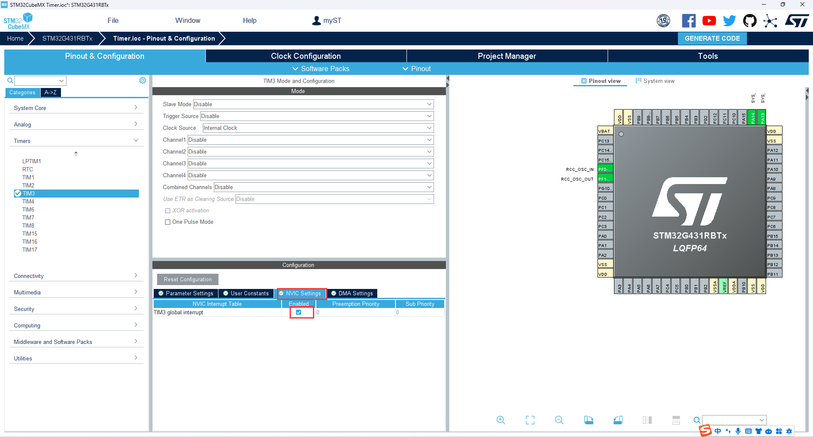

### 2.代码的配置

手动启动定时器

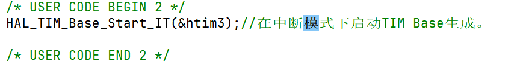

CubeMx只是设置了定时器的各种参数，但它并不会自动开始计数或触发中断。启动定时器的具体操作需要在应用程序中手动调用相应的函数。htim3就是由CubeMx生成的。

那么该如何编写中断服务函数呢？

`void HAL_TIM_IRQHandler(TIM_HandleTypeDef *htim)`是处理TIM中断请求。在这个函数中有个回调函数

`void HAL_TIM_PeriodElapsedCallback(TIM_HandleTypeDef *htim)`所以我们只需在这个函数中处理我们所需要的逻辑。

先判断定时器是不是TIM3，然后再进行处理

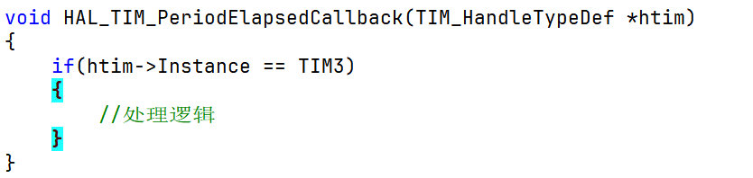

此时每10ms进一次中断。

## 八、按钮的配置

### 1.CubeMx的配置

通过查看产品手册可以看到，官方提供的开发板有四个按钮分别是PB1 PB2 PB3 PB4，并且还是并联一个上拉电阻。

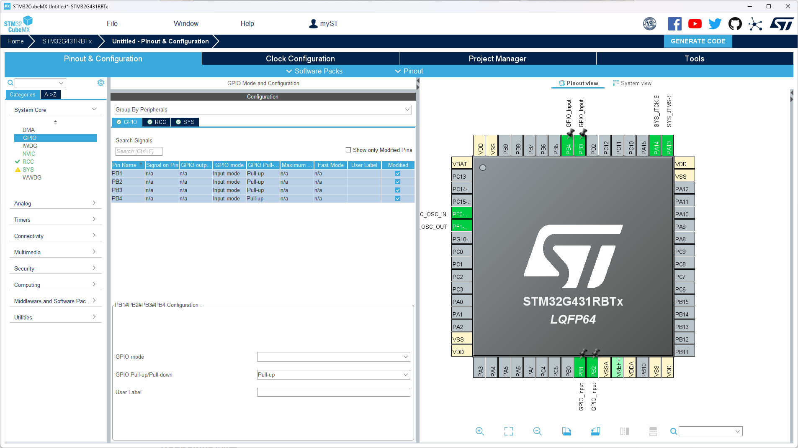

这样就完成看按钮的配置，那我们如何来判断按钮。

### 2.代码部分

由于按钮是机械结构，被按下是会产生抖动，使得电路信号也会抖动，常见的处理就是硬件防抖（加个电容）或者软件防抖。

软件防抖的方式有延时和状态机。这里推荐用状态机的写法。

定义一个结构体来表示按钮的状态。

~~~c
typedef struct
{
    char keyMode;//按钮的模式
    bool keyState;//按钮的状态
    bool keyLongFlag;//按钮长按的标志
    bool keyShortFlag;//按钮短按的标志
    uint32_t keyTime;//按钮被按下的时间
}keyFlag;
~~~

开启一个定时器，定时时间为10ms进一次中断。

~~~c
void HAL_TIM_PeriodElapsedCallback(TIM_HandleTypeDef *htim)
{
    if(htim->Instance == TIM4)//判断是Timer几产生的中断
    {
        //读取按钮状态
        key[0].keyState = HAL_GPIO_ReadPin(GPIOB, GPIO_PIN_1);
        key[1].keyState = HAL_GPIO_ReadPin(GPIOB, GPIO_PIN_2);
        key[2].keyState = HAL_GPIO_ReadPin(GPIOB, GPIO_PIN_3);
        key[3].keyState = HAL_GPIO_ReadPin(GPIOB, GPIO_PIN_4);

        for (int i = 0; i < 4; i++)
        {
            switch (key[i].keyMode)
            {
                case 0:
                    // 模式0：按键空闲状态
                    if (key[i].keyState == 0) 
                    {
                        // 如果按键被按下
                        key[i].keyMode = 1;
                        key[i].keyTime = 0;  // 重置按键时间
                    }
                    break;
                case 1:
                    // 模式1：按键按下检测中
                    if (key[i].keyState == 0)
                    {
                        // 如果按键仍然被按下
                        key[i].keyMode = 2;
                        key[i].keyTime++;//按下时间加一
                    }
                    else
                    {
                        // 如果按键被释放
                        key[i].keyMode = 0;
                    }
                    break;
                case 2:
                    // 模式2：按键释放和长按检测中
                    if (key[i].keyState == 1) 
                    {
                        // 如果按键被释放
                        key[i].keyMode = 0;
                        if (key[i].keyTime < 70) 
                        {
                            // 如果按键时间短，标记为短按
                            key[i].keyShortFlag = 1;
                        }
                    } 
                    else
                    {
                        // 如果按键仍然被按下
                        key[i].keyTime++;
                        if (key[i].keyTime > 70)//因为定时器是10ms进一次，所以就是70*10=700ms
                        {
                            // 如果按键时间长，标记为长按
                            key[i].keyLongFlag = 1;
                        }
                    }
                    break;
            }
        }
    }
}
~~~

## 九、UART配置

### 1.CubeMx的配置

对于串口来说CubeMx的配置很简单，只需把usart1的模式改为Asynchronous（异步模式）。

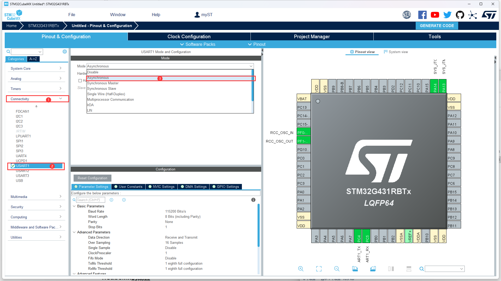

我们可以看到此时的PC4、PC5作为串口一的TX、RX。但是实际上开发板的串口一是和daplink的RX、TX连接，然后转发给电脑。

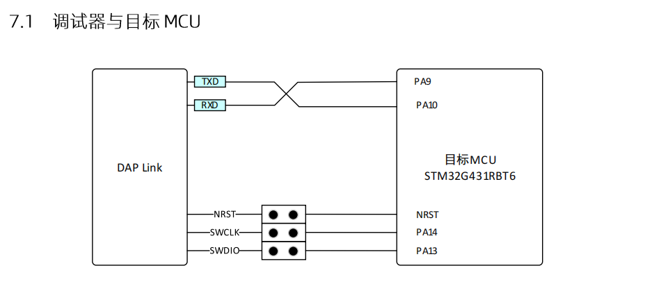

所以如果改完模式的时候，默认的串口TX、RX不是PA9、PA10，需要手动更改为PA9、PA10.

接下来是串口的参数配置

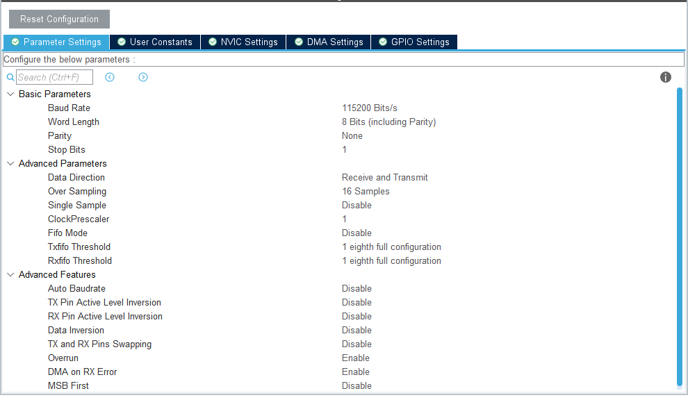

* Baud Rate：串口的波特率
* Word Length ：数据位
* Parity：效应位
* Stop Bits：停止位

这些参数根据题目的要求设置。

如果要接收数据，我采用的方法是DMA+串口空闲中断

首先配置串口的RX的DMA

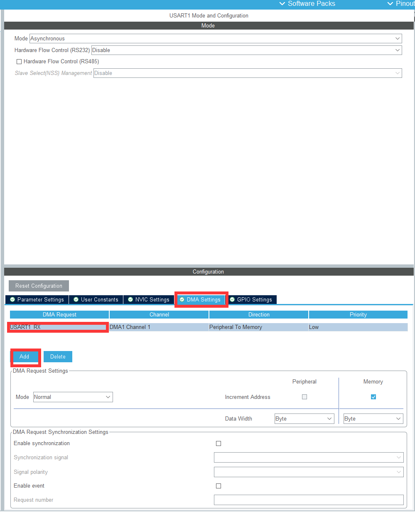

使用串口空闲中断，必须开启串口全局中断

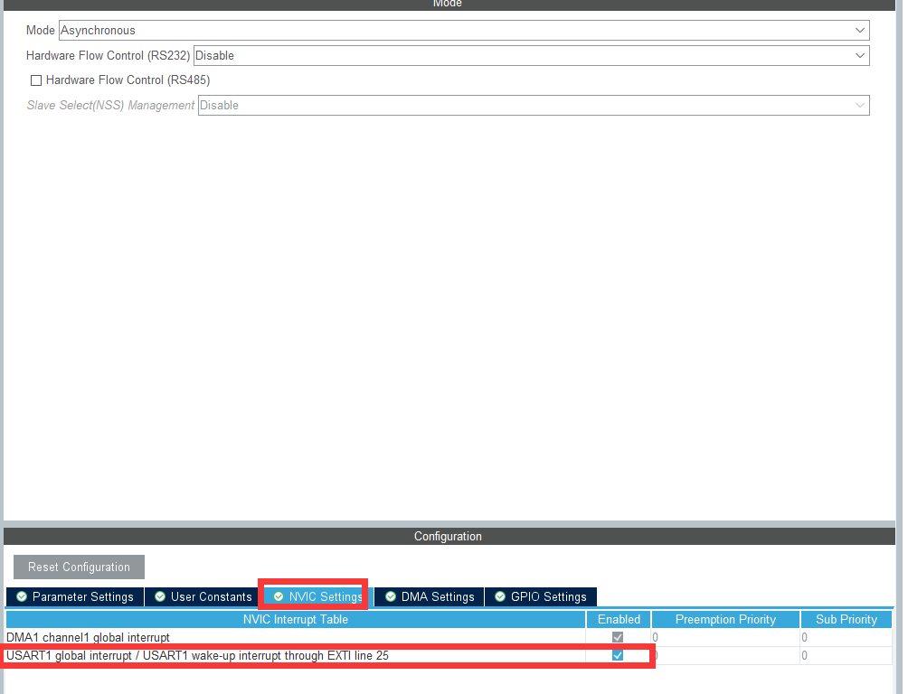

### 2.代码编写

* 串口发送

 串口的发送函数`HAL_StatusTypeDef HAL_UART_Transmit(UART_HandleTypeDef *huart, const uint8_t *pData, uint16_t Size, uint32_t Timeout)`

~~~c
char text[] = "Hello world\r\n";
HAL_UART_Transmit(&huart1,text,strlen(text),HAL_MAX_DELAY);
~~~

* 串口的接收

只需要在初始化后开启`HAL_UARTEx_ReceiveToIdle_DMA`,串口接收完成数据，就会触发空闲中断，此时我们只需要在中断回调服务函数中处理接收的数据即可

~~~c
int main(void)
{
 //init
 
 ......
 
 
 //开启串口接收
 HAL_UARTEx_ReceiveToIdle_DMA(&huart1,text,30);//后面的参数意思是允许接收最大的字节
 
}

//中断回调函数
void HAL_UARTEx_RxEventCallback(UART_HandleTypeDef *huart, uint16_t Size)
{
    if(huart == &huart1)
    {
        HAL_UART_Transmit(&huart1,text,Size,HAL_MAX_DELAY);
        HAL_UARTEx_ReceiveToIdle_DMA(&huart1,text,30);//再次开启接收
    }
}
~~~

==注意：串口的过半中断也可以触发上面的中断服务函数==

解决方法：

* 把接收数组设置大点
* 把过半中断关闭:`__HAL_DMA_DISABLE_IT(&hdma_usart1_rx,DMA_IT_HT;`(hdma_usart1_rx可能需要extern声明外部变量)

## 十、PWM输出（PWM模式）

### 1.CubeMx配置

选择要输出的引脚，配置成定时器通道TIMX_CHX

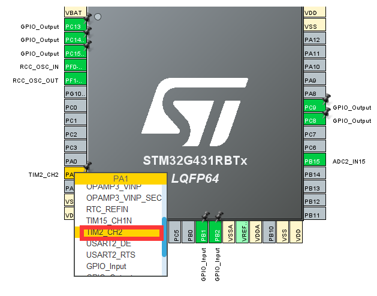

接下来在Timers中选择对应的定时器，指定时钟源为内部时钟。

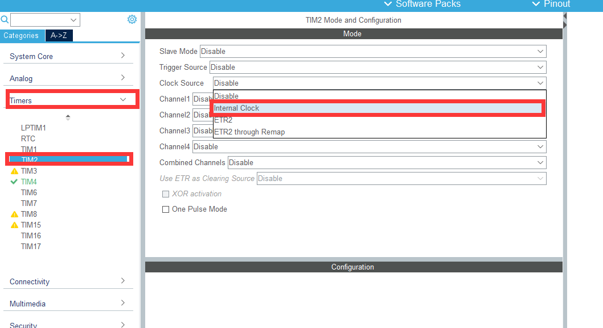

选择对应的通道输出PWM Generation CH4

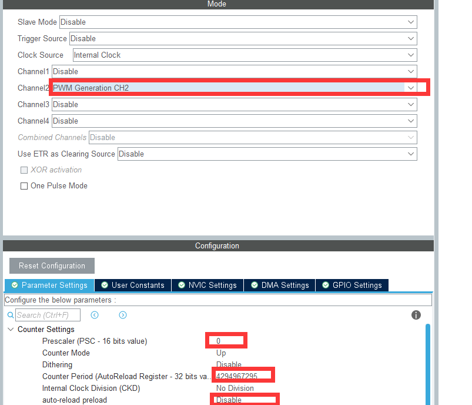

* `Prescaler`：时钟预分频数（PSC），这边为了方便计算可以设为 `80 - 1`
* `Counter Mode`：计算模式，Up向上计数
* `Counter Period`：自动重装载值（ARR）。
* `auto-rekoad preload`：自动重装载使能

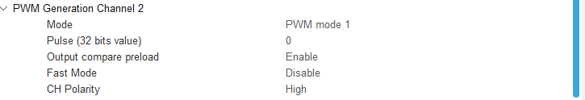

* `Mode`：定时模式，PWM mode 1 
* `Pulse`：计数比较值（CCR）
* `Output compare preload`：输出比较预加载
* `Fast Mode`：脉冲快速模式
* `CH Polarity`:输出极性

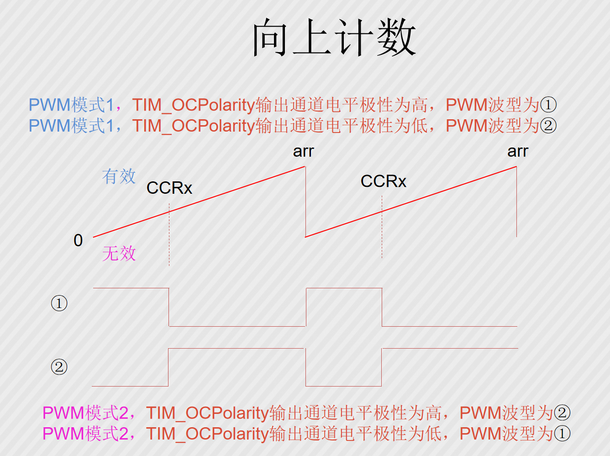

PWM选择模式1，这样CCR/ARR就是对应高电平的时间，也就是占空比。

假设我们这边要输出一个 1KHz的方波。

PSC 可以设为 80 -1 ARR：1000-1 CCR： 500 - 1

因为时钟的频率是80MHZ,所以输出的PWM频率就是80000000/80/1000=1000

### 2.代码的编写

我们已经把PWM的输出配置好了，但是要开始产生PWM输出，我们还需要调用

`HAL_StatusTypeDef HAL_TIM_PWM_Start(TIM_HandleTypeDef *htim, uint32_t Channel)`

因为我们这边是TIM2的通道2，所以要`HAL_TIM_PWM_Start(&htim2,TIM_CHANNEL_2);`

此时PA1引脚才正式的输出PWM

### 3.变化频率以及占空比

想要变化频率就要改变ARR的值，想改变占空比就改变CCR的值。

* 改变频率

​	`__HAL_TIM_SetAutoreload()`:改变ARR的值

​	例：`__HAL_TIM_SetAutoreload(&htim2,500-1);`

* 改变占空比

  `__HAL_TIM_SetCompare()`

  例： `__HAL_TIM_SetCompare(&htim2,TIM_CHANNEL_2,50);`

  可以直接改变TIMx->CCRx的值，来改变CCR

## 十一、PWM输出（输出比较模式）

通过定时器TIM的输出比较模式得到的预定频率与占空比的PWM波形；其中定时器 的输出比较模式与PWM模式的区别在于PWM模式在同一个TIM下所有输出口的频率一致不能单独控制单个频率，而输出比较就弥补了这一缺点，可以对同一个TIM下的各个输出口分别设置频率。

==重要的是比赛要求的输出不同占空比和频率时，用此方法比较简单==

### 1.CubeMx的配置

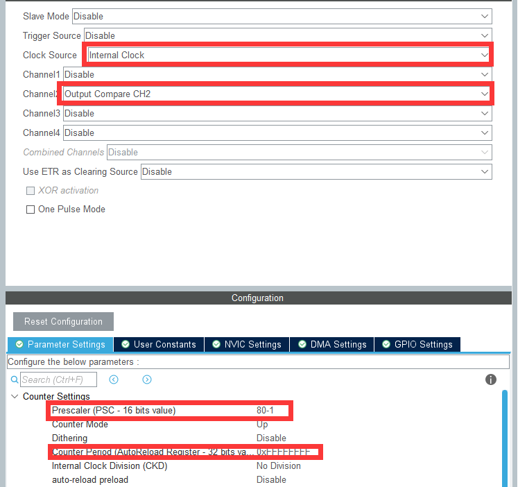

* `Clock Source`:时钟源，选择内部时钟即可。
* `Channel2`：通道2，选择`Output Compare CH2`（输出比较）
* `Prescaler`:时钟分频系数，这边为了方便计算设为 `80 - 1`
* `Counter Period`:自动预装载值，设为最大即可。

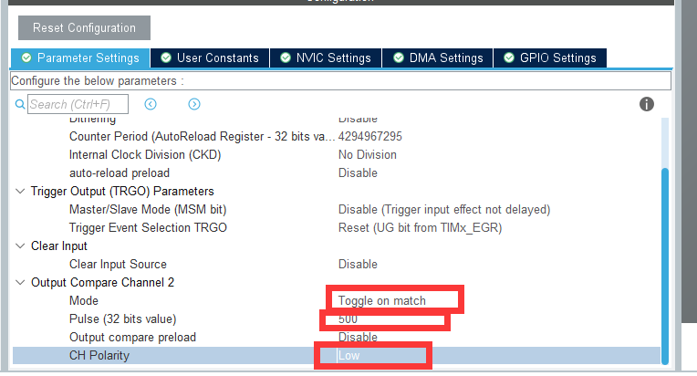

* Mode：选择 Toggle on match
* Pulse:这边只需要指不为0就行
* Ch Polarity 设为低电平(这边也可以设为高电平，但是下面的代码要有所变动)

开启全局中断

### 2.代码编写

~~~c
int main(void)
{
 //init 
 
 ......
 
 
 //开启输出比较
HAL_TIM_OC_Start_IT(&htim2,TIM_CHANNEL_2);
}

//编写输出比较中断回调函数
int fra = 1000;//输出的频率
float duty = 0.2;//占空比
void HAL_TIM_OC_DelayElapsedCallback(TIM_HandleTypeDef *htim)
{
    static char flag = 0;
    if(htim->Instance == TIM2)
    {
        if(htim->Channel == HAL_TIM_ACTIVE_CHANNEL_2)
        {
            int val = TIM2->CCR2;
            if(!flag)//低电平有效时间
            {
                TIM2->CCR2 = val + (1000000 / fra) * (1 - duty);
            }
            else//高电平有效时间
            {
                TIM2->CCR2 = val + (1000000 / fra) * duty;
            }
            flag = !flag;
        }
    }
}
~~~

能力有限，我尽量表诉一下我的理解。

一开始的CCR值假设为100，因为我们psc设置为80-1，所以计算频率就是1Mhz，有效电平为低电平，所以当CNT == CCR的时候进入中断，电平翻转变为高电平。第一次进入中断TIM2->CCR2 = val + (1000000 / fra) * duty，此时CCR的值被增加高电平值，所以当CNT再次等于CCR，电平再次翻转变为低电平，TIM2->CCR2 = val + (1000000 / fra) * (1 - duty),CCR的值增加了低电平所需要的值。这样就形成了一个周期。

==注意：输出比较对于需要突变或者在某段时间递增的时候好用，但是在需要输出高低电平的时候就有问题，对于低频信号则需要变大PSC的值。==

## 十二、输入捕获

### 1.CubeMX的配置

这边以PA6来做为例子。注：基本定时器是不能入捕获。

这边我们使用定时器TIM3的通道1来捕获波形

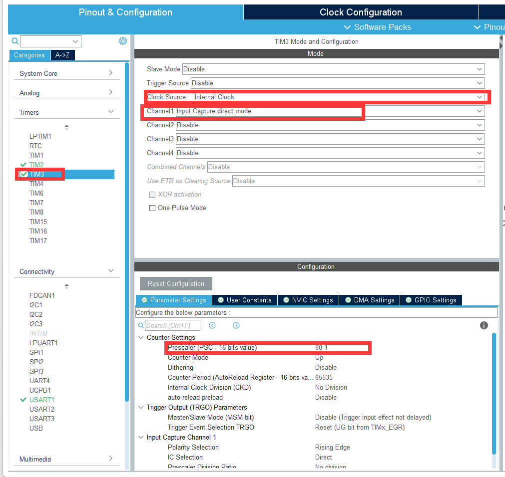

* 开启时钟
* 通道一：直接输入模式
* PSC：80-1

这边不要忘记开启中断

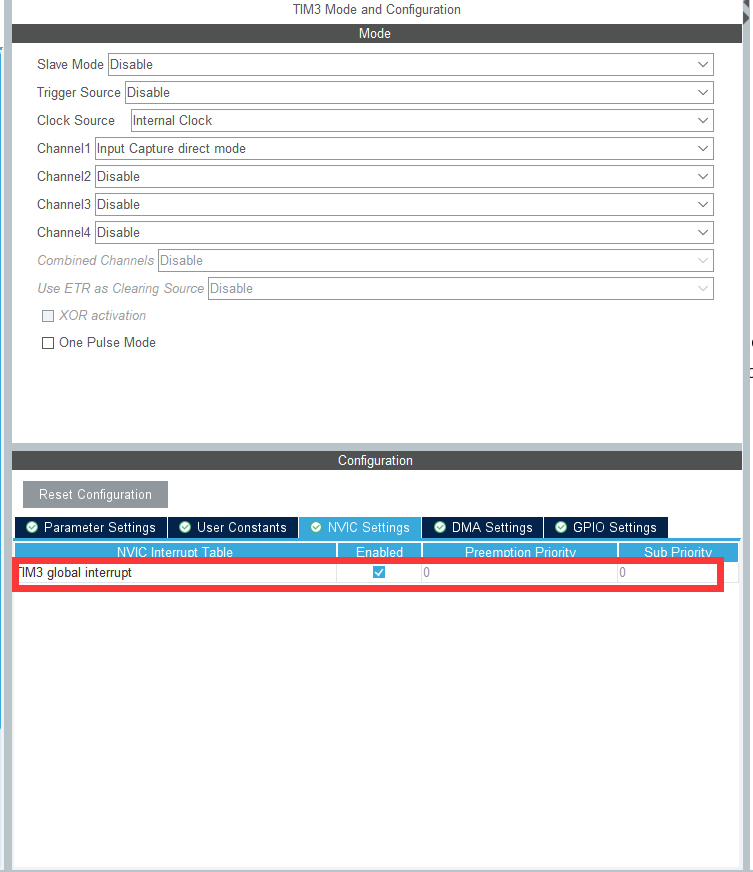

### 2.代码的编写

~~~c
int main(void)
{
    //init
    
    ....
        
    //开启定时器3通道一的输入捕获
    HAL_TIM_IC_Start_IT(&htim3,TIM_CHANNEL_1);
}

uint32_t PA6_fra = 0;
uint32_t ccr1_val2;
void HAL_TIM_IC_CaptureCallback(TIM_HandleTypeDef *htim)
{
    if(htim->Instance == TIM3)
    {
       if(htim->Channel==HAL_TIM_ACTIVE_CHANNEL_1)
       {
           PA6_fra = 80000000 / 80 / (TIM3->CCR1 + 1);
      	   TIM3->CNT = 0; 
       	   HAL_TIM_IC_Start(htim,TIM_CHANNEL_1);
       }
    }
}
~~~

### 3.测占空比

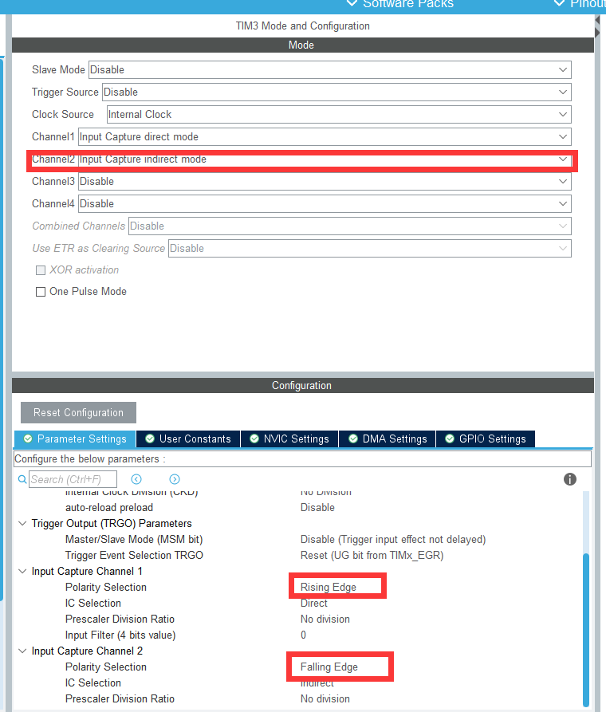

只需要开启通道二的间接模式，以及通道一上升沿触发，通道二下降沿触发。

~~~c
uint32_t PA6_fra = 0;
float PA6_Duty = 0;
double ccr1_val1;
double ccr2_val2;
void HAL_TIM_IC_CaptureCallback(TIM_HandleTypeDef *htim)
{
    if(htim->Instance == TIM3)
    {
         if(htim->Channel==HAL_TIM_ACTIVE_CHANNEL_1)
         {
            ccr1_val1 = TIM3->CCR1;
            ccr2_val2 = TIM3->CCR2;       
            TIM3->CNT = 0;     
            PA6_fra = 80000000 / 80 / (ccr1_val1 + 1);
            PA6_Duty = (ccr2_val2 / ccr1_val1) * 100;
         }        
    }
}
~~~

## 十三、EEPROM

### 1.iic移植

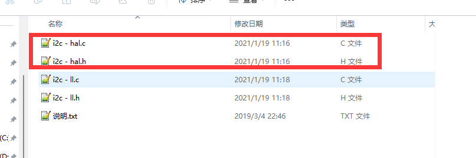

将官方提供的资源包的iic代码copy到我们的工程，并添加.c文件，并修改.c文件的错误的包含头文件。

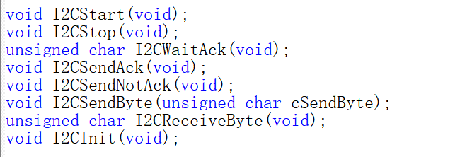

可以看到官方提供的代码

* `I2CStart`：iic启始信号
* `I2CStop`：iic停止信号
* `I2CWaitAck`：iic等待应答
* `I2CSendAck`：iic确认应答
* `I2CSendNotAck`：iic非确认应答
* `I2CSendByte`：发送一字节
* `I2CReceiveByte`：接受一字节
* `I2CInit`：iic初始化函数

### 2.写EEPORM

我们可以查看官方提供的AT24C02手册和板卡的产品手册。

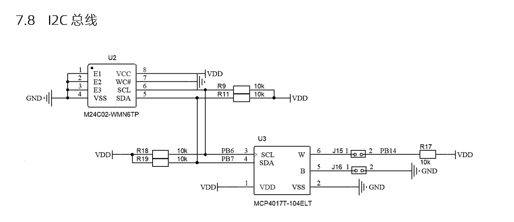

可以看到AT24C02的E1、E2、E3引脚都是接地。

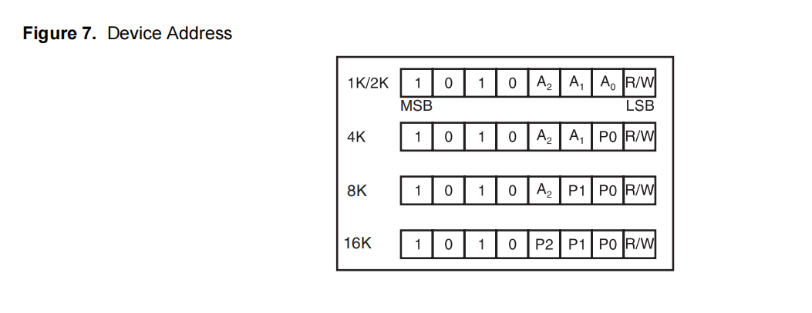

所以A2、A1、A0都是为0，而R/W位代表读写，0代表写，1代表读。

所以可以算出AT24C02的地址是`10100000`即`0xA0`

可以看到手册中有两种写方式，分别是写一个字节和写一页。这边的一页是8个字节，而且超过八个字节就覆盖（最多只能写一页）。

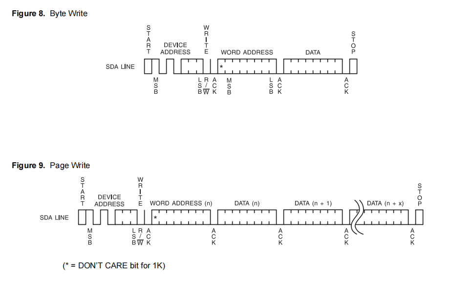

因为蓝桥储存的数据大概率是大于255的，所以我们采用第二种方式，储存四个字节。

根据图上所示,代码如下：

~~~c
void save_eeprom(uint8_t addr,uint32_t data)
{
 
    I2CStart();
    I2CSendByte(0xA0);
    I2CWaitAck();
    I2CSendByte(addr);
    I2CWaitAck();
    I2CSendByte((data>>24) & 0xFF);
    I2CWaitAck();
    I2CSendByte((data>>16) & 0xFF);
    I2CWaitAck();
    I2CSendByte((data>>8)&0xFF);
    I2CWaitAck();
    I2CSendByte(data& 0xFF);
    I2CWaitAck();
    I2CStop();
}
~~~

注：官方给的i2cinit是没有开启GPIOB的时钟，如果你的代码中没有用到GPIOB时钟，需要手动开启。

### 3.读EEPROM

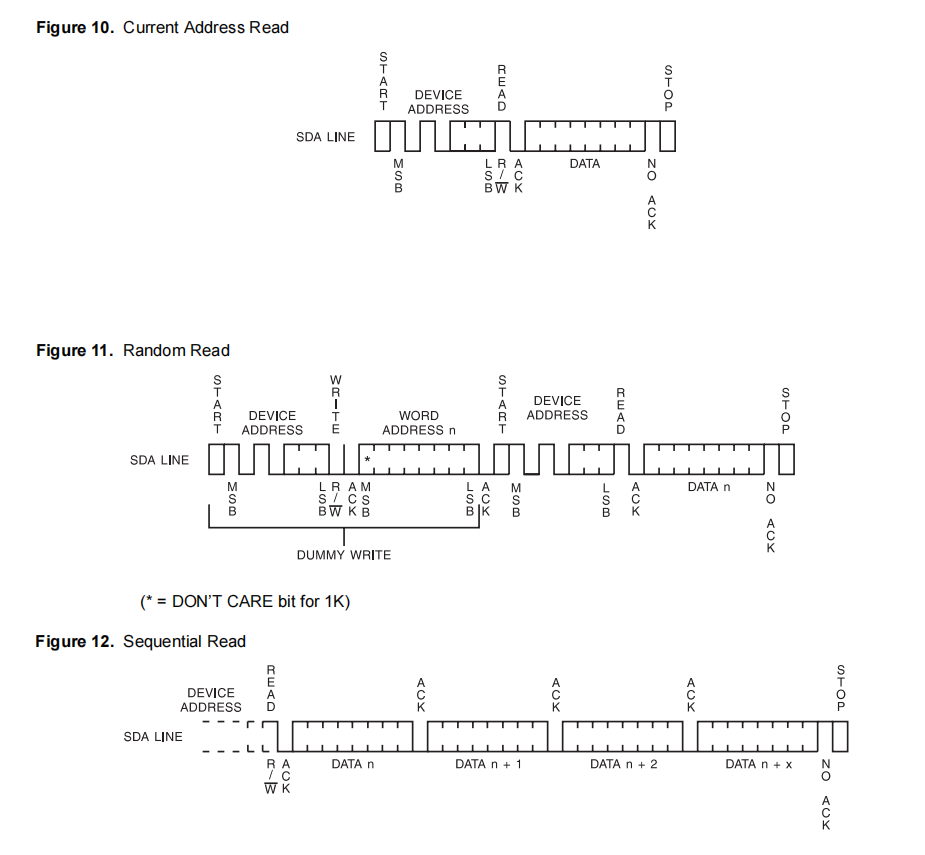

代码：

~~~c
uint32_t read_eeprom(uint8_t addr)
{
    
    uint32_t data = 0x00;
    I2CStart();
    I2CSendByte(0xA0);
    I2CWaitAck();
    I2CSendByte(addr);
    I2CWaitAck();
    I2CStart();
    I2CSendByte(0xA1);
    I2CWaitAck();
    data = I2CReceiveByte();
    I2CSendAck();
    data = (data << 8)+ I2CReceiveByte();
    I2CSendAck();
    data = (data << 8)+ I2CReceiveByte();
    I2CSendAck();
    data = (data << 8)+ I2CReceiveByte();
    I2CSendNotAck();
    I2CStop();
    return data;
    
}
~~~

## 十四、RTC

### 1.CubeMX配置

配置RTC时钟源，选择旁路时钟源，也就是HSE。

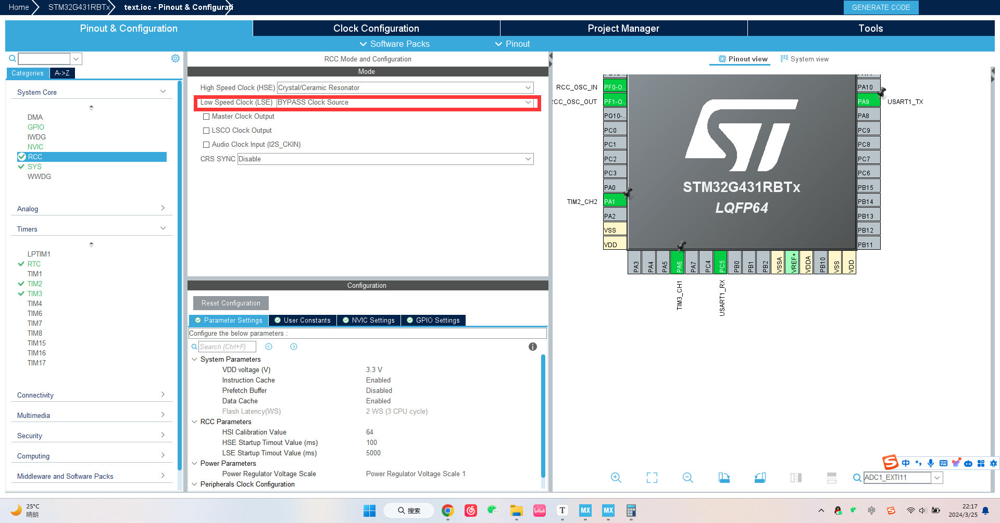

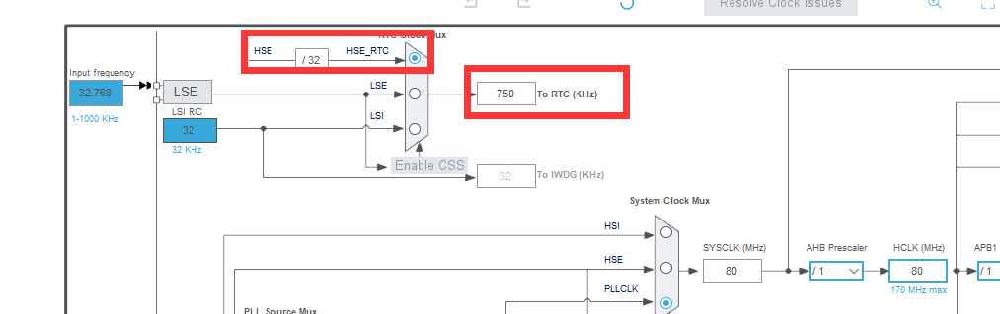

此时RTC的时钟频率是750KHZ。

使能RTC的时钟以及日期功能。

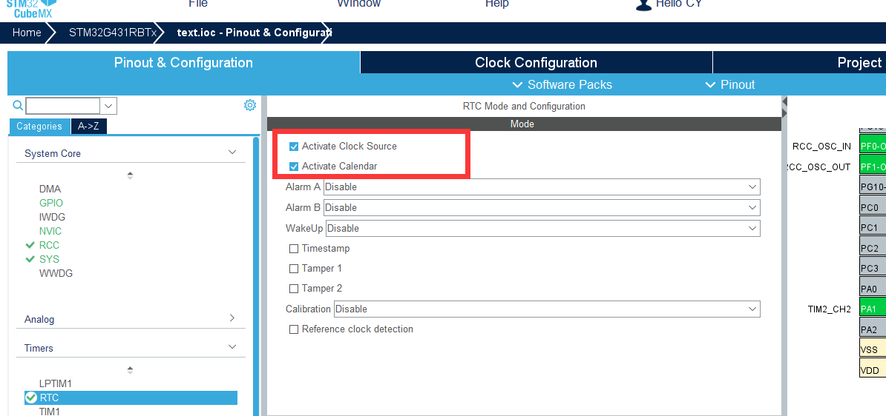

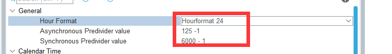

选择24小时制，      **Asynchronous Predivider value**  为125-1，      **Synchronous Predivider value**  为6000-1，因为750Khz/125/6000=1hz

设置时间格式为BCD，设置时间为23.55.55

设置日期为2024年3月25日

注：年份只填2024年的后两位。

RTC的闹钟功能，有两个闹钟，我们以A为例子

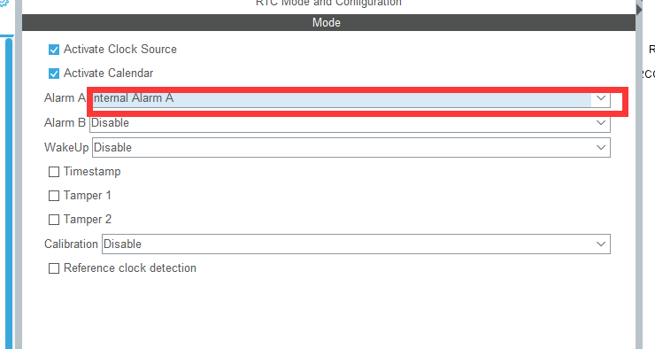

设置闹钟时间为每天的0.0.0，

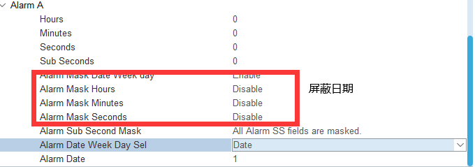

最后别忘记了，使能中断

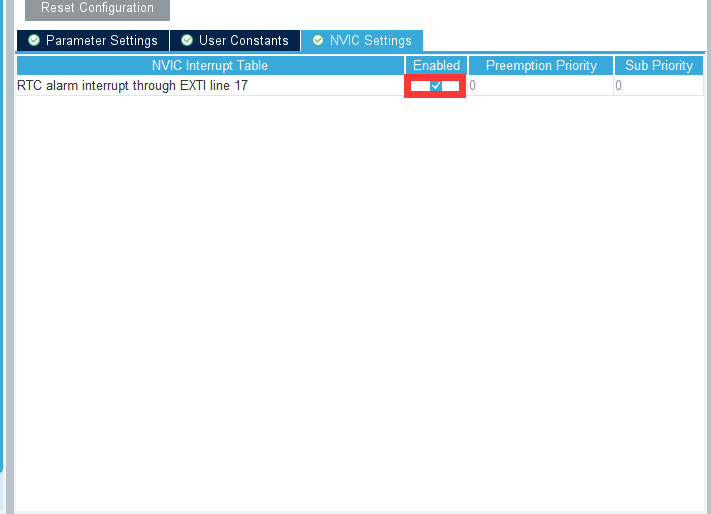

RTC主要的函数有：

* `HAL_StatusTypeDef HAL_RTC_GetDate(RTC_HandleTypeDef *hrtc, RTC_DateTypeDef *sDate, uint32_t Format)`:得到日期
* `HAL_StatusTypeDef HAL_RTC_GetTime(RTC_HandleTypeDef *hrtc, RTC_TimeTypeDef *sTime, uint32_t Format)`：得到时间
* `HAL_StatusTypeDef HAL_RTC_SetDate(RTC_HandleTypeDef *hrtc, RTC_DateTypeDef *sDate, uint32_t Format)`:设置日期
* `HAL_StatusTypeDef HAL_RTC_SetTime(RTC_HandleTypeDef *hrtc, RTC_TimeTypeDef *sTime, uint32_t Format)`:设置时间】
* `void HAL_RTC_AlarmAEventCallback(RTC_HandleTypeDef *hrtc)`:闹钟A回调函数

注意：HAL_RTC_GetTime()和HAL_RTC_GetDate()必须同时使用。

### 2.获得时间

~~~c
	RTC_DateTypeDef sDate;
    RTC_TimeTypeDef sTime;
    HAL_RTC_GetTime(&hrtc,&sTime,RTC_FORMAT_BIN);
    HAL_RTC_GetDate(&hrtc,&sDate,RTC_FORMAT_BIN);
~~~

再次强调HAL_RTC_GetTime()和HAL_RTC_GetDate()必须同时使用。官方的解释是为了安全性，必须保证日期和时间的一致性。

### 3.设置时间

~~~c
	RTC_DateTypeDef sDate;
	sDate.Year = xx;
    sDate.Month = xx;
    sDate.Date = xx;
    HAL_RTC_SetDate(&hrtc,&sDate,RTC_FORMAT_BIN);
    RTC_TimeTypeDef sTime;
	sTime.Hours = xx;
    sTime.Minutes = xx;
    sTime.Seconds = xx;
	sTime.StoreOperation = RTC_STOREOPERATION_RESET;
    sTime.DayLightSaving = RTC_DAYLIGHTSAVING_NONE;
    HAL_RTC_SetTime(&hrtc,&sTime,RTC_FORMAT_BIN);
~~~

这边建议用AC6的编译器，因为笔者遇到了很奇怪的bug，如果这边也有bug的可以交流一下。（bug：时间会超过24小时）

### 4.闹钟A回调函数

~~~c
void HAL_RTC_AlarmAEventCallback(RTC_HandleTypeDef *hrtc)
{
    //实现闹钟逻辑
  	...
}
~~~

## 十五、DMA+ADC

### 1.CubeMX配置

这边以PA4和PA5为例子。

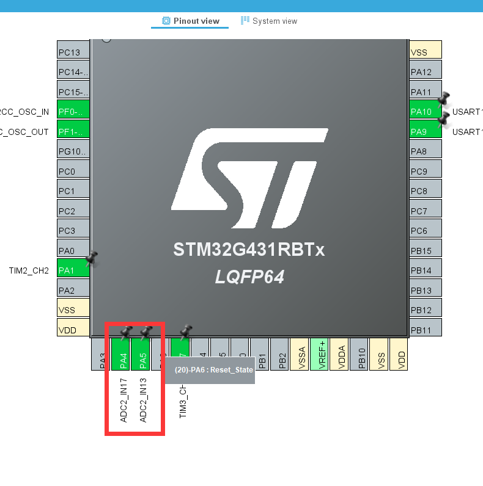

然后把IN13改为 Single-ended。

接下来只需要，配置下面的选项。

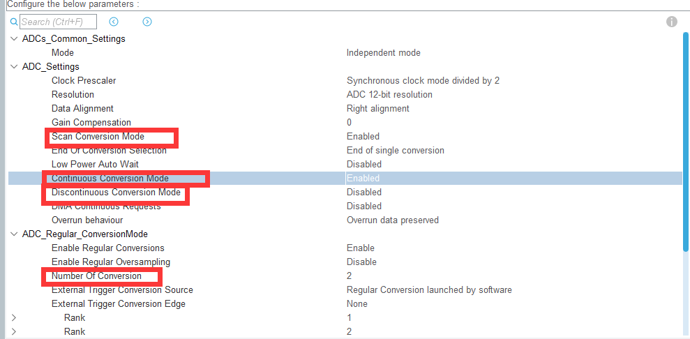

* `Scan Conversion Mode`: 连续转换模式
* `Continuous Conersion Mode`:连续转换
* `Discontinuous Conversion Mode`：不连续转换
* `Number Of Conversion`:通道数

只需要把Scan Conversion Mode 使能，然后把通道数改为对应的通道，其他两个选项就会默认对应，且不能修改。

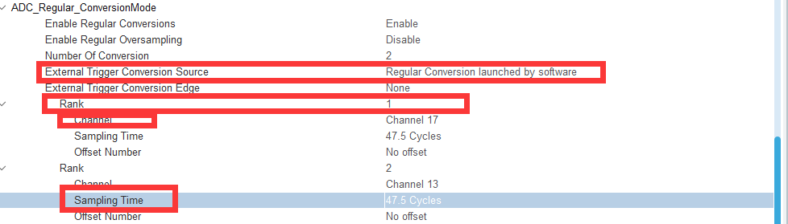

* `External Trigger Conbersion Souece`:触发方式，这边选择软件触发。
* `Rank`：转化的顺序
* `Channel`:选择要转换的通道
* `Sampling Time`:转换的时间，越高越准确

开启DMA

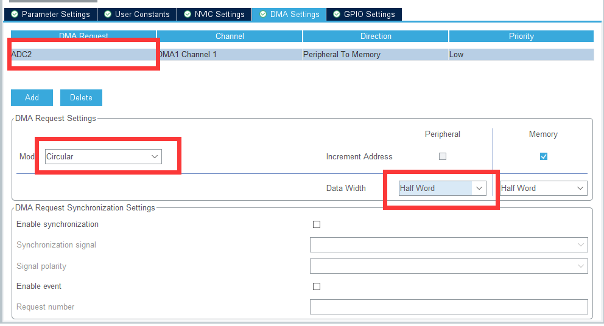

* `Mode`:选择Circular
* 外设读取的字节选择4字节

### 2.代码编写

先进行ADC校准

~~~c
HAL_ADCEx_Calibration_Start(&hadc2,ADC_SINGLE_ENDED); 
~~~

读取ADC的值

~~~c
uint16_t adc_val[4];
HAL_ADC_Start_DMA(&hadc2,(uint32_t*)adc_val,4);
//可以读多次取平均
~~~

## 十六、DAC

### 1.CubeMX 配置

DAC的CubemX配置很简单，只需要开启输出

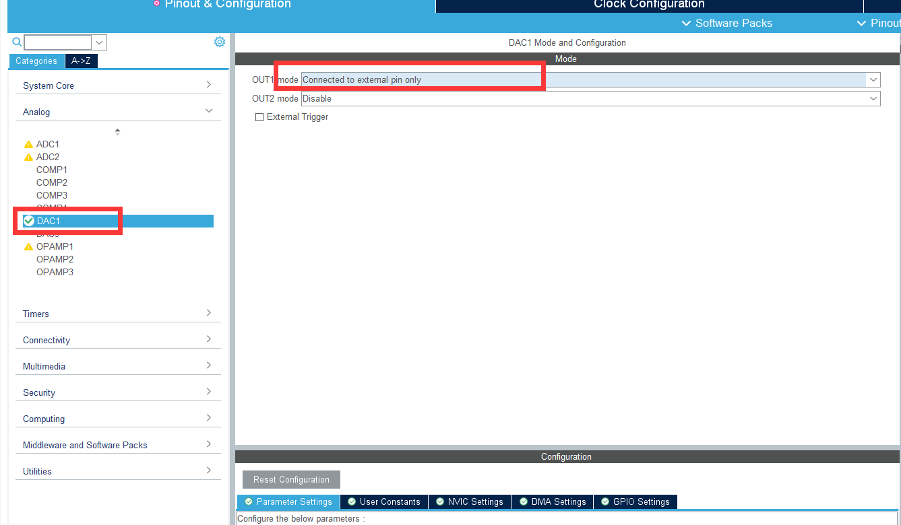

### 2.代码编写

~~~c
HAL_DAC_SetValue(&hdac1, DAC_CHANNEL_1, DAC_ALIGN_12B_R, 4095);  //设置发生的电压
HAL_DAC_Start(&hdac1,DAC_CHANNEL_1);  //开启DAC1
~~~

## 十七、MCP4017

### 1.MCP4017介绍

根据手册我们可以得知MCP4017的地址为`5E`

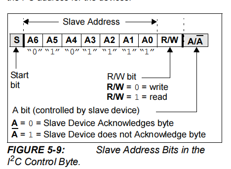

蓝桥嵌入式开发板采用的是MCP4017-104RLT

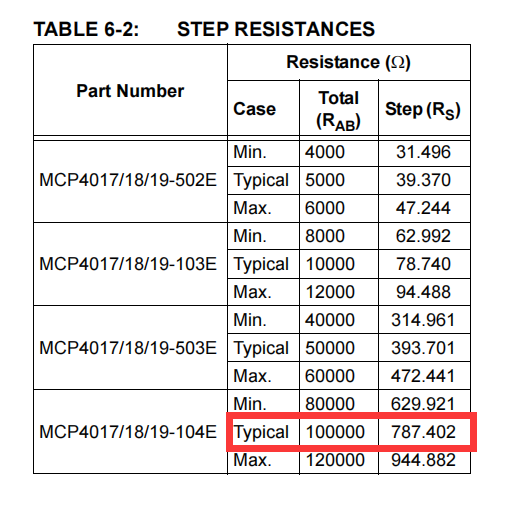

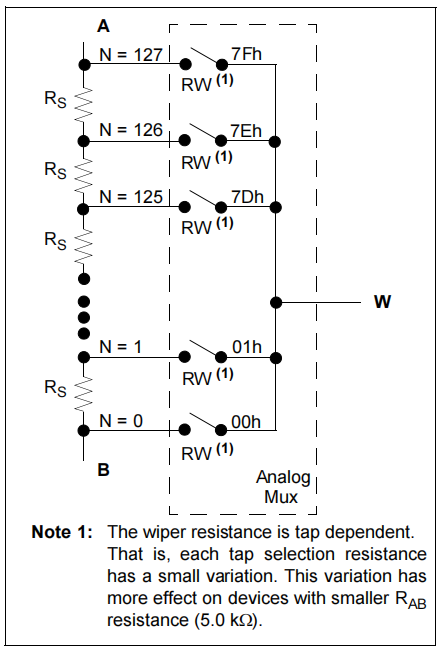

可以看到最大电压为100K，且步进为787.402，因为可以分成127份，所以100000 / 127 = 787.402

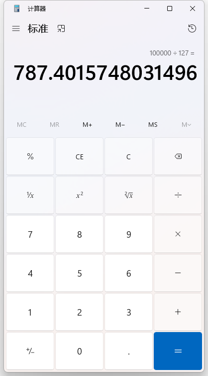

### 2.代码编写

写操作

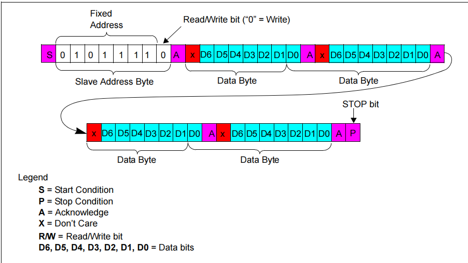

~~~c
void MCP_Write(char byts)
{
    I2CStart();
    I2CSendByte(0x5E);
    I2CWaitAck();
    I2CSendByte(byts);
    I2CWaitAck();
    I2CStop();
}
~~~

读操作

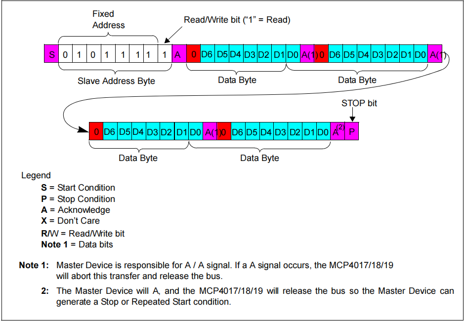

~~~c
char MCP_Read(void)
{
    char byts;
    I2CStart();
    I2CSendByte(0x5F);
    I2CWaitAck();
    byts = I2CReceiveByte();
    I2CSendNotAck();
    I2CStop();
    return byts;
}
~~~

